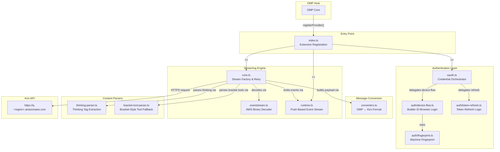

**omp-kiro-provider** is a zero-dependency local plugin that integrates [Kiro](https://kiro.dev) as an AI model provider inside the OMP (Oh My Pi) ecosystem. Written in pure TypeScript using only Node.js built-in modules, it implements the exact same provider contract used by other OMP extensions — meaning OMP can swap providers interchangeably without any architectural changes. The plugin handles the full lifecycle of a Kiro API session: authentication (API keys, social OAuth, AWS Builder ID), conversation format conversion, AWS Event Stream binary decoding, retry logic with exponential backoff, thinking/reasoning tag extraction, tool call dispatch (both native and bracket-style fallback), and request fingerprinting that mimics the real Kiro IDE. Because Kiro is currently free during its trial period, all cost fields are set to zero.

Sources: [index.ts](index.ts#L1-L99), [package.json](package.json#L1-L26)

## What This Project Does

At its core, this provider translates between two worlds. On one side sits **OMP**, which sends conversations in its own internal message format — a flat list of `{ role, content, toolCalls, toolResults }` messages along with a system prompt and tool definitions. On the other side sits the **Kiro API** (hosted at `https://q.<region>.amazonaws.com`), which expects a nested `conversationState` structure with strict alternation rules (history must alternate user/assistant, first message must be user), tool names capped at 64 characters, and tool results embedded inside user message context objects. The provider bridges these two formats transparently, so neither OMP nor Kiro needs to know about each other's conventions.

The provider also manages the streaming response pipeline. Kiro returns responses as **AWS Event Stream** binary frames — a format originally designed for AWS services like Kinesis. Each frame contains JSON payloads for content deltas, tool call events, and usage statistics. The provider decodes these binary frames in real time, parses thinking tags out of the text stream, handles tool calls (both native events and bracket-style text fallbacks), strips echo noise, and emits a clean sequence of typed events that OMP can consume via async iteration.

Sources: [src/converters.ts](src/converters.ts#L1-L22), [src/core.ts](src/core.ts#L1-L13), [src/eventstream.ts](src/eventstream.ts#L1-L8)

## Architecture at a Glance

The diagram below shows the major modules and how data flows from OMP through the provider to the Kiro API and back. Each colored group represents a distinct responsibility layer.



Sources: [index.ts](index.ts#L83-L99), [src/core.ts](src/core.ts#L166-L190), [src/oauth.ts](src/oauth.ts#L1-L13)

## Project Structure

The repository is intentionally flat — every module has a single, clear responsibility. There are no nested frameworks, no dependency injection containers, and no build tooling beyond TypeScript's own compiler. The `auth/` subdirectory groups the three authentication-related modules together.

```
omp-kiro-provider/
├── index.ts                 ← Extension entry point: registers "kiro" provider with OMP
├── models.json              ← Model catalog: 13 models with context windows & capabilities
├── package.json             ← Zero external dependencies; OMP extension manifest
│
└── src/
    ├── core.ts              ← Stream factory: retry, timeout, buffered event emission
    ├── converters.ts        ← OMP message format → Kiro conversationState format
    ├── runtime.ts           ← Push-based async iterable event stream (bridges to OMP)
    ├── eventstream.ts       ← AWS Event Stream binary frame → JSON event decoder
    ├── thinking-parser.ts   ← Stateful <thinking>/<reasoning>/<thought> tag extractor
    ├── bracket-tool-parser.ts ← Fallback parser for [Called func_name with args: {...}]
    ├── types.ts             ← Shared type definitions matching the OMP provider contract
    ├── oauth.ts             ← Auth orchestrator: auto-detects credentials from 4 sources
    │
    └── auth/
        ├── device-flow.ts   ← AWS SSO OIDC device code flow (Builder ID browser login)
        ├── token-refresh.ts ← Token refresh for social (Google/GitHub) & OIDC sessions
        └── fingerprint.ts   ← SHA-256 machine fingerprint from hostname + username
```

Sources: [package.json](package.json#L1-L26), [index.ts](index.ts#L1-L15)

## Key Design Principles

The following table summarizes the architectural decisions that shape every module in this codebase. Understanding these principles will make the implementation details in subsequent pages much easier to follow.

| Principle | How It Manifests | Where You'll See It |
|---|---|---|
| **Zero dependencies** | Only Node.js built-ins (`crypto`, `fs`, `path`, `os`, `child_process`). No axios, no jwt library, no AWS SDK. | [package.json](package.json#L1-L26) — empty `dependencies` block |
| **Contract matching** | Types in `types.ts` mirror OMP's `AssistantMessageLike`, `ModelLike`, etc. exactly, so OMP treats every provider identically. | [src/types.ts](src/types.ts#L1-L7) |
| **Dependency injection** | `CoreDependencies` injects `fetchImpl`, `cwd`, `now`, `uuid`, `env` — all side effects are parameterized for testability without mocks. | [src/types.ts](src/types.ts#L161-L172), [index.ts](index.ts#L66-L77) |
| **Buffered event emission** | Events are collected in a per-attempt buffer and only flushed to OMP after a successful response, so retries never leak partial content. | [src/core.ts](src/core.ts#L278-L289) |
| **Anti-detection** | Request headers impersonate the real Kiro IDE's User-Agent, including a per-request `amz-sdk-invocation-id` and the `x-amzn-kiro-agent-mode: vibe` flag. | [src/core.ts](src/core.ts#L141-L161) |
| **Multi-source auth** | Credentials are auto-detected from four sources in priority order: kiro-cli SQLite → Kiro IDE SSO cache → API key → OIDC device flow. | [src/oauth.ts](src/oauth.ts#L8-L13) |

Sources: [package.json](package.json#L1-L26), [src/types.ts](src/types.ts#L1-L7), [src/types.ts](src/types.ts#L161-L172), [src/core.ts](src/core.ts#L141-L161), [src/oauth.ts](src/oauth.ts#L8-L13)

## Supported Authentication Methods

The provider supports four authentication pathways, auto-detected at runtime in priority order. This means you can simply run `/login` and the provider figures out which method to use based on what credentials are already present on your system.

| Method | Priority | Source | Typical Use Case |
|---|---|---|---|
| **kiro-cli SQLite** | 1st (highest) | `~/.local/share/kiro-cli/data.sqlite3` | Already authenticated via Kiro CLI — tokens are always fresh |
| **Kiro IDE SSO cache** | 2nd | `~/.aws/sso/cache/kiro-auth-token.json` | Already authenticated via Kiro IDE desktop app |
| **API Key** | 3rd | `KIRO_API_KEY` env var or manual input | Simple setup; key starts with `ksk_` prefix |
| **Builder ID (OIDC Device Code)** | 4th (fallback) | Browser-based AWS SSO login | First-time setup when no other credentials exist |

Sources: [src/oauth.ts](src/oauth.ts#L8-L13), [src/auth/device-flow.ts](src/auth/device-flow.ts#L1-L14)

## Supported Models

The provider ships with 13 model definitions in [models.json](models.json), ranging from lightweight fast responders to heavy-duty million-token-context reasoners. All models are currently free during Kiro's trial period. The `reasoning` flag indicates whether a model supports extended thinking; `reasoningHidden` means thinking occurs server-side without streaming reasoning tokens back.

| Model ID | Display Name | Context Window | Max Output | Reasoning |
|---|---|---|---|---|
| `auto` | Auto | 1,000,000 | 65,536 | ✅ |
| `claude-sonnet-4-5` | Claude Sonnet 4.5 | 200,000 | 65,536 | ✅ |
| `claude-sonnet-4-6` | Claude Sonnet 4.6 | 1,000,000 | 65,536 | ✅ |
| `claude-sonnet-4` | Claude Sonnet 4 | 200,000 | 65,536 | ✅ |
| `claude-opus-4-6` | Claude Opus 4.6 | 1,000,000 | 32,768 | ✅ |
| `claude-opus-4-7` | Claude Opus 4.7 | 1,000,000 | 128,000 | ✅ (hidden) |
| `claude-opus-4-8` | Claude Opus 4.8 | 1,000,000 | 128,000 | ✅ |
| `claude-haiku-4-5` | Claude Haiku 4.5 | 200,000 | 65,536 | ❌ |
| `deepseek-3-2` | DeepSeek 3.2 | 164,000 | 8,192 | ✅ |
| `qwen3-coder-next` | Qwen3 Coder Next | 256,000 | 8,192 | ✅ |
| `minimax-m2-5` | MiniMax M2.5 | 196,000 | 8,192 | ❌ |
| `minimax-m2-1` | MiniMax M2.1 | 196,000 | 8,192 | ❌ |
| `glm-5` | GLM 5 | 200,000 | 8,192 | ✅ |

Sources: [models.json](models.json#L1-L110), [index.ts](index.ts#L37-L60)

## Where to Go Next

The documentation is organized into two major sections. **Get Started** pages will help you set up and configure the provider. **Deep Dive** pages explore every module in detail, grouped by subsystem.

### Get Started
- **[Quick Start](2-quick-start)** — Get the provider running in under five minutes with step-by-step setup instructions.
- **[Supported Models and Configuration](3-supported-models-and-configuration)** — Full model catalog with context windows, reasoning capabilities, and configuration options.
- **[Environment Variables and Runtime Configuration](4-environment-variables-and-runtime-configuration)** — Every environment variable (`KIRO_REGION`, `KIRO_API_BASE`, `KIRO_API_KEY`) and how it affects behavior.

### Deep Dive
- **[Architecture Overview and Module Responsibilities](5-architecture-overview-and-module-responsibilities)** — Detailed breakdown of every module, its public API, and how modules interact.
- **[OMP Provider Contract and Extension Registration](6-omp-provider-contract-and-extension-registration)** — How `registerProvider()` works and what OMP expects from a provider.
- **[Authentication Methods and Credential Auto-Detection](8-authentication-methods-and-credential-auto-detection)** — The four-source credential detection chain explained in depth.