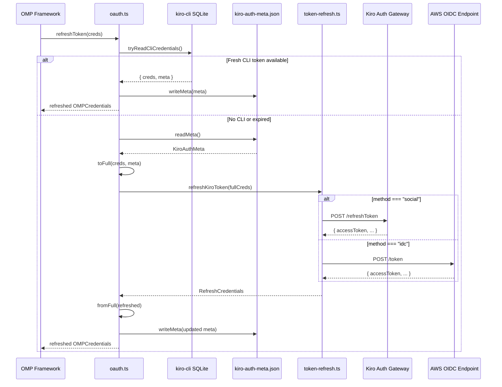

The provider's token refresh subsystem is a dual-path engine that keeps sessions alive across two fundamentally different authentication backends: **social logins** (Google/GitHub via Kiro's own auth gateway) and **AWS SSO OIDC sessions** (Builder ID / IAM Identity Center via Amazon's standard token endpoint). A single exported function — `refreshKiroToken` — serves as the routing gateway, inspecting the credential's `method` field to dispatch to the appropriate backend, with a fast passthrough for API keys that never expire. This design isolates the anti-detection fingerprinting concerns (social requests carry KiroIDE branding; OIDC requests carry AWS SDK branding) while presenting a uniform interface to the rest of the provider.

Sources: [token-refresh.ts](src/auth/token-refresh.ts#L1-L12)

## RefreshCredentials Data Contract

The internal credential type used throughout the refresh module is `RefreshCredentials`, a superset of OMP's minimal credential shape. It carries not just the tokens themselves but all routing metadata needed to select and parameterize the correct refresh endpoint. The `method` field is the discriminant — `"social"`, `"idc"`, or `"apikey"` — while optional fields like `clientId`, `clientSecret`, and `region` are populated conditionally based on the auth source.

| Field | Type | Purpose | Required By |
|-------|------|---------|-------------|
| `access` | `string` | Current access/bearer token | All methods |
| `refresh` | `string` | Token presented to the refresh endpoint | Social, OIDC |
| `expiresAt` | `number` | Unix epoch (ms) when access token expires | All methods |
| `method` | `string` | Auth method discriminator (`"social"` \| `"idc"` \| `"apikey"`) | Routing |
| `clientId` | `string?` | OIDC client registration ID | OIDC only |
| `clientSecret` | `string?` | OIDC client registration secret | OIDC only |
| `region` | `string?` | AWS region for endpoint routing (default: `us-east-1`) | Social, OIDC |
| `profileArn` | `string?` | Kiro profile ARN, forwarded from prior session | Social |

This type lives in [token-refresh.ts](src/auth/token-refresh.ts#L21-L30). The broader system stores a subset of these fields in a separate sidecar metadata file (`KiroAuthMeta`), and the `oauth.ts` module bridges the two shapes through its `toFull` / `fromFull` adapter functions.

Sources: [token-refresh.ts](src/auth/token-refresh.ts#L21-L30), [types.ts](src/types.ts#L186-L196), [oauth.ts](src/oauth.ts#L244-L279)

## Unified Routing: refreshKiroToken

The single entry point `refreshKiroToken` implements a three-branch dispatch. If the method is `"apikey"`, credentials are returned unchanged — API keys have no expiry, so refresh is a no-op. If the method is `"idc"`, the request is routed to the OIDC refresh path. All other methods (including the default `"social"`) fall through to the social refresh path. This means any unrecognized method string gracefully defaults to social behavior rather than throwing, which is a deliberate resilience choice.

```
refreshKiroToken(credentials)
        │
        ├── method === "apikey"  →  return credentials (no-op)
        │
        ├── method === "idc"     →  refreshOidcToken(credentials)
        │
        └── (default)            →  refreshSocialToken(credentials)
```

Sources: [token-refresh.ts](src/auth/token-refresh.ts#L138-L144)

## Social Token Refresh

Social sessions (Google and GitHub logins) refresh through Kiro's own authentication gateway. The endpoint is region-aware: `https://prod.{region}.auth.desktop.kiro.dev/refreshToken`, defaulting to `us-east-1` when no region is specified. The request body is a minimal JSON payload containing only `refreshToken`, and the response is expected to contain at minimum an `accessToken` field, with optional `refreshToken` (rotation), `expiresIn` (seconds until expiry), and `profileArn`.

**Anti-detection fingerprinting** is critical here. The `User-Agent` header is crafted to mimic the Kiro IDE desktop application: `aws-sdk-js/3.0.0 KiroIDE-0.1.0 os/linux lang/js md/nodejs/18.0.0`. This is distinct from the OIDC path's User-Agent and from the API request headers used in [Kiro IDE Header Impersonation and Request Fingerprinting](24-kiro-ide-header-impersonation-and-request-fingerprinting) — each context uses a precisely matched identity.

The expiry calculation applies a **60-second safety margin**: `Date.now() + (expiresIn ?? 3600) * 1000 - 60_000`. This means a token reporting 3600 seconds (1 hour) of validity is treated as if it expires 59 minutes from now, ensuring downstream code always has a non-zero buffer to trigger a refresh before actual expiry. The refresh token itself is also rotated when the server returns a new one, falling back to the existing token if no rotation occurs.

Sources: [token-refresh.ts](src/auth/token-refresh.ts#L36-L76)

## OIDC Token Refresh

AWS SSO OIDC sessions (Builder ID and IAM Identity Center) follow the standard OAuth 2.0 refresh token grant against Amazon's OIDC endpoint: `https://oidc.{region}.amazonaws.com/token`. Unlike social refresh, this path **requires** `clientId` and `clientSecret` — the OIDC client registration that was established during device code authorization (see [AWS SSO OIDC Device Code Flow](9-aws-sso-oidc-device-code-flow)). If either is missing, an immediate error is thrown rather than issuing a doomed request.

The request payload contains four fields: `grantType: "refresh_token"`, `clientId`, `clientSecret`, and `refreshToken`. The `User-Agent` header here impersonates the AWS SDK for JavaScript's SSO-OIDC client: `aws-sdk-js/3.738.0 ua/2.1 os/other lang/js md/browser#unknown_unknown api/sso-oidc#3.738.0 m/E KiroIDE`. The trailing `KiroIDE` tag is consistent with the real Kiro desktop client's behavior but otherwise the header follows the standard AWS SDK format.

The response parsing and expiry calculation mirror the social path exactly: mandatory `accessToken`, optional `refreshToken` rotation, 60-second safety margin on `expiresAt`. This symmetry is intentional — both paths return the same `RefreshCredentials` shape so the caller never needs to know which backend was used.

Sources: [token-refresh.ts](src/auth/token-refresh.ts#L82-L132)

## Error Handling and Account Suspension Detection

Both refresh paths share identical error handling logic. When the HTTP response is non-OK, the response body is read as text and inspected for a `TEMPORARILY_SUSPENDED` substring. If detected, a user-friendly error is thrown: `"Kiro account suspended. Check your Kiro account status."`. This pattern provides early, actionable feedback rather than letting a cryptic HTTP 401/403 propagate. For all other failures, the error message includes the HTTP status code and the first 200 characters of the response body for diagnostics.

After a successful HTTP response, the JSON body is further validated: if `accessToken` is missing or falsy, a dedicated error is thrown. This guards against malformed server responses that would otherwise silently produce invalid credentials.

Sources: [token-refresh.ts](src/auth/token-refresh.ts#L50-L67), [token-refresh.ts](src/auth/token-refresh.ts#L108-L124)

## Integration with the OAuth Module

The `oauth.ts` module is the public surface that OMP calls. Its `refreshToken()` function orchestrates a two-tier strategy. **First**, it attempts to re-read credentials from the kiro-cli SQLite database — since kiro-cli manages its own token lifecycle, this avoids unnecessary network calls and always returns the freshest available token. **Only if** the CLI source is unavailable or its token is already expired does the function fall back to the stored metadata from `kiro-auth-meta.json` and delegate to `refreshKiroToken` for a manual network refresh.

The adapter functions `toFull` and `fromFull` bridge the gap between OMP's minimal `OMPCredentials` shape (just `access`, `refresh`, `expires`) and the richer `FullCredentials`/`RefreshCredentials` shape. The sidecar metadata file (`~/.omp/agent/kiro-auth-meta.json`) persists the `method`, `clientId`, `clientSecret`, `region`, and `profileArn` fields between sessions, since OMP's credential store doesn't include them. After every successful refresh, the metadata file is updated with any new values (particularly `profileArn` and rotated `refreshToken`).



Sources: [oauth.ts](src/oauth.ts#L380-L396), [oauth.ts](src/oauth.ts#L255-L279), [oauth.ts](src/oauth.ts#L34-L51)

## Comparative Overview: Social vs. OIDC Refresh

| Aspect | Social Refresh | OIDC Refresh |
|--------|---------------|--------------|
| **Endpoint** | `prod.{region}.auth.desktop.kiro.dev/refreshToken` | `oidc.{region}.amazonaws.com/token` |
| **Auth backend** | Kiro's own gateway (Google/GitHub) | AWS SSO OIDC (Builder ID / IDC) |
| **Required credentials** | `refresh` token only | `refresh` + `clientId` + `clientSecret` |
| **User-Agent** | `KiroIDE-0.1.0` branded | `aws-sdk-js/3.738.0` with `KiroIDE` tag |
| **Request body fields** | `{ refreshToken }` | `{ grantType, clientId, clientSecret, refreshToken }` |
| **Default `expiresIn`** | 3600s (1 hour) | 3600s (1 hour) |
| **Safety margin** | 60 seconds | 60 seconds |
| **Token rotation** | Yes (conditional) | Yes (conditional) |
| **Region default** | `us-east-1` | `us-east-1` |

Sources: [token-refresh.ts](src/auth/token-refresh.ts#L36-L76), [token-refresh.ts](src/auth/token-refresh.ts#L82-L132)

## Downstream Reading

The refresh system is one link in the authentication chain. For the full picture of how credentials are initially obtained and how the sidecar metadata persists across sessions, see [API Key and Sidecar Metadata Persistence](11-api-key-and-sidecar-metadata-persistence). For the OIDC device code flow that establishes the `clientId`/`clientSecret` pair required by OIDC refresh, see [AWS SSO OIDC Device Code Flow](9-aws-sso-oidc-device-code-flow). For how the broader credential auto-detection prioritizes sources before refresh is ever needed, see [Authentication Methods and Credential Auto-Detection](8-authentication-methods-and-credential-auto-detection).