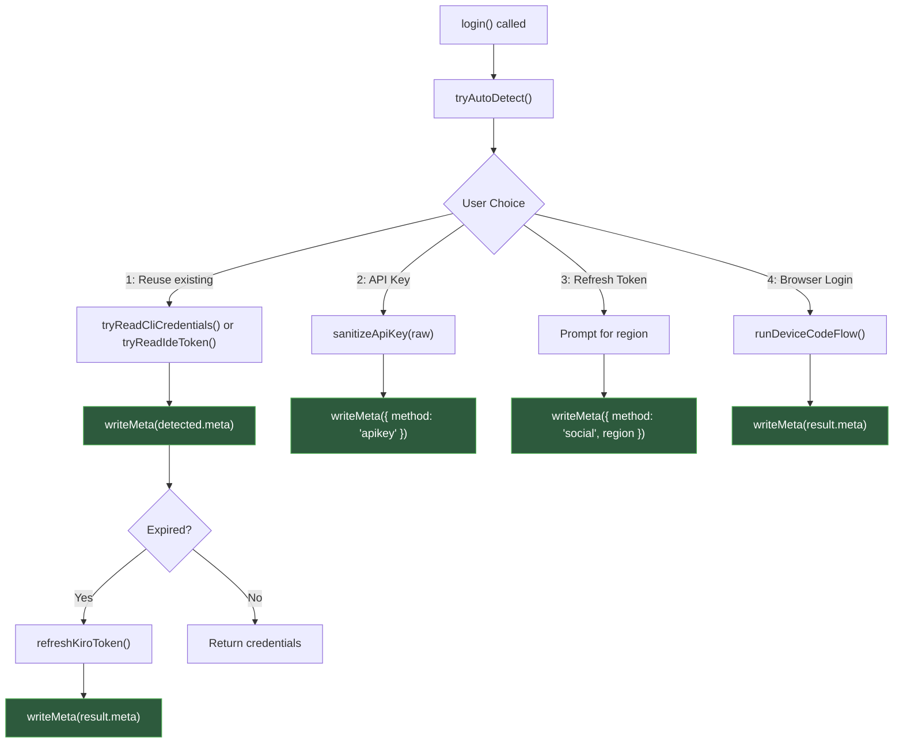
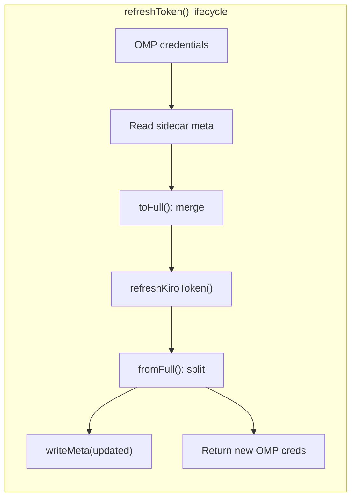

The Kiro OMP provider operates at the intersection of two credential schemas: **OMP's generic OAuth contract** (`access`, `refresh`, `expires`) and **Kiro's authentication-specific metadata** (method, OIDC client registration, region, profileArn). Because OMP's `OAuthCredentials` type lacks fields for authentication method discrimination and OIDC client secrets, the provider persists Kiro-specific metadata in a **sidecar JSON file** at `~/.omp/agent/kiro-auth-meta.json`. This dual-store architecture means every login path writes its metadata alongside OMP credentials, every token refresh reads metadata to route correctly, and every streaming request reads metadata to construct API headers with the right authentication context. The design is a pragmatic compromise — it avoids modifying OMP's provider contract while preserving the full fidelity of Kiro's multi-method authentication system.

Sources: [oauth.ts](src/oauth.ts#L1-L28), [types.ts](src/types.ts#L186-L196)

## The Credential Schema Split

OMP's provider contract expects a flat credential object with three fields: `access` (the bearer token), `refresh` (the refresh token), and `expires` (a Unix timestamp in milliseconds). This schema works for simple OAuth flows but cannot express Kiro's authentication diversity. A **social login** (Google/GitHub) needs only the token endpoint region. An **IDC login** (Builder ID / IAM Identity Center) requires `clientId`, `clientSecret`, and `region` for OIDC token refresh. An **API key** (`ksk_xxx`) needs no refresh at all but must be flagged so the refresh path skips it. And a `profileArn` — required in API requests for non-social auth — has no home in OMP's schema.

The sidecar file bridges this gap. Its shape is defined by the `KiroAuthMeta` interface:

| Field | Type | Purpose | Used By |
|---|---|---|---|
| `method` | `"social" \| "idc" \| "apikey"` | Discriminates auth method for refresh routing | `refreshKiroToken()`, `core.ts` |
| `clientId` | `string` (optional) | OIDC client ID for IDC refresh | `refreshOidcToken()` |
| `clientSecret` | `string` (optional) | OIDC client secret for IDC refresh | `refreshOidcToken()` |
| `region` | `string` (optional) | AWS region for token endpoint routing | `refreshSocialToken()`, `refreshOidcToken()` |
| `profileArn` | `string` (optional) | AWS profile ARN sent in API requests | `buildKiroPayload()`, `resolveProfileArn()` |

Sources: [types.ts](src/types.ts#L186-L196), [oauth.ts](src/oauth.ts#L57-L61)

## Sidecar File I/O

The persistence layer consists of two functions — `readMeta()` and `writeMeta()` — that operate on the canonical path `~/.omp/agent/kiro-auth-meta.json`. Both functions are **best-effort**: read failures return `null`, write failures are silently swallowed. This design choice reflects the reality that the sidecar is a performance optimization, not a correctness requirement — the system can always re-derive metadata from auth sources.

The `writeMeta()` function ensures the parent directory exists with `mkdirSync(..., { recursive: true, mode: 0o700 })` and writes the file with mode `0o600` (owner read/write only), protecting sensitive OIDC client secrets from other users on the system. The JSON is pretty-printed (`JSON.stringify(meta, null, 2)`) for human inspectability during debugging.

```typescript
// Read — returns null on any failure
function readMeta(): KiroAuthMeta | null {
  try {
    if (!existsSync(META_PATH)) return null
    return JSON.parse(readFileSync(META_PATH, "utf-8")) as KiroAuthMeta
  } catch {
    return null
  }
}

// Write — best-effort, creates directory if needed
function writeMeta(meta: KiroAuthMeta): void {
  try {
    const dir = dirname(META_PATH)
    if (!existsSync(dir)) mkdirSync(dir, { recursive: true, mode: 0o700 })
    writeFileSync(META_PATH, JSON.stringify(meta, null, 2), { mode: 0o600 })
  } catch { /* Best effort */ }
}
```

Sources: [oauth.ts](src/oauth.ts#L27-L51)

## Metadata Write Points in the Login Flow

Every login path in the `login()` function writes sidecar metadata immediately after deriving credentials. The following diagram shows where `writeMeta()` is called across the four authentication methods:



Each write point captures the **minimal metadata** needed for future refresh and routing. An API key login writes only `{ method: "apikey" }` — no tokens, no region, no secrets. A refresh token login writes `{ method: "social", region }`. A device code flow writes the full set including `clientId`, `clientSecret`, and `region`. This graduated approach avoids storing unnecessary secrets while ensuring every refresh path has exactly the data it needs.

Sources: [oauth.ts](src/oauth.ts#L293-L374)

## API Key Handling and Sanitization

When the user provides an API key (the `ksk_xxx` prefix identifies it), the provider creates an **effectively non-expiring** OMP credential by setting `expires` to `Date.now() + 10 * 365 * 24 * 60 * 60 * 1000` (10 years in the future). This prevents OMP from ever triggering a refresh cycle for API keys, since the `refreshKiroToken()` function short-circuits when `method === "apikey"`:

```typescript
if (credentials.method === "apikey") return credentials
```

Before storage, the raw user input passes through `sanitizeApiKey()`, which strips three classes of noise that commonly appear during copy-paste operations: surrounding quotation marks and backticks (`'ksk_xxx'`, `` `ksk_xxx` ``), terminal paste wrappers that may include bracket-escaped control sequences, and embedded control characters (`\x00-\x1F`, `\x7F`). The function also trims surrounding whitespace.

| Sanitization Step | Pattern | Rationale |
|---|---|---|
| Quote stripping | `/^['"`]+\|['"`]+$/g` | Shell and editor paste artifacts |
| Control char removal | `/[\x00-\x1F\x7F]/g` | Terminal escape sequences |
| Whitespace trim | `.trim()` | Leading/trailing spaces |

Sources: [oauth.ts](src/oauth.ts#L26-L66), [token-refresh.ts](src/auth/token-refresh.ts#L138-L144)

## Token Refresh and Metadata Round-Trip

The `refreshToken()` function demonstrates the full metadata lifecycle — reading the sidecar, using it to route the correct refresh strategy, and writing back updated metadata. The flow has two tiers:

**Tier 1 — kiro-cli re-read.** For IDC auth, the function first attempts to re-read credentials from the kiro-cli SQLite database. Because kiro-cli manages its own token lifecycle and keeps tokens fresh, this avoids unnecessary network calls. If the CLI credentials are valid and unexpired, the function writes the CLI's metadata to the sidecar (in case the previous login was from a different source) and returns immediately.

**Tier 2 — Manual refresh using sidecar metadata.** If the CLI is unavailable or its tokens are expired, the function falls back to the sidecar metadata. It reads the stored `KiroAuthMeta`, combines it with OMP's current credentials using `toFull()`, delegates to `refreshKiroToken()` (which routes to either `refreshSocialToken()` or `refreshOidcToken()` based on `method`), then writes the updated metadata back via `fromFull()` → `writeMeta()`.



The `toFull()` and `fromFull()` adapter functions translate between the split schema (OMP credentials + sidecar metadata) and the unified `FullCredentials` / `RefreshCredentials` shape that the refresh functions expect. This bidirectional conversion ensures the sidecar stays in sync with the latest token refresh response — for example, if the server rotates the refresh token or returns an updated `profileArn`.

Sources: [oauth.ts](src/oauth.ts#L255-L396), [token-refresh.ts](src/auth/token-refresh.ts#L138-L144)

## Sidecar Consumption in the Streaming Layer

The `core.ts` streaming factory reads the sidecar file **directly** at the start of each request lifecycle. It does not go through `readMeta()` — instead, it performs an inline read of `~/.omp/agent/kiro-auth-meta.json` to extract `method` and `profileArn`. This data drives two critical decisions:

1. **Auth method detection** — The `isApiKey` flag (derived from the `ksk_` prefix) determines which header template to use. The `authMethod` from the sidecar refines this further for profileArn handling.

2. **ProfileArn resolution** — For social auth (`method === "social"`), the sidecar's `profileArn` is used directly. For non-social auth, the system falls back to a dynamic `ListAvailableProfiles` API call (cached per endpoint) to resolve the ARN at runtime. This conditional strategy avoids sending an unnecessary API call when the ARN is already known from the login flow.

The sidecar read in `core.ts` is also best-effort — if the file is missing or corrupt, the code defaults to `authMethod = "social"` and proceeds with dynamic ARN resolution.

Sources: [core.ts](src/core.ts#L253-L266), [core.ts](src/core.ts#L452-L454)

## Architecture Summary

The following table summarizes the three-way relationship between OMP credentials, the sidecar metadata, and their consumers:

| Component | Storage Location | Written By | Read By |
|---|---|---|---|
| OMP credentials (`access`, `refresh`, `expires`) | OMP's internal credential store | `login()`, `refreshToken()` | `getApiKey()`, OMP refresh cycle |
| Sidecar metadata (`method`, `clientId`, etc.) | `~/.omp/agent/kiro-auth-meta.json` | `login()` (all paths), `refreshToken()` | `refreshToken()`, `core.ts` streaming |
| Auth method detection (`isApiKey`) | In-memory per request | `core.ts` (prefix check) | `buildKiroHeaders()` |

This separation means the provider never modifies OMP's credential schema, remains compatible with any OMP version, and retains full Kiro authentication context across restarts. The sidecar acts as a **private extension** of OMP's public contract — invisible to OMP, essential to Kiro's multi-method auth routing.

Sources: [oauth.ts](src/oauth.ts#L34-L51), [core.ts](src/core.ts#L253-L266), [index.ts](index.ts#L83-L99)

## Related Pages

- [Authentication Methods and Credential Auto-Detection](8-authentication-methods-and-credential-auto-detection) — covers the four auth sources and the auto-detection priority chain that populates the sidecar.
- [Token Refresh for Social and OIDC Sessions](10-token-refresh-for-social-and-oidc-sessions) — details the refresh implementations that consume sidecar metadata.
- [AWS SSO OIDC Device Code Flow](9-aws-sso-oidc-device-code-flow) — documents the browser login flow that writes the richest sidecar metadata (including OIDC client registration).
- [Architecture Overview and Module Responsibilities](5-architecture-overview-and-module-responsibilities) — provides the module-level context for how `oauth.ts` fits into the overall provider architecture.