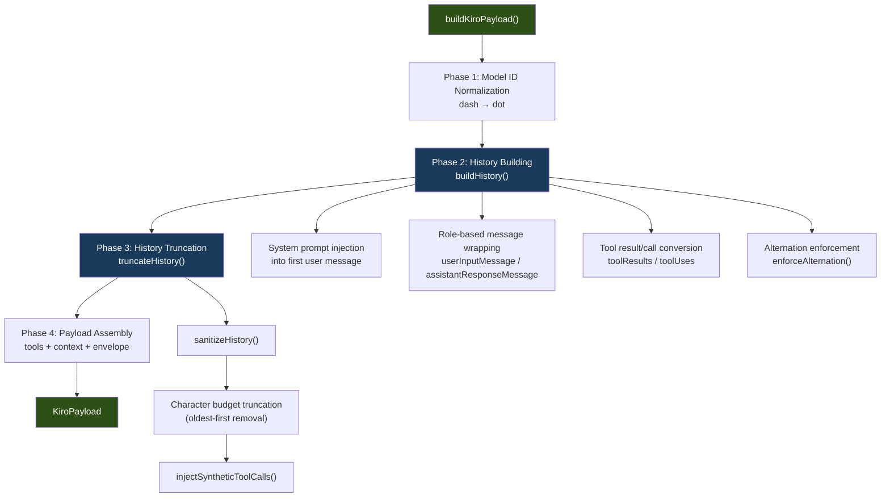
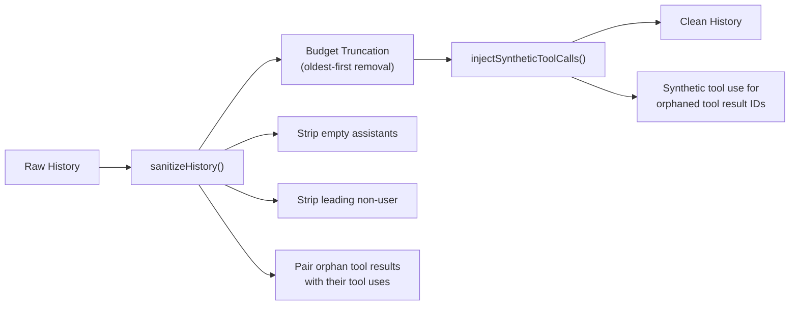

The conversion layer bridges OMP's provider-agnostic message contract with Kiro's proprietary conversation API format. Housed entirely in `src/converters.ts`, it translates the universal `ContextLike` structure — a flat list of messages, optional system prompt, and tool definitions — into the nested `conversationState` envelope that Kiro's backend expects. This is not a naive field mapping: the converter enforces Kiro's strict constraints on history alternation, tool name length, empty content handling, and context-window-aware truncation, ensuring every outbound payload is structurally valid before the first network byte is written.

Sources: [converters.ts](src/converters.ts#L1-L22), [types.ts](src/types.ts#L91-L108)

## OMP Contract vs. Kiro API: Structural Mismatch

OMP's internal representation is simple and role-symmetric: a flat array of `MessageLike` objects, each with a `role` of `"user"` or `"assistant"`, optional `toolCalls`, and optional `toolResults`. The system prompt sits outside the message stream entirely, as a property on `ContextLike`. Kiro's API, by contrast, imposes a deeply nested envelope with rigid requirements:

| Aspect | OMP (`ContextLike`) | Kiro (`conversationState`) |
|---|---|---|
| **System prompt** | `context.systemPrompt` (standalone field) | Prepended to first `userInputMessage.content` |
| **Current message** | Last element of `context.messages[]` | `conversationState.currentMessage.userInputMessage` |
| **History** | `context.messages[0..n-1]` (flat array) | `conversationState.history[]` (alternating user/assistant) |
| **Tools** | `context.tools[]` (top-level array) | `userInputMessageContext.tools` (nested in current message) |
| **Tool results** | `message.toolResults[]` (on user messages) | `userInputMessageContext.toolResults` (nested in user message) |
| **Tool calls** | `message.toolCalls[]` (on assistant messages) | `assistantResponseMessage.toolUses[]` |
| **Empty content** | Empty string `""` | Placeholder text `"(empty placeholder)"` |
| **Model ID format** | Dash-separated: `claude-sonnet-4-5` | Dot-separated: `claude-sonnet-4.5` |
| **Message origin** | Not tracked | `"KIRO_CLI"` (current) / `"AI_EDITOR"` (history) |

The converter resolves every one of these mismatches. Understanding them is prerequisite to following the conversion pipeline.

Sources: [types.ts](src/types.ts#L91-L108), [converters.ts](src/converters.ts#L1-L22)

## Conversion Pipeline Architecture

The public entry point is `buildKiroPayload()`, a pure function that accepts a model ID, a `ContextLike`, an optional `profileArn`, an optional `conversationId`, and an optional `contextWindow`. It orchestrates five sequential phases:



Each phase is described in detail in the sections that follow.

Sources: [converters.ts](src/converters.ts#L433-L495)

## Phase 1 — Model ID Normalization

OMP uses dash-separated model identifiers (e.g., `claude-sonnet-4-5`), while Kiro expects dot notation (e.g., `claude-sonnet-4.5`). The normalization is a targeted regex that matches only digit-dash-digit sequences, avoiding false positives on identifiers like `model-3-20250101`:

```typescript
const kiroModelId = modelId.replace(/(\d)-(\d)(?!\d)/g, "$1.$2")
```

The negative lookahead `(?!\d)` ensures that multi-digit sequences are handled correctly — only the boundary between two single digits triggers replacement. This runs once per request at the top of `buildKiroPayload()`.

Sources: [converters.ts](src/converters.ts#L444-L447)

## Phase 2 — History Building

The `buildHistory()` function partitions the OMP message array into two segments: all messages except the last become `history`, and the final message becomes the `currentMessage`. This partitioning is critical because Kiro treats the current message differently from history — it sits at a separate path in the envelope and carries tools and the active origin marker.

**System prompt injection.** Kiro has no dedicated system prompt field. The converter prepends the system prompt to the first user message's content, separated by `\n\n`. If there are no history messages (single-turn conversations), the system prompt is instead prepended to the current message content. A `systemInjected` flag ensures the prompt is only added once, never duplicated.

**Role-based wrapping.** Each OMP message is wrapped in its Kiro-specific container based on role:

| OMP Role | Kiro Wrapper | Key Fields |
|---|---|---|
| `"user"` | `{ userInputMessage: {...} }` | `content`, `modelId`, `origin: "AI_EDITOR"`, `userInputMessageContext?` |
| `"assistant"` | `{ assistantResponseMessage: {...} }` | `content`, `toolUses?` |

**Tool result/call conversion.** OMP tool calls on assistant messages are mapped to Kiro's `toolUses` array (renaming `id` → `toolUseId`, `arguments` → `input`, with name truncation). OMP tool results on user messages are mapped to `userInputMessageContext.toolResults` (renaming `toolCallId` → `toolUseId`).

**Alternation enforcement.** After wrapping, `enforceAlternation()` ensures the history strictly alternates between user and assistant messages — a hard Kiro API constraint. Two correction mechanisms are applied: (1) if the history starts with an assistant message, a synthetic user message with content `"(continued)"` is prepended; (2) if consecutive messages share the same role, their content is merged (concatenated with `\n`) and their tool arrays are unioned. This merge-and-continue strategy preserves information that naive filtering would lose.

Sources: [converters.ts](src/converters.ts#L279-L413)

## Phase 3 — History Truncation and Sanitization

Long conversations must be truncated to fit within Kiro's context window. The converter uses a character-based budget calibrated at 850,000 characters for a 200K-token context window, dynamically scaled to the model's actual context window:

```typescript
const dynamicLimit = Math.floor((contextWindow / HISTORY_LIMIT_CONTEXT_WINDOW) * HISTORY_LIMIT)
```

The `truncateHistory()` function applies three sanitization passes in sequence:



**sanitizeHistory()** strips leading non-user messages, removes empty assistant messages (those with no content and no tool uses — typically artifacts from API errors), and ensures tool-use/tool-result pairs remain structurally paired. Any assistant entry with `toolUses` must be followed by a user entry with matching `toolResults`, and vice versa.

**Budget truncation** removes the oldest entries first, then re-sanitizes to maintain alternation integrity. This loop continues until the JSON-serialized history fits within the character limit or only two entries remain.

**injectSyntheticToolCalls()** is a defensive measure: it scans for tool results whose `toolUseId` doesn't match any tool use in the history (orphaned results from truncation or malformed data) and injects synthetic assistant messages with a `"unknown_tool"` placeholder to prevent API rejection.

Sources: [converters.ts](src/converters.ts#L139-L231)

## Phase 4 — Payload Assembly

With history built and truncated, the final payload is assembled. The `currentMessage` carries the last OMP message wrapped as a `userInputMessage` with origin `"KIRO_CLI"` (distinct from history's `"AI_EDITOR"`). Tools and tool results for the current message are nested inside `userInputMessageContext`. The complete envelope structure is:

```typescript
{
  conversationState: {
    conversationId: "<uuid>",
    chatTriggerType: "MANUAL",
    agentTaskType: "vibe",
    currentMessage: {
      userInputMessage: {
        content: "<system prompt>\n\n<user content>",
        modelId: "claude-sonnet-4.5",
        origin: "KIRO_CLI",
        userInputMessageContext?: {
          tools?: [{ name, description, inputSchema }],
          toolResults?: [{ toolUseId, content }],
        },
      },
    },
    history?: [/* alternating user/assistant entries */],
  },
  profileArn?: "arn:aws:...",
  agentMode: "vibe",
}
```

The `conversationId` is generated via `randomUUID()` unless one is explicitly provided. `profileArn` is conditionally included only when present — omitted entirely for Builder ID authentication. The `agentMode` and `agentTaskType` are both hardcoded to `"vibe"`.

Sources: [converters.ts](src/converters.ts#L419-L495)

## Tool Name Truncation and the Reverse Map

Kiro enforces a 64-character maximum on tool names. Since OMP tools may have longer names (e.g., deeply namespaced MCP tools), the converter truncates names while maintaining reversibility through an in-memory `Map<string, string>`:

The truncation algorithm preserves as much of the original name as possible, replacing the tail with a 4-character hexadecimal hash suffix prefixed by `_t`. For example, a 100-character tool name becomes a 64-character string ending in `_t3a7f`. The `simpleHash()` function uses a deterministic bitwise hash, ensuring the same name always produces the same suffix. The `resolveToolName()` export allows the streaming layer to reverse-map truncated names back to originals when processing Kiro's tool-use responses. The truncation map is cleared at the start of each request via `clearTruncationMap()` to prevent cross-request contamination.

Sources: [converters.ts](src/converters.ts#L27-L65)

## Content Extraction and Edge Cases

The `textContent()` helper normalizes OMP's polymorphic content field into a plain string. OMP content can be a plain string or an array of typed content blocks (`{ type: "text", text: "..." }`). The helper filters for text blocks and concatenates them, falling back to `String()` coercion for unexpected types.

Empty content is a first-class concern. Kiro rejects empty strings, so the converter replaces them with the literal placeholder `"(empty placeholder)"` at two points: during history construction and when preparing the current message. This ensures every message in the payload carries non-empty content regardless of OMP's input.

Sources: [converters.ts](src/converters.ts#L71-L81), [converters.ts](src/converters.ts#L306-L307), [converters.ts](src/converters.ts#L347)

## Integration with the Streaming Pipeline

The converter is consumed in `core.ts` during the streaming factory's request preparation. Before calling `buildKiroPayload()`, the core layer may modify the system prompt — prepending thinking mode directives (`<thinking_mode>enabled</thinking_mode>`) when reasoning is active. This modified `ContextLike` is passed to the converter, which remains unaware of reasoning concerns and treats the prepended directives as ordinary system prompt text.

The resulting `KiroPayload` is sent as the HTTP request body to Kiro's chat endpoint. After the response arrives, `resolveToolName()` is used to reverse-map truncated tool names found in the response's tool-use events back to their original OMP names, completing the round-trip conversion.

Sources: [core.ts](src/core.ts#L460-L475), [core.ts](src/core.ts#L33)

## Key Design Decisions

| Decision | Rationale |
|---|---|
| **Pure function** (`buildKiroPayload`) | No side effects, trivially testable. The only stateful element is the per-request truncation map, which is cleared at entry. |
| **Character-based history budget** | Token counting is expensive and model-dependent. Character counting is a fast, conservative proxy — 850K characters safely fits within 200K tokens. |
| **Merge-over-drop for alternation** | When consecutive same-role messages appear, merging preserves all content. Dropping would silently lose user input or assistant reasoning. |
| **Synthetic tool calls for orphans** | Orphaned tool results cause API errors. Injecting a synthetic `"unknown_tool"` entry is the minimal safe fix that prevents rejection without fabricating meaningful data. |
| **System prompt prepending** | Kiro has no system prompt field. Prepending to the first user message is the standard workaround used by the kiro-gateway reference implementation. |

Sources: [converters.ts](src/converters.ts#L1-L22), [converters.ts](src/converters.ts#L139-L142), [converters.ts](src/converters.ts#L356-L413), [converters.ts](src/converters.ts#L182-L214)

## Related Pages

- [Tool Name Truncation and Reverse Mapping](13-tool-name-truncation-and-reverse-mapping) — deep dive into the hash algorithm, collision resistance, and reverse-map lifecycle
- [History Sanitization, Orphan Repair, and Trimming](14-history-sanitization-orphan-repair-and-trimming) — detailed analysis of the sanitization and truncation passes
- [Core Streaming Factory and Request Lifecycle](15-core-streaming-factory-and-request-lifecycle) — where `buildKiroPayload` is invoked within the streaming pipeline
- [Testing the Converter and Event Stream Decoder](26-testing-the-converter-and-event-stream-decoder) — test coverage for every conversion path described here