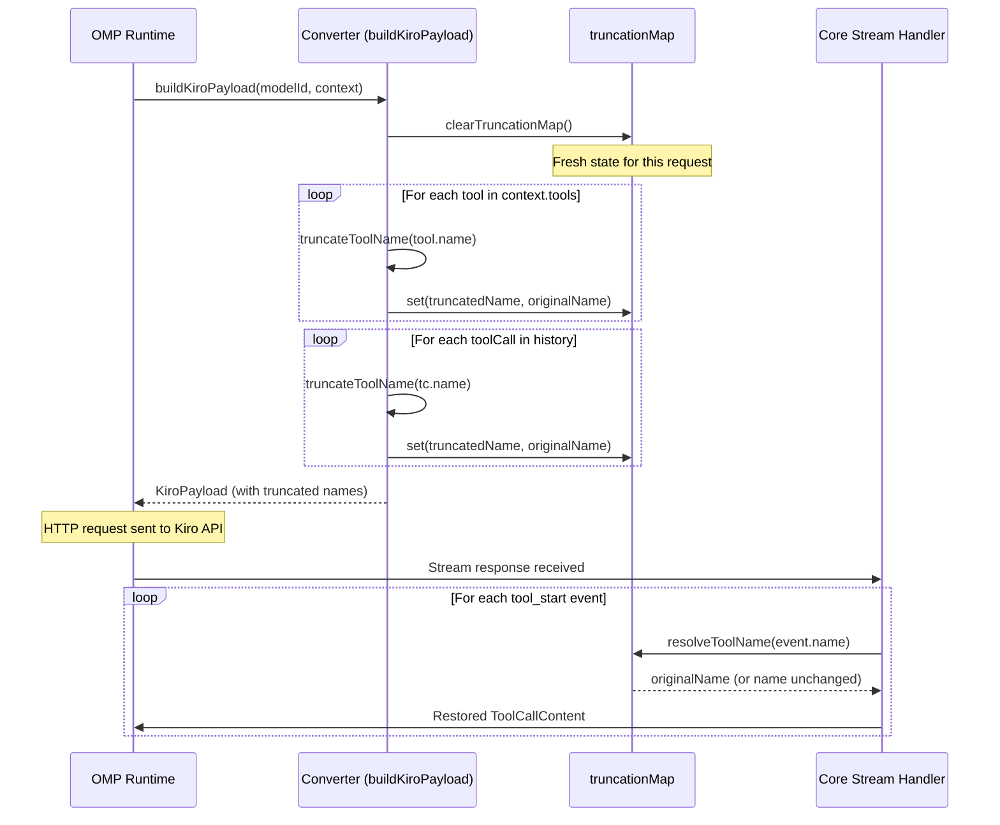

The Kiro API enforces a hard **64-character limit** on tool names. When the OMP provider supplies tools with names exceeding this boundary — common with deeply-qualified MCP tool identifiers or verbose namespacing conventions — the converter layer must truncate them before transmission while preserving the ability to restore the original names when Kiro's response references those truncated identifiers. This page documents the truncation algorithm, the module-scoped reverse mapping that bridges request-to-response name translation, and the lifecycle semantics that keep the mapping consistent within a single request cycle.

Sources: [converters.ts](src/converters.ts#L19-L19)

## The Constraint: Kiro's 64-Character Tool Name Limit

The Kiro gateway rejects requests containing tool definitions whose `name` field exceeds 64 characters. This is a protocol-level constraint documented in the converter module's header comment, derived from the upstream `kiro-gateway converters_core.py` specification. The constant `KIRO_MAX_TOOL_NAME = 64` encodes this boundary. Every tool name that passes through the conversion pipeline — whether from the initial tool definitions attached to a request or from tool call records embedded in conversation history — is subject to truncation. Short names pass through untouched; names exceeding the limit undergo a deterministic compression that preserves uniqueness via a hash suffix.

Sources: [converters.ts](src/converters.ts#L31-L31), [converters.ts](src/converters.ts#L19-L19)

## Truncation Algorithm: Prefix Preservation with Hash Suffix

The `truncateToolName` function implements a **maximal prefix preservation** strategy. Rather than arbitrarily slicing a name, it retains as much of the original leading substring as the 64-character budget allows, then appends a `_t` prefix followed by a 4-character hex hash derived from the full original name. The suffix format `_tXXXX` occupies 6 characters (underscore, `t`, and 4 hex digits), leaving 58 characters for the original prefix. This design ensures that: (1) the truncated name remains visually recognizable to human readers inspecting payloads, and (2) different original names that share a common prefix still produce distinct truncated forms because the hash incorporates the entire original string.

The hash itself is computed by `simpleHash`, a deterministic DJB2-variant algorithm. It iterates over each character of the input string, accumulating via the formula `h = ((h << 5) - h + charCode) | 0` — effectively `h * 31 + charCode` with 32-bit integer truncation. The unsigned conversion `(h >>> 0)` ensures positive values before extracting the last 4 hex characters via `.toString(16).slice(0, 4)`. The `.padStart(4, "0")` guarantees a fixed-width suffix even when the hex representation is shorter than 4 digits.

```
Original name (100 chars):  "aaaa...aaaa" (100 × 'a')
Hash suffix:                 "_t" + simpleHash("aaaa...aaaa") → "_t2917"
Truncated name (64 chars):   "aaaa...aaaa_t2917"  (58 × 'a' + "_t2917")
```

Sources: [converters.ts](src/converters.ts#L37-L46), [converters.ts](src/converters.ts#L59-L65)

## Reverse Mapping: Module-Scoped State and Lifecycle

The truncation system relies on a **module-level `Map<string, string>`** named `truncationMap` that stores the mapping from each truncated name back to its original form. This map is populated as a side effect of `truncateToolName` — every time a name is truncated, the function inserts an entry via `truncationMap.set(truncated, name)`. The corresponding reverse lookup, `resolveToolName`, is the system's only exported read path: it checks the map and falls back to returning the name unchanged, which correctly handles names that were never truncated.

The map's lifecycle is explicitly managed. The `clearTruncationMap` function resets the map at the start of each request cycle, invoked as the first line inside `buildKiroPayload`. This ensures that mappings from a previous request never leak into the current one — a critical guarantee because different requests may define entirely different tool sets. The entire flow operates as a **two-phase pattern** within a single request:



Sources: [converters.ts](src/converters.ts#L33-L55), [converters.ts](src/converters.ts#L441-L441), [core.ts](src/core.ts#L362-L372)

## Points of Application: Where Truncation Touches the Pipeline

Truncation is applied at exactly **two conversion sites** within the converter module, both producing Kiro-format output from OMP-format input:

| Site | Function | Context | Purpose |
|---|---|---|---|
| **Tool definitions** | `toolsToKiroFormat` | Current message's `userInputMessageContext.tools` | Truncates tool names in the tool schema sent to Kiro so the model knows which tools are available |
| **Tool call history** | `toolCallsToKiroToolUses` | History assistant messages' `toolUses` arrays | Truncates tool names in historical tool call records so Kiro can correlate them with previously-defined truncated tools |

The reverse mapping is consumed at exactly **one site** in the core streaming module: the `"tool_start"` event handler inside the stream processing loop. When Kiro responds with a tool invocation, the event's `name` field contains the truncated name (or an unmodified name if it was short enough). The `resolveToolName` call at that point restores the original name before constructing the `ToolCallContent` object that gets emitted to the OMP runtime. This is the only place where the original name matters — the OMP layer must dispatch tool execution using the full, unmodified tool identifier.

Sources: [converters.ts](src/converters.ts#L91-L99), [converters.ts](src/converters.ts#L120-L130), [core.ts](src/core.ts#L362-L372)

## Architectural Implications and Design Trade-offs

The choice of a module-level singleton `Map` for the reverse mapping introduces a deliberate trade-off: it provides O(1) lookup performance and zero serialization overhead, but it couples the truncation state to the module's evaluation scope rather than the request's call stack. This is safe **only** because the OMP runtime processes requests sequentially — the `clearTruncationMap()` call at the top of `buildKiroPayload` guarantees that each request starts with a clean slate. If the provider were ever extended to support concurrent request processing, this pattern would require refactoring to either a per-request closure or an explicit state object threaded through the conversion pipeline.

The hash suffix strategy also carries a theoretical collision risk: two distinct original names could produce the same 4-hex-character suffix, and if those names additionally share a 58-character prefix, their truncated forms would collide. In practice, this is astronomically unlikely — the probability is 1/65536 per pair — and the worst-case consequence is that `resolveToolName` would return the wrong original name for one of the colliding tools, which would manifest as a tool dispatch error at the OMP layer. The 4-character width was chosen as a practical balance between truncation budget (consuming only 6 of 64 characters) and collision resistance.

The `resolveToolName` function is the **only export** from the truncation subsystem. All other components — `truncateToolName`, `clearTruncationMap`, `simpleHash`, and `truncationMap` itself — are module-private. The core module re-exports everything from converters via `export * from "./converters.ts"`, making `resolveToolName` available transitively, but the internal machinery remains encapsulated.

Sources: [converters.ts](src/converters.ts#L37-L51), [core.ts](src/core.ts#L38-L38)

## Test Coverage

The test suite includes a dedicated case in the `buildKiroPayload` describe block that verifies the 64-character truncation boundary. The test constructs a tool with a 100-character name, builds a payload, and asserts that the resulting tool name in `userInputMessageContext.tools` is exactly 64 characters long. This validates the truncation path but does **not** verify the reverse mapping or the hash suffix format — those behaviors are exercised implicitly through integration with the core streaming module during tool call round-trips.

Sources: [test-converters.ts](tests/test-converters.ts#L101-L115)

## Related Pages

- [OMP-to-Kiro Conversation Format Conversion](12-omp-to-kiro-conversation-format-conversion) — the broader conversion pipeline within which truncation operates
- [Native Tool Call Event Processing](21-native-tool-call-event-processing) — how `resolveToolName` is called during stream decoding
- [Bracket-Style Tool Call Fallback Parser](22-bracket-style-tool-call-fallback-parser) — the alternative tool call parser that operates on text output and may encounter truncated names in model responses