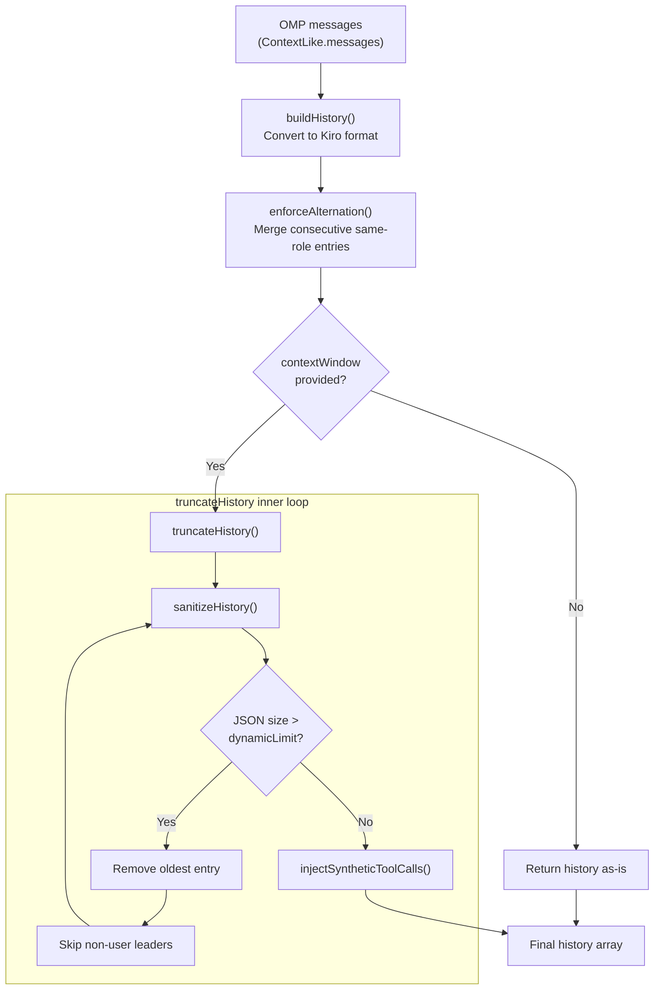
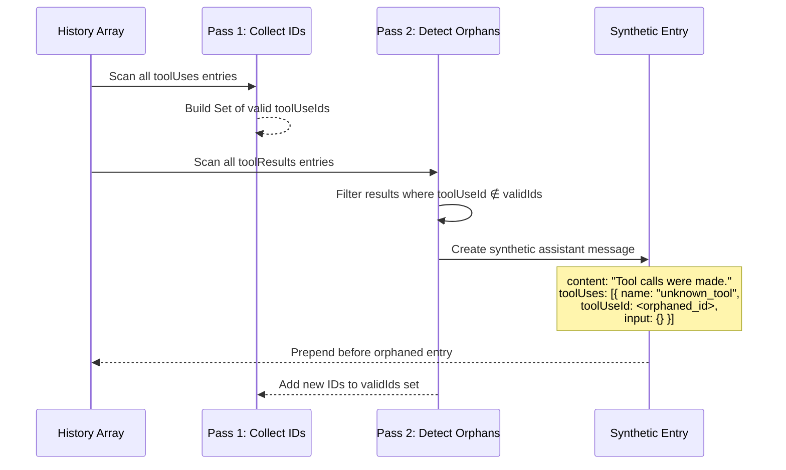
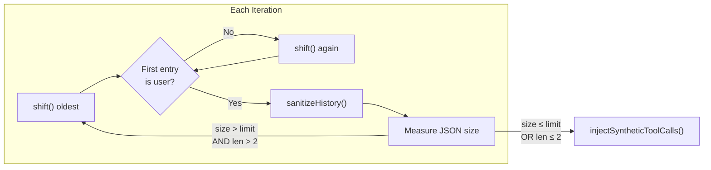

The Kiro API enforces strict structural constraints on the conversation `history` array it receives — it must alternate between user and assistant messages, begin with a user message, and remain within a character budget calibrated to the model's context window. The OMP provider therefore runs every conversation through a **four-stage pipeline** before transmitting it: format conversion → alternation enforcement → sanitization + trimming → orphan repair. This page dissects the three post-conversion stages — sanitization, orphan repair, and trimming — that collectively guarantee a valid, compact, and structurally sound history payload.

Sources: [converters.ts](src/converters.ts#L139-L141)

## The History Processing Pipeline

The pipeline is triggered inside `buildKiroPayload`, the public entry point that assembles the final Kiro request body. After `buildHistory` converts raw OMP messages into Kiro-formatted entries and `enforceAlternation` guarantees the user/assistant alternation invariant, the optional truncation path activates when a `contextWindow` value is available. This path chains `sanitizeHistory` → character-based trimming → `sanitizeHistory` (re-applied) → `injectSyntheticToolCalls` to produce the final history array.

Sources: [converters.ts](src/converters.ts#L433-L458)



### Dynamic Character Limit Scaling

The base character budget is `HISTORY_LIMIT = 850,000`, calibrated against a reference window of `HISTORY_LIMIT_CONTEXT_WINDOW = 200,000` tokens. When a model provides its own `contextWindow`, the limit scales linearly:

```
dynamicLimit = floor((model.contextWindow / 200,000) × 850,000)
```

This means a model with a 1M-token context window receives a budget of approximately 4.25 million characters, while a 200K-token model stays at the 850K baseline. The scaling is intentionally conservative — it uses character count as a rough proxy for token count rather than running an exact tokenizer, trading precision for zero-latency overhead.

Sources: [converters.ts](src/converters.ts#L139-L142), [converters.ts](src/converters.ts#L454-L458), [models.json](models.json#L8)

## Stage 1 — History Sanitization

The `sanitizeHistory` function performs two structural cleanups that protect against malformed history arrays:

**Leading-entry cleanup.** The Kiro API rejects histories that start with an assistant message that carries no tool uses. The function strips such entries from the front of the array, since a leading assistant response without a preceding tool call has no contextual anchor and indicates a truncated or errored conversation prefix.

**Content-and-linkage validation.** The function iterates through all entries with a forward-looking and backward-looking linkage check. Assistant messages that contain neither text content nor tool uses are silently dropped — these typically arise from API error responses where the model produced no useful output. Tool-use entries (assistant messages with `toolUses`) are kept only if they are immediately followed by a user message containing matching `toolResults`. Conversely, tool-result entries (user messages with `toolResults`) are kept only if they immediately follow an assistant entry with `toolUses`. Entries that fail these linkage checks are pruned, preventing broken tool-call/result pairs from reaching the API.

Sources: [converters.ts](src/converters.ts#L144-L176)

### Predicate Helper Library

Sanitization relies on six predicate functions that inspect the opaque `unknown`-typed history entries by checking for specific Kiro API key names. These predicates form the detection backbone for all three stages:

| Predicate | Checks for | Key inspected |
|-----------|-----------|---------------|
| `hasAssistantMessage` | Entry is an assistant turn | `assistantResponseMessage` |
| `hasUserMessage` | Entry is a user turn | `userInputMessage` |
| `hasToolUses` | Assistant entry carries tool calls | `assistantResponseMessage.toolUses` |
| `hasContent` | Assistant entry has non-empty text | `assistantResponseMessage.content` |
| `hasToolResults` | User entry carries tool results | `userInputMessage.userInputMessageContext.toolResults` |

Two additional extractors — `getToolUses` and `getToolResults` — return the arrays themselves rather than booleans, enabling the orphan repair stage to enumerate IDs.

Sources: [converters.ts](src/converters.ts#L234-L277)

## Stage 2 — Orphan Repair via Synthetic Tool Calls

The Kiro API requires every tool result in a user message to reference a `toolUseId` that appears in a preceding assistant message's `toolUses` array. When history trimming removes older entries — or when upstream errors produce incomplete conversation state — tool results can become **orphaned**: they reference IDs that no longer exist in the history. Submitting orphaned tool results triggers an API error.

The `injectSyntheticToolCalls` function solves this by performing a two-pass repair:

1. **ID Collection Pass.** Iterates all history entries, collecting every `toolUseId` found in `toolUses` arrays into a `Set<string>` of valid IDs.
2. **Injection Pass.** For each entry containing tool results, filters for results whose `toolUseId` is not in the valid set. For any orphaned results, the function **prepends** a synthetic assistant message with placeholder content (`"Tool calls were made."`), a synthetic tool use entry named `unknown_tool` with an empty input schema `{}`, and the orphaned `toolUseId` wired through. The newly created IDs are then added to the valid set, so multiple orphaned results in the same entry are handled in a single synthetic message.

This repair is the final stage of `truncateHistory`, running after all sanitization and trimming has completed. It guarantees that every `toolUseId` referenced in a tool result has a matching `toolUseId` declaration in a preceding assistant entry, regardless of what the trimming process removed.

Sources: [converters.ts](src/converters.ts#L178-L214)

### Orphan Repair Data Flow



Sources: [converters.ts](src/converters.ts#L182-L213)

## Stage 3 — Character-Budget Trimming

The `truncateHistory` function is the orchestrator that chains sanitization and orphan repair with an iterative character-budget loop. It operates on the serialized JSON size of the history array — `JSON.stringify(sanitized).length` — rather than token count, accepting the imprecision in exchange for zero-cost computation.

The trimming loop follows this algorithm:

1. **Sanitize** the full history.
2. **Measure** the serialized size.
3. While size exceeds `charLimit` and history has more than 2 entries:
   - **Remove** the oldest entry (`shift`).
   - **Skip** any subsequent non-user entries at the front (the Kiro API requires the first entry to be a user message).
   - **Re-sanitize** the remaining history (removal may break tool-use/result pairs at the new boundary).
   - **Re-measure** the serialized size.
4. **Run** `injectSyntheticToolCalls` on the final trimmed history.

The minimum threshold of 2 entries (`sanitized.length > 2`) prevents trimming from collapsing to an empty history, which would lose all conversation context. The re-sanitization step inside the loop is critical: removing the oldest entry can create new structural violations — for example, the new first entry might be an assistant message, or a tool result might lose its preceding tool-use partner — so the full sanitization logic must be re-applied after each removal.

Sources: [converters.ts](src/converters.ts#L216-L231)

### Trimming Iteration Detail



Sources: [converters.ts](src/converters.ts#L220-L231)

## End-to-End Example: Multi-Tool Conversation Under Pressure

Consider a conversation with 10 turns that includes multiple tool-call/result cycles, and a model with a 200K context window (850K character budget). When the serialized history exceeds 850K characters:

1. `truncateHistory` calls `sanitizeHistory`, which removes any empty assistant responses and prunes broken tool pairs.
2. The loop removes the oldest entry (a user message), then skips any non-user entries that become the new first element.
3. After each removal, re-sanitization may discover that a tool-result entry at the new boundary no longer has a preceding tool-use partner — it prunes both the orphaned result and any now-unmatched tool use.
4. Eventually the serialized size drops below the budget. At this point, `injectSyntheticToolCalls` scans the trimmed history: if a tool result references a `toolUseId` that was removed during trimming, a synthetic `"Tool calls were made."` assistant message is prepended with the missing ID, preventing an API rejection.
5. The final history is structurally valid, within budget, and free of orphan references.

Sources: [converters.ts](src/converters.ts#L216-L231), [converters.ts](src/converters.ts#L433-L458)

## Design Trade-offs and Constraints

| Decision | Rationale | Trade-off |
|----------|-----------|-----------|
| **Character-count budget** over token counting | Zero-latency, no tokenizer dependency | Over-trims for text-heavy content, under-trims for code-heavy content |
| **FIFO trimming** (oldest first) | Preserves most recent context, which is most relevant | Loses early conversation setup and instructions |
| **Synthetic `"unknown_tool"` injection** over error propagation | Keeps the request alive; API accepts any tool name | Downstream may see phantom tool calls in history |
| **Re-sanitization inside trim loop** | Guarantees structural validity after every removal | O(n²) worst case on pathological inputs |
| **Minimum 2-entry floor** | Prevents total context collapse | May still exceed budget if those 2 entries are enormous |

The `enforceAlternation` function (covered in [OMP-to-Kiro Conversation Format Conversion](12-omp-to-kiro-conversation-format-conversion)) runs *before* this pipeline and handles a different problem — consecutive same-role messages — while the stages documented here handle structural corruption that emerges from trimming and API error artifacts.

Sources: [converters.ts](src/converters.ts#L139-L231)

## Related Pages

- **[OMP-to-Kiro Conversation Format Conversion](12-omp-to-kiro-conversation-format-conversion)** — the `buildHistory` and `enforceAlternation` functions that produce the initial history array fed into this pipeline
- **[Tool Name Truncation and Reverse Mapping](13-tool-name-truncation-and-reverse-mapping)** — how tool names within history entries are shortened to satisfy Kiro's 64-character limit
- **[Core Streaming Factory and Request Lifecycle](15-core-streaming-factory-and-request-lifecycle)** — where `buildKiroPayload` is invoked with the model's `contextWindow` to activate the trimming pipeline
- **[Testing the Converter and Event Stream Decoder](26-testing-the-converter-and-event-stream-decoder)** — pure-function tests validating history construction and tool inclusion