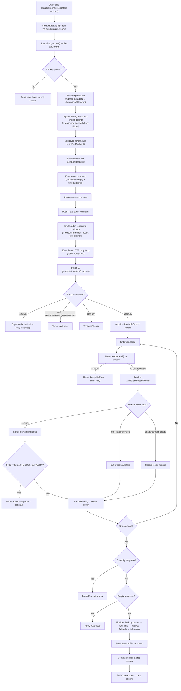
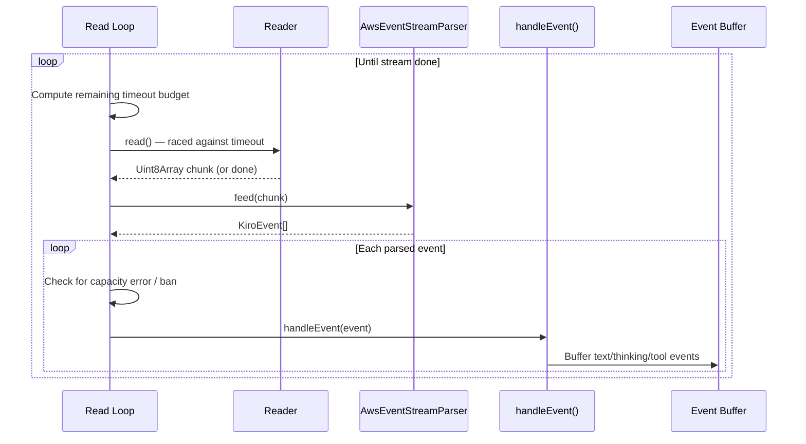

The **streaming factory** is the central orchestration engine of the Kiro OMP provider — the function that transforms an OMP conversation request into a live, event-driven response stream from the Kiro API. Exported as `createStreamKiro`, this closure-based factory produces a stateful `streamKiro` function that conforms to OMP's `streamSimple` provider contract while internally managing HTTP retries, timeout enforcement, capacity-aware backoff, buffered event emission, and multi-format tool call detection. Every byte of data flowing between the OMP host and the Kiro backend passes through this lifecycle, making its architecture the single most important piece to understand for debugging, extending, or contributing to the provider.

Sources: [core.ts](src/core.ts#L1-L13), [index.ts](index.ts#L66-L77)

## Factory Architecture: Closure-Based Dependency Injection

The factory follows a **two-phase construction** pattern. The outer phase — `createStreamKiro(deps: CoreDependencies)` — receives all injectable dependencies and returns a closure that captures them. The inner phase — the returned `streamKiro(model, context, options?)` function — is what OMP invokes per request. This separation ensures that infrastructure concerns (fetch implementation, time source, UUID generation, stream constructors) are resolved once at registration time, while per-request state is freshly initialized on every call.

The `CoreDependencies` interface defines the injection surface:

| Dependency | Purpose | Production Default |
|---|---|---|
| `apiBase` | Kiro API endpoint URL | `https://q.<region>.amazonaws.com` |
| `fetchImpl` | HTTP client for API calls | Global `fetch` |
| `createStream` | Event stream constructor | `createAssistantMessageEventStream` |
| `cwd` / `now` / `uuid` | Deterministic test doubles | `process.cwd()` / `Date.now()` / `crypto.randomUUID()` |
| `env` | Environment variable access | `process.env` |
| `calculateCost` | Token cost computation | No-op (free tier) |

Sources: [types.ts](src/types.ts#L161-L172), [core.ts](src/core.ts#L166-L171), [index.ts](index.ts#L66-L77)

## Request Lifecycle Overview

Each invocation of the returned `streamKiro` function proceeds through a well-defined lifecycle. The following diagram illustrates the complete flow from OMP invocation through event emission:

Sources: [core.ts](src/core.ts#L211-L838)

## Phase 1: Stream Creation and Fire-and-Forget Launch

When OMP invokes `streamKiro`, the function immediately creates a `KiroEventStream` instance via the injected `createStream` factory, then launches the internal `run()` coroutine without awaiting it. The stream is returned synchronously to OMP while `run()` executes asynchronously in the background. This **fire-and-forget** pattern is critical — it allows OMP to begin iterating the `AsyncIterable<AssistantMessageEvent>` immediately while the provider handles network I/O concurrently.

The `KiroEventStream` (defined in [runtime.ts](src/runtime.ts)) implements a push-to-pull bridge: the `run()` coroutine pushes events via `stream.push()`, while OMP consumes them via the `async *[Symbol.asyncIterator]()` generator. Internally, a queue array and a waiting-resolvers array implement a classic condition-variable pattern — if a consumer is already waiting when an event arrives, it's resolved immediately; otherwise the event is queued.

Sources: [core.ts](src/core.ts#L216-L217), [core.ts](src/core.ts#L821-L838), [runtime.ts](src/runtime.ts#L17-L76)

## Phase 2: Authentication Gate and Profile Resolution

The `run()` function first checks for an API key. If absent, it immediately emits an `error` event and ends the stream — no network request is made. When present, the key determines the authentication pathway: keys prefixed with `ksk_` are treated as direct API keys, while everything else routes through the OIDC/SSO path.

**Profile ARN resolution** follows a two-tier strategy. First, the factory attempts to read a cached `profileArn` from the sidecar metadata file (`~/.omp/agent/kiro-auth-meta.json`) for social-auth sessions. If unavailable, it makes a live `ListAvailableProfiles` call to the Kiro API endpoint (with the path suffix stripped and replaced with the listing target). Successful results are memoized in an in-memory `Map<string, string>` keyed by endpoint URL, avoiding repeated lookups across requests within the same process lifetime.

Sources: [core.ts](src/core.ts#L219-L265), [core.ts](src/core.ts#L106-L135)

## Phase 3: Payload Construction and Header Fingerprinting

Before dispatching the HTTP request, the factory performs three preparation steps:

1. **Thinking mode injection**: When reasoning is enabled (either explicitly via `options.reasoning` or implicitly via `model.reasoning`) and the model doesn't use server-side hidden reasoning, the factory prepends `<thinking_mode>enabled</thinking_mode>` and a `<max_thinking_length>` tag to the system prompt. The thinking budget maps from the reasoning level string to token counts: `xhigh` → 50,000, `high` → 30,000, `medium` → 20,000, and `low`/default → 10,000.

2. **Payload construction**: The modified context is passed to `buildKiroPayload()`, which converts the OMP message format into Kiro's `conversationState` structure — including conversation ID generation, history sanitization, tool name truncation, and system prompt embedding.

3. **Header construction**: `buildKiroHeaders()` generates the AWS SDK-style header set that impersonates the Kiro CLI Rust SDK. Each request receives a fresh `amz-sdk-invocation-id` UUID. User-supplied headers are merged last, with `Authorization` stripped to prevent accidental OAuth bypass.

Sources: [core.ts](src/core.ts#L456-L492), [core.ts](src/core.ts#L141-L161), [converters.ts](src/converters.ts#L1-L22)

## Phase 4: The Dual-Layer Retry Architecture

The request lifecycle employs a **nested retry loop** with distinct responsibilities:

### Outer Loop: Capacity, Empty Response, and Timeout Retries

The outer loop runs up to `1 + MAX_CAPACITY_RETRIES(3) + MAX_EMPTY_RETRIES(2)` = **6 total attempts**. On each iteration, it calls `resetAttemptState()` which clears the output content array, event buffer, tool call state, thinking parser, and all usage counters. This is the **buffered emission guarantee** — if a retry is needed, no partial content has been pushed to the OMP stream; the event buffer is silently discarded and a fresh `start` event is emitted.

Three conditions trigger outer-loop retries:
- **`INSUFFICIENT_MODEL_CAPACITY`** detected in stream content (common on free-tier Kiro)
- **Empty response** — a 200 OK with zero content events
- **`RetryableError`** thrown by timeout enforcement (first-token or idle stream)

Backoff for capacity and timeout retries follows `min(2000 × 2^attempt, 30000)` milliseconds (capped at 30 seconds).

### Inner Loop: HTTP 429/5xx Retries

The inner loop handles transport-level failures with up to `MAX_HTTP_RETRIES(3)` retries. It uses exponential backoff of `min(1000 × 2^(attempt-1), 10000)` milliseconds. Notably, **403 responses with `TEMPORARILY_SUSPENDED`** bypass the retry loop entirely — these represent account bans, not transient failures. On any 403, the `profileArn` cache entry for the endpoint is evicted as a defensive measure.

Sources: [core.ts](src/core.ts#L494-L577), [core.ts](src/core.ts#L44-L49)

## Phase 5: Stream Reading and Event Processing

Once a successful HTTP 200 response is obtained, the factory acquires a `ReadableStreamDefaultReader` and enters the **read loop** — the tight inner cycle that drives all event processing:

Two timeout thresholds govern the read loop, both implemented as abort-controller races:

| Timeout | Value | Trigger |
|---|---|---|
| **First token** | 180,000 ms (3 min) | Time since stream start with no content event received |
| **Idle stream** | 90,000 ms (1.5 min) | Time since last content event (after first content) |
| **Connection** | 120,000 ms (2 min) | Overall request deadline (set before fetch) |

When a timeout fires, a `RetryableError` is thrown and caught by the outer retry handler. If the consumer's abort signal fires (e.g., user cancellation), the error propagates as a non-retryable `AbortError`.

Sources: [core.ts](src/core.ts#L591-L664), [core.ts](src/core.ts#L44-L49)

## Phase 6: Event Buffering and the handleEvent State Machine

The `handleEvent` function is a **state machine** that processes parsed `KiroEvent` objects and writes them into an in-memory event buffer. It maintains several pieces of per-attempt state:

- **`textBlock` / `currentTextIdx`**: Tracks the current open text content block. When new text arrives and no block is open, a `text_start` event is buffered and a new `TextContent` is appended to the output. Subsequent deltas produce `text_delta` events.
- **`currentToolCall`**: Accumulates tool call metadata (ID, name, input chunks) across `tool_start` and `tool_input` events. On `tool_stop` (when `event.stop` is true), it finalizes into a `ToolCallContent` and buffers both `toolcall_start` and `toolcall_end` events.
- **`thinkingParser`**: When thinking mode is active (not hidden), content events are routed through the `ThinkingTagParser` instead of directly to the text buffer, enabling extraction of `<thinking>` tag-enclosed reasoning from the content stream.
- **Usage tracking**: `usage` events populate `usageInputTokens` / `usageOutputTokens`; `context_usage` events record the context window consumption percentage.

A critical invariant: **no events are emitted to the OMP stream until `flushBuffer()` is called after a successful attempt**. This means that if a retry is triggered (capacity error, empty response, timeout), all buffered events are silently discarded by `resetAttemptState()`. The OMP consumer never sees partial content from a failed attempt.

Sources: [core.ts](src/core.ts#L278-L399), [core.ts](src/core.ts#L401-L418), [core.ts](src/core.ts#L441-L447)

## Phase 7: Finalization Pipeline

Once the read loop completes successfully (stream done, no capacity error, non-empty response), a six-step finalization pipeline transforms raw accumulated state into properly sequenced OMP events:

| Step | Operation | Purpose |
|---|---|---|
| 1 | `thinkingParser.finalize()` | Flush remaining thinking content and emit `thinking_end` / `text_end` |
| 2 | `finalizeToolCall()` | Commit any pending native tool call to output + buffer |
| 3 | `parseBracketToolCalls()` fallback | Detect `[Called func with args: {...}]` patterns in text when no native tool events occurred |
| 4 | Echo noise stripping | Remove `"."` or `"continue"` text blocks when tool calls are present |
| 5 | `closeHiddenBreadcrumb()` | Close any still-open hidden reasoning indicator |
| 6 | Final `text_end` emission | Emit the definitive `text_end` for the last text block |

After finalization, `flushBuffer()` drains all buffered events into the OMP stream in order, followed by usage computation and a `done` event.

Sources: [core.ts](src/core.ts#L696-L763)

## Phase 8: Usage Computation and Stop Reason Determination

Usage metrics are computed using a **tiered estimation** strategy since the Kiro API does not always return explicit token counts:

1. **Input tokens**: If a `context_usage` event was received, input is estimated as `(percentage / 100) × model.contextWindow`. This estimate is overridden by the `usage` event's `inputTokens` if available.
2. **Output tokens**: Uses `outputTokens` from the `usage` event, or falls back to `max(1, floor(totalContentLength / 4))` as a character-to-token approximation.
3. **Total tokens**: Sum of input and output.

The **stop reason** is determined by a simple decision tree: if no context usage was received and no tool calls were emitted, the reason is `"length"` (context exhaustion). Otherwise, `"toolUse"` if tool calls exist, or `"stop"` for a clean completion.

Sources: [core.ts](src/core.ts#L778-L796)

## Error Handling and Cleanup Guarantees

The entire `run()` coroutine is wrapped in a `try/catch/finally` structure that provides three guarantees:

1. **Fatal errors** (non-retryable or retries exhausted) emit an `error` event with the error message and `reason: "error"`, then end the stream.
2. **Abort scenarios** (user cancellation) emit an `error` event with `reason: "aborted"`.
3. **Resource cleanup** in `finally`: the connection timeout timer is cleared, the hidden reasoning marker timer is cancelled, the consumer's abort listener is removed, and the `ReadableStream` reader is cancelled and released.

An additional **top-level catch** on `run()` itself handles any uncaught exceptions (e.g., from `createStream` failures), ensuring the stream always receives a terminal event.

Sources: [core.ts](src/core.ts#L798-L838)

## Configuration Constants Reference

| Constant | Value | Controls |
|---|---|---|
| `MAX_HTTP_RETRIES` | 3 | Maximum 429/5xx retries per outer attempt |
| `MAX_CAPACITY_RETRIES` | 3 | Maximum INSUFFICIENT_MODEL_CAPACITY retries |
| `MAX_EMPTY_RETRIES` | 2 | Maximum empty response retries |
| `FIRST_TOKEN_TIMEOUT_MS` | 180,000 | Time to wait for first content event |
| `IDLE_STREAM_TIMEOUT_MS` | 90,000 | Maximum gap between content events |
| `CONNECTION_TIMEOUT_MS` | 120,000 | Overall HTTP connection deadline |
| `HIDDEN_REASONING_COUNTDOWN_MS` | 2,000 | Delay before showing "reasoning hidden" placeholder |

Sources: [core.ts](src/core.ts#L43-L53)

## Related Pages

- [Push-Based Event Stream Runtime](17-push-based-event-stream-runtime) — internal mechanics of the `KiroEventStream` push/pull bridge
- [Retry Strategy: HTTP 429/5xx, Capacity, Timeout, and Empty Response](16-retry-strategy-http-429-5xx-capacity-timeout-and-empty-response) — detailed analysis of the dual-layer retry architecture
- [AWS Event Stream Binary Decoding](18-aws-event-stream-binary-decoding) — how `AwsEventStreamParser` transforms binary chunks into typed events
- [OMP-to-Kiro Conversation Format Conversion](12-omp-to-kiro-conversation-format-conversion) — the `buildKiroPayload` conversion pipeline
- [Dependency Injection and Testability Pattern](7-dependency-injection-and-testability-pattern) — how `CoreDependencies` enables deterministic testing