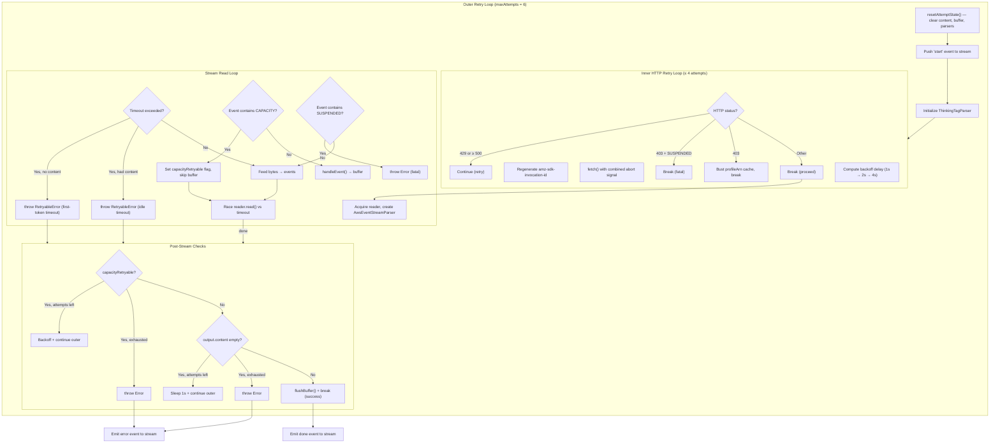

The Kiro provider implements a **layered retry architecture** that shields consumers from transient failures at every stage of the request lifecycle — from initial HTTP connection through stream reading to final content validation. The system distinguishes four classes of retryable failure, each with its own backoff strategy and maximum attempt count, unified under a single outer retry loop that guarantees **buffered event emission**: no partial content ever leaks to the consumer on retry. This page dissects the dual-loop retry mechanism, the timeout hierarchy, the capacity-error detection heuristic, and the empty-response guard that together provide resilience against the most common failure modes of the Kiro/AWS backend.

Sources: [core.ts](src/core.ts#L1-L13)

## Retry Configuration Constants

Six constants govern the retry and timeout behavior. They are module-scoped and not configurable at runtime, reflecting the design decision that these values are tuned for the Kiro backend's documented SLA and should not be overridden per-request.

| Constant | Value | Purpose |
|---|---|---|
| `MAX_HTTP_RETRIES` | 3 | Maximum retries for HTTP 429 / 5xx responses |
| `MAX_CAPACITY_RETRIES` | 3 | Maximum retries for `INSUFFICIENT_MODEL_CAPACITY` stream errors |
| `MAX_EMPTY_RETRIES` | 2 | Maximum retries when a 200 OK yields zero content |
| `FIRST_TOKEN_TIMEOUT_MS` | 180,000 (3 min) | Deadline for receiving the first content event after connection |
| `IDLE_STREAM_TIMEOUT_MS` | 90,000 (90 s) | Deadline between consecutive content events during streaming |
| `CONNECTION_TIMEOUT_MS` | 120,000 (2 min) | Deadline for the initial HTTP connection to complete |

Sources: [core.ts](src/core.ts#L44-L49)

## Dual-Loop Retry Architecture

The retry system is organized as a **nested dual-loop** inside the `streamKiro` function returned by `createStreamKiro`. The outer loop handles stream-level failures (capacity, timeout, empty response), while the inner loop handles HTTP-level failures (429, 5xx). Each iteration of the outer loop resets all per-attempt state and discards the event buffer, ensuring that the consumer never sees stale or partial data from a failed attempt.



The outer loop runs up to `maxAttempts = 1 + MAX_CAPACITY_RETRIES + MAX_EMPTY_RETRIES = 6` iterations (lines 495–496). This budget is shared between capacity retries, timeout retries, and empty-response retries, so in the worst case a request may iterate the outer loop six times, each time going through its own inner HTTP retry cycle.

Sources: [core.ts](src/core.ts#L494-L496), [core.ts](src/core.ts#L537-L567)

## HTTP 429 and 5xx Retry (Inner Loop)

The inner retry loop executes up to `MAX_HTTP_RETRIES + 1 = 4` total attempts per outer iteration. On each retry, the provider applies **exponential backoff** with the formula:

```
delay = min(1000 × 2^(attempt - 1), 10_000)
```

This produces backoff intervals of **1s, 2s, 4s** (the third retry), capped at 10 seconds. The sleep is abort-aware — it resolves immediately if the consumer's `AbortSignal` fires, preventing hung requests.

Each retry regenerates two critical request headers:

- **`amz-sdk-invocation-id`**: A fresh UUID per attempt, required by the AWS SDK contract so the backend can distinguish retries from duplicate requests.
- **`amz-sdk-request`**: Updated to `attempt=N; max=4` to communicate retry state to the AWS service.

The loop breaks immediately on `TEMPORARILY_SUSPENDED` within a 403 response body (ban detection — no retry is appropriate). A plain 403 also **busts the profileArn cache** before proceeding, since a stale ARN is a common cause of 403s and the dynamic `ListAvailableProfiles` resolution should be re-attempted on the next outer iteration.

Sources: [core.ts](src/core.ts#L537-L567)

## INSUFFICIENT_MODEL_CAPACITY Retry

The Kiro backend frequently returns HTTP 200 with the string `INSUFFICIENT_MODEL_CAPACITY` embedded in stream content events, particularly on free-tier accounts. The provider detects this by inspecting every parsed content event:

When the string is found, the provider sets a `capacityRetryable` flag and **skips buffering** that event — the capacity error message is never forwarded to the consumer. After the stream ends, if the flag is set and attempts remain, the provider applies backoff:

```
delay = min(2000 × 2^outerAttempt, 30_000)
```

This produces intervals of **2s, 4s, 8s** across successive capacity retries, capped at 30 seconds. If all capacity retries are exhausted, the provider throws a terminal error: `"INSUFFICIENT_MODEL_CAPACITY after all retries"`.

Sources: [core.ts](src/core.ts#L633-L679)

## Timeout Hierarchy

The provider implements a three-tier timeout system that protects against different failure modes:

| Timeout | Duration | Trigger | Retry Behavior |
|---|---|---|---|
| **Connection** | 120 s | `setTimeout` on `AbortController` wrapping `fetch()` | Triggers HTTP retry (5xx-like behavior via abort) |
| **First-token** | 180 s | Elapsed time since stream open with no content events | `RetryableError` → outer loop retry |
| **Idle stream** | 90 s | Elapsed time since last content event | `RetryableError` → outer loop retry |

The connection timeout is implemented via a dedicated `AbortController` whose signal is combined with the consumer's signal using `AbortSignal.any()`. This means the fetch call aborts if either the consumer cancels or the connection deadline expires.

The first-token and idle timeouts operate differently — they are **read-deadline timers** computed inside the stream read loop. On each iteration, the provider calculates `elapsed = Date.now() - lastContentTime` and compares it against the appropriate threshold. If the deadline is exceeded, a `RetryableError` is thrown, which is caught by the outer loop's `try/catch` block and triggers a retry with backoff (`2000 × 2^attempt`, capped at 30s).

The first-token timeout is notably generous at 3 minutes, accommodating the Kiro backend's server-side reasoning delay on large models (e.g., Claude 4.7 Opus can spend 25–30 seconds in deliberation before emitting the first token).

Sources: [core.ts](src/core.ts#L487-L492), [core.ts](src/core.ts#L598-L663)

## Empty Response Detection

Even when the HTTP response is 200 OK and the stream completes cleanly, the provider guards against **empty responses** — cases where the backend returns a valid stream structure but zero content events. After the stream read loop exits, the provider checks `output.content.length`:

If content is empty and outer attempts remain, the provider sleeps for 1 second and retries. If all attempts are exhausted, it throws `"Kiro returned an empty response after all retries"`. This prevents the consumer from silently receiving an empty assistant message, which would corrupt conversation history and confuse subsequent turns.

Sources: [core.ts](src/core.ts#L681-L694)

## Buffered Event Emission

A critical invariant of the retry architecture is that **partial content never reaches the consumer during a retry**. The provider achieves this through a per-attempt event buffer:

The `eventBuffer` array accumulates all `AssistantMessageEvent` objects generated during a single attempt. Events are only flushed to the consumer's stream via `flushBuffer()` **after** the attempt succeeds — that is, after the stream read loop completes, content is verified as non-empty, no capacity error was detected, and no `RetryableError` was thrown. If any retry condition triggers, `resetAttemptState()` is called at the top of the next outer iteration, which clears the buffer, resets all output content, and reinitializes parser state.

The `resetAttemptState()` function zeroes out: `output.content`, `eventBuffer`, `textBlock`, `currentTextIdx`, `currentToolCall`, `thinkingParser`, `usageInputTokens`, `usageOutputTokens`, `contextUsagePercentage`, `totalContentLength`, and all tool-call tracking flags. This guarantees complete isolation between retry attempts.

Sources: [core.ts](src/core.ts#L278-L289), [core.ts](src/core.ts#L401-L418), [core.ts](src/core.ts#L442-L447), [core.ts](src/core.ts#L696-L763)

## RetryableError and Non-Retryable Error Paths

The `RetryableError` class serves as the internal control-flow mechanism for timeout-triggered retries. It extends the native `Error` class with no additional properties — its sole purpose is to be distinguishable via `instanceof` in the outer loop's catch block:

When caught and retries remain, the provider cancels and releases the reader, applies exponential backoff, and continues the outer loop. When retries are exhausted (or the error is not a `RetryableError`), the error propagates to the top-level `catch` block, which emits an `error` event to the stream with the appropriate `ErrorReason`:

| Condition | Error Reason | Retryable? |
|---|---|---|
| `AbortSignal` fired by consumer | `"aborted"` | No — immediate termination |
| `TEMPORARILY_SUSPENDED` in HTTP body or stream | `"error"` | No — ban is permanent |
| `ThrottlingException` in HTTP body | `"error"` | No — account-level throttle |
| HTTP 429 after exhausting inner retries | `"error"` | No — retries exhausted |
| HTTP 5xx after exhausting inner retries | `"error"` | No — retries exhausted |
| First-token / idle timeout | `RetryableError` → outer retry | Yes (up to `maxAttempts`) |
| `INSUFFICIENT_MODEL_CAPACITY` | Outer loop continue | Yes (up to `MAX_CAPACITY_RETRIES`) |
| Empty response | Outer loop continue | Yes (up to `MAX_EMPTY_RETRIES`) |

Sources: [core.ts](src/core.ts#L98-L101), [core.ts](src/core.ts#L764-L775), [core.ts](src/core.ts#L798-L818)

## Retry Behavior Summary

The following table summarizes the maximum total attempts and worst-case latency for each retry category, assuming a single retry type is exercised in isolation:

| Failure Type | Max Retries | Max Total Attempts | Backoff Sequence | Worst-Case Added Latency |
|---|---|---|---|---|
| HTTP 429 / 5xx | 3 | 4 per outer attempt | 1s, 2s, 4s | ~7 s |
| INSUFFICIENT_MODEL_CAPACITY | 3 | 4 (outer) | 2s, 4s, 8s | ~14 s |
| First-token timeout | 5 (shared outer) | 6 (outer) | 2s, 4s, 8s, 16s, 30s | ~60 s |
| Idle stream timeout | 5 (shared outer) | 6 (outer) | 2s, 4s, 8s, 16s, 30s | ~60 s |
| Empty response | 2 | 3 (outer) | 1s, 1s | ~2 s |

Note that the outer loop budget is shared between capacity, timeout, and empty retries. In the worst pathological case where all failure types alternate, the total outer iterations are capped at 6, with each iteration potentially incurring its own inner HTTP retry cycle.

Sources: [core.ts](src/core.ts#L44-L49), [core.ts](src/core.ts#L494-L496)

## Next Steps

- **[Core Streaming Factory and Request Lifecycle](15-core-streaming-factory-and-request-lifecycle)** — understand how the retry system fits into the broader request lifecycle, from authentication resolution through payload construction to the stream factory's `run()` coroutine.
- **[Push-Based Event Stream Runtime](17-push-based-event-stream-runtime)** — explore the `KiroEventStream` class that receives the buffered events after a successful retry, and how the push-to-async-iterable bridge works.
- **[AWS Event Stream Binary Decoding](18-aws-event-stream-binary-decoding)** — dive into `AwsEventStreamParser.feed()` that produces the parsed events inspected by the capacity and ban-detection heuristics within the retry read loop.