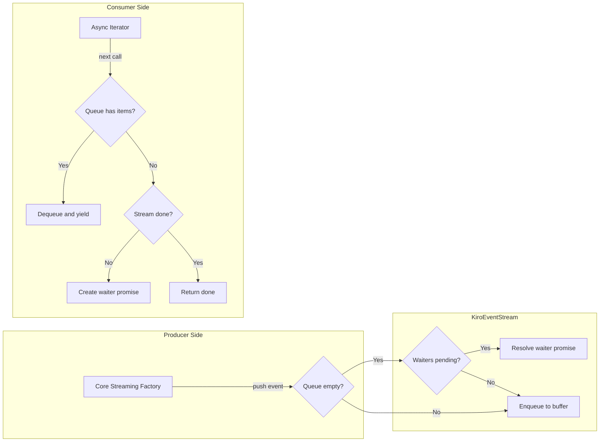
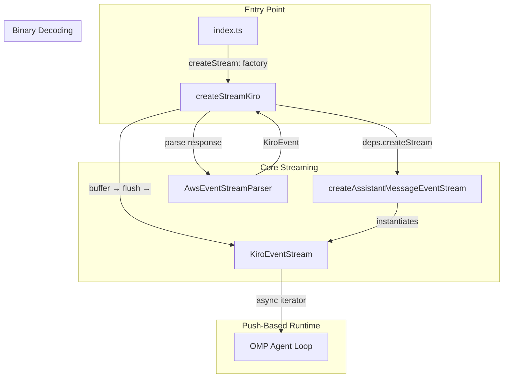

The **Push-Based Event Stream Runtime** is the async bridge between the Kiro provider's internal event producers and the OMP framework's async-iteration consumers. It solves a fundamental impedance mismatch: the streaming HTTP response from Kiro's API delivers events through push-based callbacks (feed a chunk → get events → push them into a stream), while OMP consumes them through pull-based `for await...of` loops. The `KiroEventStream` class in [runtime.ts](src/runtime.ts) implements this bridge using a synchronized queue-and-waiting pattern, and the factory function `createAssistantMessageEventStream` injects it into the dependency system so the core streaming logic never directly instantiates the stream.

Sources: [runtime.ts](src/runtime.ts#L1-L8), [types.ts](src/types.ts#L138-L155)

## The Push-to-Pull Impedance Mismatch

OMP's provider contract defines `AssistantMessageEventStreamLike` — an `AsyncIterable<AssistantMessageEvent>` with three additional methods: `push()`, `end()`, and `result()`. This dual nature means the same object must simultaneously support being written to by the producer (the streaming factory in core) and iterated over by the consumer (OMP's agent loop). The contract is declared in the shared types module:

| Method | Role | Caller |
|---|---|---|
| `push(event)` | Enqueue a single event for consumption | Producer (core streaming factory) |
| `end(result?)` | Signal stream termination | Producer |
| `result()` | Promise resolving to the final `AssistantMessageLike` | Consumer |
| `[Symbol.asyncIterator]()` | Async generator yielding events | Consumer (via `for await...of`) |

Sources: [types.ts](src/types.ts#L151-L155)

## KiroEventStream Internal Architecture

The `KiroEventStream` class maintains two internal data structures that work in tandem: a **queue** for buffering events that arrive before any consumer is ready, and a **waiting list** for consumers that request events before any are available. This duality ensures zero data loss regardless of timing — whether the producer races ahead or the consumer polls first.

Sources: [runtime.ts](src/runtime.ts#L17-L76)

## Event Queue and Waiting List Mechanics

When `push()` is called with an event, the stream first checks the waiting list. If a consumer is currently suspended awaiting an event, the waiter is immediately resolved with the pushed event — no intermediate queue storage occurs. Only when no waiter exists does the event get appended to the `queue` array. This avoids unnecessary memory churn during steady-state streaming where producer and consumer are roughly synchronized.

Conversely, when the async iterator's `next()` is called (triggered by a `for await...of` loop), it first checks the queue. If events are buffered, it immediately dequeues and yields one. If the queue is empty and the stream is marked `done`, it returns `{ value: undefined, done: true }`. If neither condition holds, it creates a new `Promise`, appends its resolver to the `waiting` array, and suspends until `push()` or `end()` resolves it.

| Scenario | Producer Action | Consumer State | Result |
|---|---|---|---|
| Producer ahead | `push(event)` | No waiter | Event buffered in queue |
| Consumer ahead | — (waiting) | `for await` awaiting | Promise created, stored in waiting list |
| Synchronized | `push(event)` | Waiter pending | Waiter resolved immediately |
| Stream ended | `end()` called | Queue drained | Remaining waiters resolved with `done: true` |

Sources: [runtime.ts](src/runtime.ts#L32-L71)

## Terminal Event Handling and Final Result

Two event types signal stream termination: `done` (successful completion) and `error` (failure or abort). When `push()` receives either, it sets the internal `done` flag to `true` and resolves the `finalResultPromise` — either with the successful `AssistantMessageLike` from the `done` event's `message` field, or with the `AssistantMessageLike` from the error event's `error` field. This dual-purpose promise allows consumers who don't need incremental streaming to simply `await stream.result()` for the final aggregated message.

The `end()` method serves as a separate termination path, used when the producer needs to force-close the stream without emitting a terminal event (for example, after a catastrophic failure in the `run()` catch block). It drains all remaining waiters with `done: true`, ensuring no consumer is left hanging on a permanently unresolved promise.

Sources: [runtime.ts](src/runtime.ts#L32-L54), [runtime.ts](src/runtime.ts#L73-L75)

## Integration with the Core Streaming Factory

The `createAssistantMessageEventStream` factory function is injected into the `CoreDependencies` interface as the `createStream` field. The core streaming factory in [core.ts](src/core.ts) calls `deps.createStream()` at the beginning of each request to obtain a fresh `KiroEventStream` instance, then immediately launches an async `run()` function that handles the HTTP request, response parsing, and event emission. Critically, the stream object is **returned synchronously** — the OMP framework can begin iterating over it before the first HTTP byte arrives.

This design creates a clean ownership boundary: the `runtime.ts` module owns the push-to-pull bridge mechanics (queue management, promise resolution, terminal state), while [core.ts](src/core.ts) owns the event production logic (HTTP fetching, binary parsing, retry buffering, and final emission). The stream is a **passive conduit** — it has no knowledge of what events mean, only how to deliver them.

Sources: [runtime.ts](src/runtime.ts#L78-L80), [core.ts](src/core.ts#L211-L216), [index.ts](index.ts#L66-L69)

## Buffered Emission and Retry Safety

The push-based runtime plays a critical role in retry safety. The core streaming factory uses an **event buffer** — an internal array of `AssistantMessageEvent[]` — that accumulates events during each retry attempt. Events are only flushed to the `KiroEventStream` via `stream.push()` after the entire response has been successfully validated (non-empty content, no capacity errors). On retry, the buffer is simply discarded and reset. This means the consumer never sees partial or stale data from a failed attempt.

The sequence is: parse response chunks → accumulate events in buffer → on success, `flushBuffer()` iterates the buffer and calls `stream.push()` for each event → the stream delivers them to the waiting consumer. The only events pushed during the attempt are `start` (marking a new attempt) and any hidden-reasoning indicators, which are safe to emit speculatively since they carry no user-visible content.

Sources: [core.ts](src/core.ts#L284-L286), [core.ts](src/core.ts#L441-L447), [core.ts](src/core.ts#L696-L763)

## Cost Calculation Placeholder

The runtime module also exports `calculateCost`, a no-op function that satisfies the `CoreDependencies` contract. Since Kiro is free during its trial period (and subscription-based afterward), per-token cost calculation is unnecessary — all cost fields in the `Usage` object are set to zero at the provider registration level.

Sources: [runtime.ts](src/runtime.ts#L82-L84), [index.ts](index.ts#L49-L60)

## Relationship to Surrounding Modules

The push-based runtime sits between the **core streaming factory** (which produces events) and the **OMP agent loop** (which consumes them). It has no dependency on [eventstream.ts](src/eventstream.ts) — the binary decoder produces `KiroEvent` objects that the core factory translates into `AssistantMessageEvent` objects before pushing them into the stream. This separation ensures the runtime module remains a generic, reusable bridge that could serve any push-based producer.

Sources: [runtime.ts](src/runtime.ts#L1-L85), [core.ts](src/core.ts#L1-L41)

## What's Next

- **[AWS Event Stream Binary Decoding](18-aws-event-stream-binary-decoding)** — Understanding how raw HTTP chunks are parsed into the `KiroEvent` objects that feed into the streaming pipeline.
- **[Core Streaming Factory and Request Lifecycle](15-core-streaming-factory-and-request-lifecycle)** — The full request lifecycle that drives events into the push-based stream.
- **[Retry Strategy: HTTP 429/5xx, Capacity, Timeout, and Empty Response](16-retry-strategy-http-429-5xx-capacity-timeout-and-empty-response)** — How the buffered emission pattern protects consumers during retries.