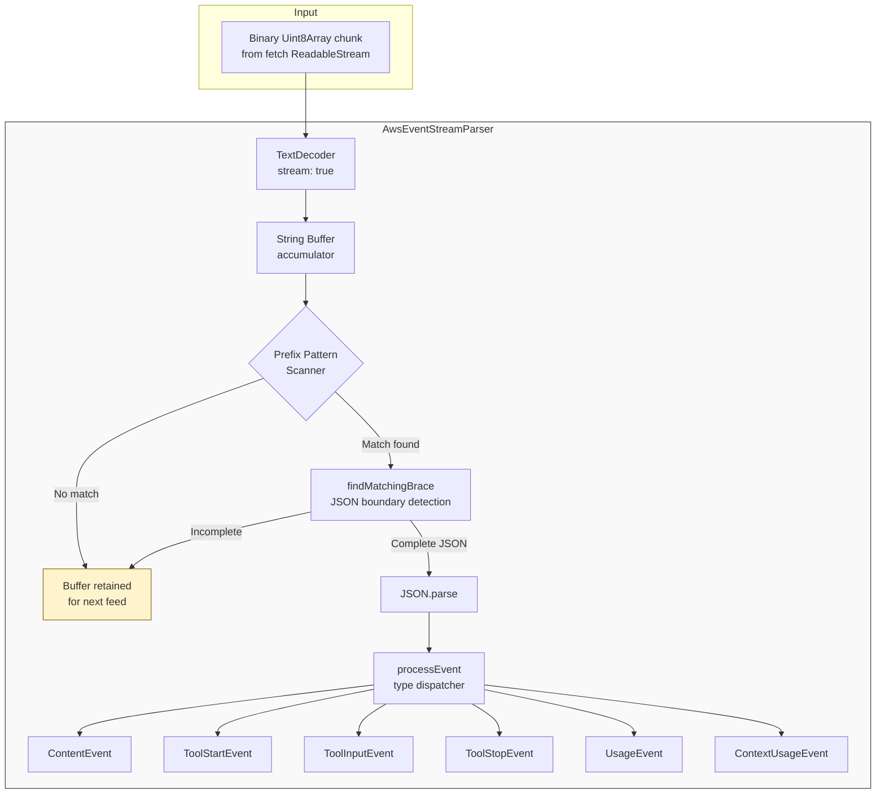
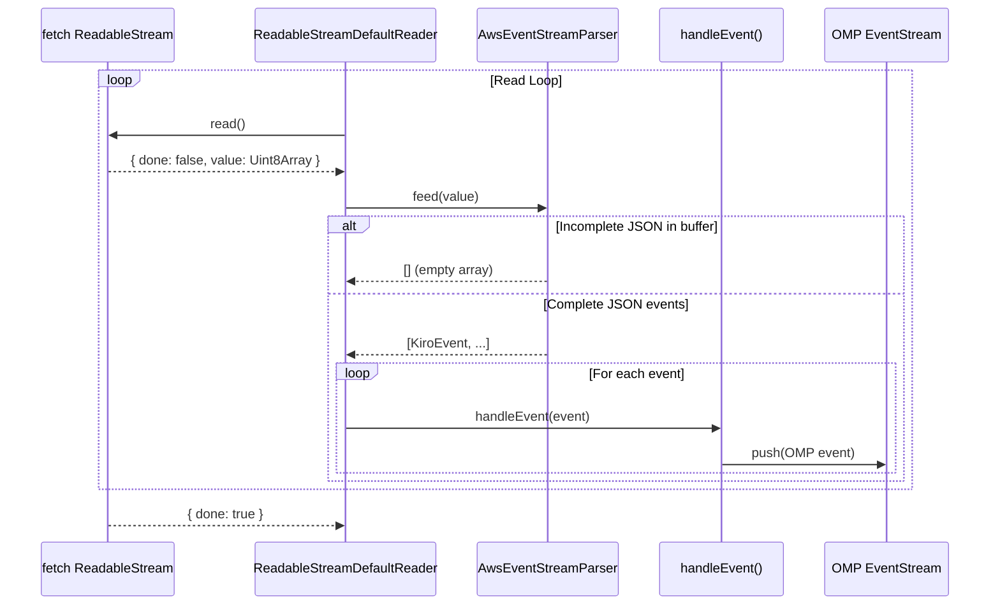

The AWS Event Stream binary decoder transforms raw binary chunks arriving from the Kiro API's `generateAssistantResponse` streaming endpoint into **typed, semantically meaningful events** that the OMP provider pipeline can consume. Unlike a traditional AWS Event Stream protocol parser that would interpret prelude headers, message CRCs, and typed headers, this implementation takes a pragmatic approach: it decodes the binary payload to UTF-8 text and then performs **prefix-pattern scanning with brace-depth JSON extraction**. This strategy was chosen because the Kiro API wraps structured JSON events inside AWS's binary framing — the JSON payload is the only part that carries semantic value for the provider layer. The decoder lives entirely in [eventstream.ts](src/eventstream.ts) and produces a discriminated union of six event types that downstream consumers in [Core Streaming Factory and Request Lifecycle](15-core-streaming-factory-and-request-lifecycle) use to build the OMP `AssistantMessageEvent` stream.

Sources: [eventstream.ts](src/eventstream.ts#L1-L8), [core.ts](src/core.ts#L596-L628)

## Event Type Taxonomy

The parser emits a discriminated union type `KiroEvent` — six distinct shapes distinguished by a string literal `type` field. Each type maps to a specific semantic signal in the Kiro streaming protocol.

| Event Type | Discriminant | Purpose | Key Fields |
|---|---|---|---|
| `ContentEvent` | `"content"` | A text delta in the assistant's response | `content: string` |
| `ToolStartEvent` | `"tool_start"` | Initiation of a tool call (may be single-shot) | `toolUseId`, `name`, `input`, `stop` |
| `ToolInputEvent` | `"tool_input"` | Continuation input for a multi-chunk tool call | `input: string` |
| `ToolStopEvent` | `"tool_stop"` | Signal that the current tool call's input is complete | `stop: boolean` |
| `UsageEvent` | `"usage"` | Token consumption metrics for the request | `inputTokens?`, `outputTokens?` |
| `ContextUsageEvent` | `"context_usage"` | Context window utilization percentage | `percentage: number` |

The `ToolStartEvent` has a notable **single-shot optimization**: when `stop === true`, the tool call is complete within a single event — no subsequent `tool_input` or `tool_stop` events will follow. This pattern is used for tools with trivial or empty input payloads. When `stop` is false or absent, the parser expects a stream of `tool_input` events terminated by a `tool_stop` event with `stop === true`.

Sources: [eventstream.ts](src/eventstream.ts#L14-L55)

## Architecture: The AwsEventStreamParser Class

The `AwsEventStreamParser` is a **stateful, incremental parser** designed for streaming consumption. It maintains three pieces of internal state across `feed()` calls:

1. **`buffer`** — a string accumulator that holds incomplete data between chunks. When a binary chunk arrives that contains half a JSON object, the partial text stays in the buffer until the next `feed()` call supplies the remainder.
2. **`lastContent` / `lastContentType`** — deduplication state that tracks the most recently emitted content value, used to suppress consecutive identical content deltas.
3. **`decoder`** — a persistent `TextDecoder` instance created with `{ stream: true }`, ensuring that multi-byte UTF-8 sequences split across chunk boundaries are decoded correctly rather than producing replacement characters.

The parser is instantiated **once per retry attempt** in the core streaming factory — a fresh `new AwsEventStreamParser()` is created each time the response body reader is acquired. This ensures that leftover buffer state from a failed attempt never contaminates a retry.

Sources: [eventstream.ts](src/eventstream.ts#L124-L143), [core.ts](src/core.ts#L596-L597)

## The feed() Method: Incremental Chunk Processing

The `feed()` method is the sole public interface for supplying data to the parser. It accepts either a `Uint8Array` (binary) or a pre-decoded `string`, making it flexible for both raw fetch body reads and pre-processed text. The method performs four sequential operations:

**Decode** — Binary input passes through the persistent `TextDecoder` with `{ stream: true }`. This flag tells the decoder to buffer incomplete multi-byte sequences internally rather than emitting replacement characters. The `{ fatal: false }` constructor option ensures that invalid byte sequences produce replacement characters rather than throwing.

**Accumulate** — The decoded text is appended to the internal buffer string. A **10 MB safety cap** (`MAX_BUFFER_SIZE`) prevents unbounded memory growth on garbage input. When the buffer exceeds this limit, the parser retains only the trailing half — the most recent data is most likely to contain the start of a valid event.

**Scan** — The parser iterates through `EVENT_PATTERNS` (ten prefix strings in priority order) using `String.indexOf()` to find the earliest match. This priority ordering resolves ambiguity when multiple patterns could match the same buffer position — for example, `{"name":` is checked before `{"content":` to correctly classify tool initiation events.

**Extract and Parse** — Once a pattern match is found at position `earliestPos`, the parser calls `findMatchingBrace()` to locate the JSON boundary. This function tracks brace depth while respecting string literals and escape sequences, returning `-1` if the closing brace hasn't arrived yet. A complete JSON object is sliced from the buffer, parsed with `JSON.parse()`, and dispatched to `processEvent()`.

Sources: [eventstream.ts](src/eventstream.ts#L131-L179), [eventstream.ts](src/eventstream.ts#L117-L118)

## Pattern Matching Strategy

The parser uses a fixed array of ten JSON prefix patterns to identify event boundaries in the buffer. Each pattern is a partial JSON string that uniquely identifies the beginning of a specific event type. The patterns are ordered by specificity and priority:

| Priority | Prefix Pattern | Detected Type | Notes |
|---|---|---|---|
| 1 | `{"name":` | `tool_start` | Tool with inline name field |
| 2 | `{"toolUseId":` | `tool_start` | Tool with ID-first ordering |
| 3 | `{"toolUseId": ` | `tool_start` | Variant with space after colon |
| 4 | `{"type":"tool_use"` | `tool_start` | Explicit type-discriminated variant |
| 5 | `{"input":` | `tool_input` | Tool input continuation |
| 6 | `{"stop":` | `tool_stop` | Tool stop signal |
| 7 | `{"content":` | `content` | Content delta (no space) |
| 8 | `{"content": ` | `content` | Content delta (with space) |
| 9 | `{"usage":` | `usage` | Token usage metrics |
| 10 | `{"contextUsagePercentage":` | `context_usage` | Context window utilization |

The scan loop finds the **earliest position** across all patterns, meaning the parser processes events in their natural arrival order regardless of type. This ensures correct interleaving of content, tool, and metadata events as they appear in the stream.

Sources: [eventstream.ts](src/eventstream.ts#L104-L115), [eventstream.ts](src/eventstream.ts#L147-L158)

## Brace-Depth JSON Boundary Detection

The `findMatchingBrace()` function is the parser's most architecturally significant utility. It solves a fundamental problem: given a starting `{` position in a potentially large buffer, find the matching `}` while correctly handling nested objects, string literals, and escape sequences. The implementation uses a three-state finite automaton:

**State 1 — Structural context** (`inString === false, escape === false`): The parser increments `depth` on `{` and decrements on `}`. A `"` transitions to string context. A `\` is ignored outside strings.

**State 2 — String context** (`inString === true, escape === false`): All characters are treated as string content. A `"` transitions back to structural context. A `\` activates escape mode.

**State 3 — Escape context** (`inString === true, escape === true`): The current character is consumed as an escaped character and the parser returns to string context.

When `depth` reaches zero, the function returns the position of the matching `}`. If the loop exhausts the input before finding a match, it returns `-1`, signaling to the main loop that the JSON is incomplete and more data is needed.

Sources: [eventstream.ts](src/eventstream.ts#L64-L98)

## Content Deduplication and State Reset

The parser implements **consecutive identical content delta suppression** to handle a specific protocol behavior where the Kiro API occasionally emits duplicate content events. The deduplication logic stores `lastContent` and `lastContentType` after each `content` event. If the next `feed()` call produces a content event with identical text and the previous event was also content, the duplicate is silently discarded.

Critically, the deduplication state is **reset at all non-content boundaries**. The `tool_start`, `tool_input`, and `tool_stop` handlers all set `lastContent` and `lastContentType` to `undefined`. This ensures that a content token like `"x"` that appears before a tool call and again after it is **not** deduplicated — only truly consecutive identical deltas are suppressed. The `reset()` method clears all internal state for parser reuse, which restores deduplication to its initial state.

Sources: [eventstream.ts](src/eventstream.ts#L186-L194), [eventstream.ts](src/eventstream.ts#L197-L236), [eventstream.ts](src/eventstream.ts#L259-L264)

## Tool Input Serialization

The `processEvent` handler for tool events implements **adaptive input serialization**. The Kiro API may deliver tool input as either a string or a structured object. The handler detects the input type and normalizes it:

- **Object input** — When `input` is a non-null, non-array object with at least one key, it is serialized with `JSON.stringify()`. Empty objects produce an empty string.
- **Non-object input** — Any other value (string, number, null, undefined) is coerced to a string via `String()`.

This normalization ensures that downstream consumers in the core streaming factory always receive a string `input` field, regardless of how the API chose to encode the tool arguments. For multi-chunk tool calls, each `tool_input` event's serialized input is appended to the growing argument string, and the complete result is parsed as JSON only when `tool_stop` arrives.

Sources: [eventstream.ts](src/eventstream.ts#L197-L231), [eventstream.ts](src/eventstream.ts#L202-L208)

## Integration with the Streaming Pipeline

The parser sits at a precise point in the [Core Streaming Factory](15-core-streaming-factory-and-request-lifecycle) data flow. After the fetch response returns a `ReadableStream`, the core factory acquires a `ReadableStreamDefaultReader` and enters a **read loop**. Each iteration calls `reader.read()` to obtain a `{ done, value }` result. The `value` (a `Uint8Array`) is fed directly to `parser.feed()`, which returns an array of parsed `KiroEvent` objects. These events are then iterated and dispatched through `handleEvent()`, which bridges them to the OMP `AssistantMessageEvent` stream.

The integration layer adds three critical protections on top of the raw parsed events:

1. **Capacity detection** — Content events containing `INSUFFICIENT_MODEL_CAPACITY` trigger a retry without buffering the error message.
2. **Suspension detection** — Content events containing `TEMPORARILY_SUSPENDED` cause an immediate hard error.
3. **Content timing** — The `gotFirstContent` flag and `lastContentTime` tracker are updated on content events to feed the idle/first-token timeout logic described in [Retry Strategy](16-retry-strategy-http-429-5xx-capacity-timeout-and-empty-response).

Sources: [core.ts](src/core.ts#L596-L652), [core.ts](src/core.ts#L339-L399)

## OOM Protection and Buffer Management

The parser implements a **soft ceiling** on buffer growth to prevent out-of-memory conditions when fed garbage or extremely large non-event data. The constant `MAX_BUFFER_SIZE` is set to **10 MB** (10 × 1024 × 1024 characters). When the buffer exceeds this threshold after appending new data, the parser discards the leading half and retains only the trailing 5 MB. The rationale is documented in the source: *the tail is most likely to contain the start of a valid event*.

This protection is essential because the parser is connected directly to a network stream — a misbehaving or compromised endpoint could send megabytes of non-JSON data. Without the cap, the string concatenation in the `feed()` method would grow the buffer indefinitely. The 10 MB threshold provides generous headroom for legitimate multi-event chunks while preventing resource exhaustion.

Sources: [eventstream.ts](src/eventstream.ts#L117-L118), [eventstream.ts](src/eventstream.ts#L139-L143)

## Error Handling Philosophy

The parser follows a **fault-tolerant, non-throwing** design throughout. Every potential failure point is guarded:

| Failure Mode | Handling Strategy |
|---|---|
| `TextDecoder` throws on invalid bytes | Caught and returns `[]` — the `{ fatal: false }` constructor option also prevents most throws |
| No pattern match in buffer | Buffer is retained; data accumulates for the next `feed()` call |
| Incomplete JSON (no matching brace) | `findMatchingBrace` returns `-1`; parsing loop breaks and waits for more data |
| `JSON.parse` throws on malformed JSON | Caught silently; the malformed text is discarded and the loop continues scanning |
| Empty content delta (`""`) | `processEvent` returns `null`; the event is not added to the output array |

This design ensures that `feed()` **never throws** and **always returns an array** — even if that array is empty. The caller can safely feed arbitrary binary data without defensive try-catch wrapping. The trade-off is that silently malformed data is lost rather than surfaced as an error, but in a streaming context, partial data loss is preferable to a crashed stream.

Sources: [eventstream.ts](src/eventstream.ts#L131-L178), [eventstream.ts](src/eventstream.ts#L169-L175), [eventstream.ts](src/eventstream.ts#L188)

## Testing the Decoder

The parser's test suite validates all six event types, incremental chunk handling, multi-event extraction, and edge cases. Key test scenarios include:

- **Incremental chunk reassembly** — feeding `'{"content":'` then `'"complete text"}'` across two calls produces a single content event
- **Garbage tolerance** — `'garbage{"content":"hello"}more garbage{"content":"world"}'` yields two content events, ignoring non-JSON noise
- **Nested JSON** — `'{"input":{"nested":{"deep":"value"}}}'` is correctly extracted with brace-depth tracking
- **Braces inside strings** — `'{"content":"text with {braces} inside"}'` correctly identifies the outer JSON boundary without being confused by braces within the string value
- **Deduplication reset** — after calling `reset()`, a previously-seen content value is emitted again

These tests are pure functions requiring no network or mocks. The full test suite is documented in [Testing the Converter and Event Stream Decoder](26-testing-the-converter-and-event-stream-decoder).