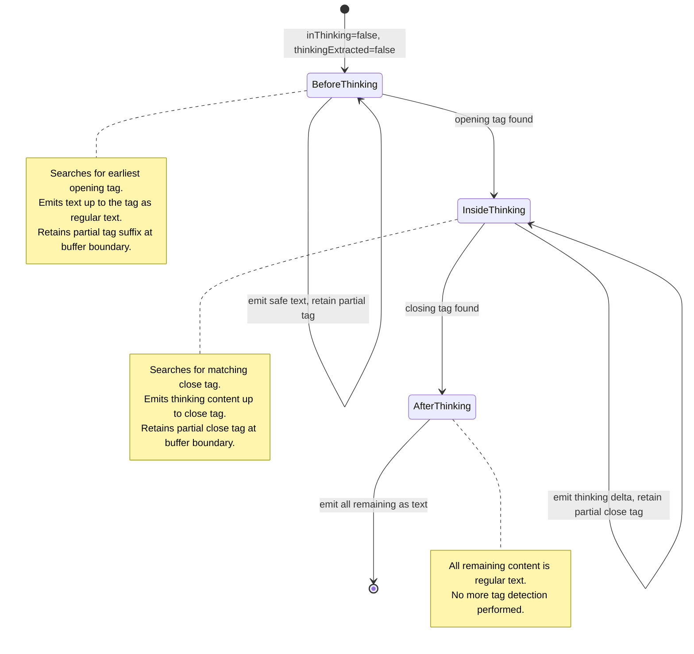
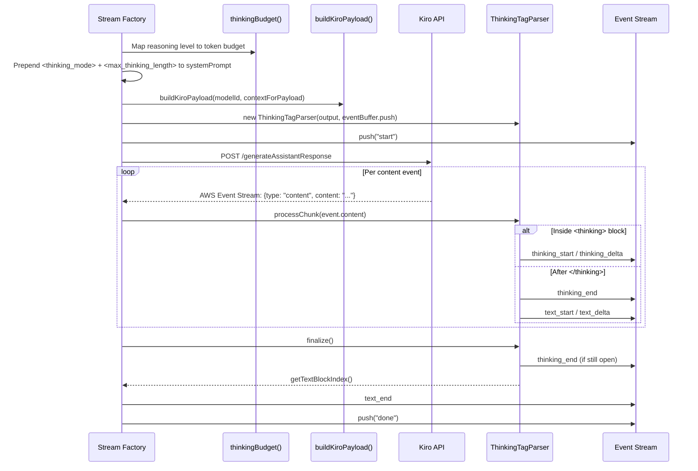

The OMP Kiro provider implements a two-phase **thinking extraction pipeline** that bridges the gap between Kiro's text-based streaming API and OMP's structured content model. Phase one injects reasoning directives into the system prompt before the request is dispatched; phase two parses the response stream to separate `<thinking>`, `<reasoning>`, and `<thought>` blocks from regular text content, emitting structured `thinking_start`/`thinking_delta`/`thinking_end` events in the process. This pipeline is critical because the Kiro API does not natively differentiate thinking content from response text — it returns a single flat text stream where reasoning blocks are demarcated by XML-like tags that the provider must detect, extract, and reorder in real time.

Sources: [thinking-parser.ts](src/thinking-parser.ts#L1-L10), [core.ts](src/core.ts#L51-L61)

## Reasoning Mode Injection — Prompt-Side Activation

Before any streaming begins, the stream factory determines whether the current model supports reasoning and whether the consumer has explicitly requested it. The decision logic evaluates two conditions: the model's `reasoning` flag in [models.json](models.json) and the `reasoning` parameter in `StreamOptions`. If either is truthy, thinking is considered enabled. However, models that declare `reasoningHidden` (such as Claude Opus 4.7) are exempt — they perform reasoning server-side and never emit thinking tags in the response.

When thinking is enabled and not hidden, the factory constructs a **prompt prefix** containing two XML directives and prepends it to the system prompt:

```
<thinking_mode>enabled</thinking_mode><max_thinking_length>{budget}</max_thinking_length>
```

The `<thinking_mode>` tag signals the model to wrap its internal reasoning in `<thinking>` tags. The `<max_thinking_length>` tag imposes a token budget that caps how much reasoning the model produces. The budget is derived from the reasoning level via a mapping function:

| Reasoning Level | Token Budget |
|-----------------|-------------|
| `"xhigh"` | 50,000 |
| `"high"` | 30,000 |
| `"medium"` | 20,000 |
| `"low"` / `true` / default | 10,000 |

This modified system prompt flows into the payload builder via a `contextForPayload` wrapper — an object that spreads the original context but overrides `systemPrompt`. The converter then prepends the system prompt (with its injected reasoning directives) to the first user message in the Kiro conversation format, making it invisible to end-users but visible to the model.

Sources: [core.ts](src/core.ts#L456-L475), [core.ts](src/core.ts#L56-L61), [types.ts](src/types.ts#L128), [converters.ts](src/converters.ts#L279-L345)

## ThinkingTagParser — Stateful Streaming State Machine

The `ThinkingTagParser` is a class-based, **single-pass state machine** that processes the response stream chunk by chunk. It is instantiated per-retry-attempt inside the stream factory and receives each content event from the AWS Event Stream decoder. The parser's core responsibility is threefold: detect thinking tag boundaries, separate thinking content from regular text, and emit properly sequenced OMP events (`thinking_start`, `thinking_delta`, `thinking_end`, `text_start`, `text_delta`, `text_end`).

### Recognized Tag Variants

The parser recognizes four tag pairs, allowing it to work across different model families that may use different tag conventions:

| Tag Variant | Open | Close | Notes |
|-------------|------|-------|-------|
| Standard | `<thinking>` | `</thinking>` | Primary variant used by Claude models |
| Dice symbol | `⚅` (U+2684) | `⚅` (U+2685) | Used by some alternative models |
| Reasoning | `<reasoning>` | `</reasoning>` | Used by DeepSeek, Qwen variants |
| Thought | `<thought>` | `</thought>` | Used by GLM, some experimental models |

When the opening tag is detected, the parser stores the matching close tag in `activeEndTag`, so the parser correctly handles streams where only one variant appears per response — even if other variants exist in the `THINKING_TAG_VARIANTS` array.

Sources: [thinking-parser.ts](src/thinking-parser.ts#L23-L28), [thinking-parser.ts](src/thinking-parser.ts#L143-L144)

### Three-Phase Processing Loop

The parser's `processChunk` method appends incoming text to an internal `textBuffer` and then enters a `while` loop that progresses through three mutually exclusive phases:



**Phase 1 — `processBeforeThinking`**: Searches the buffer for the earliest opening tag across all variants. If found, emits any preceding text as regular content, strips the opening tag, and transitions to inside-thinking. If no complete tag is found, it calculates the maximum **trailing partial tag prefix** — the longest suffix of the buffer that could be the beginning of any opening tag — and emits everything before that safe boundary as regular text, retaining the partial prefix for the next chunk.

**Phase 2 — `processInsideThinking`**: Searches for the matching close tag. If found, emits the preceding content as thinking, fires a `thinking_end` event, strips the close tag (plus up to two leading newlines), and transitions to after-thinking. If the close tag is incomplete, the same trailing-prefix-length technique prevents prematurely emitting content that might be part of the close tag.

**Phase 3 — `processAfterThinking`**: Once thinking has been extracted, all remaining content is emitted directly as text — no further tag detection occurs. This is a terminal phase for the current thinking block.

An infinite-loop guard compares buffer lengths before and after each iteration; if no progress is made, the loop breaks immediately.

Sources: [thinking-parser.ts](src/thinking-parser.ts#L72-L91), [thinking-parser.ts](src/thinking-parser.ts#L127-L197)

### Split-Tag Boundary Handling

The most technically delicate aspect of the parser is its handling of **tags split across chunk boundaries**. Because the Kiro API streams content token by token, an opening tag like `<thinking>` might arrive as `<thin` in one chunk and `king>` in the next. The parser addresses this with two helper functions:

`getTrailingPossibleTagPrefixLength` scans backward from the buffer's end, checking whether the trailing substring matches any prefix of a given tag. It returns the length of the longest matching prefix. `getMaxTrailingPossibleTagPrefixLength` extends this across all candidate tags, returning the maximum. The parser then emits only the "safe" portion of the buffer — everything except the trailing potential prefix — ensuring that a split tag is never partially emitted as regular text.

This approach is **conservative**: it may temporarily hold back a few characters of legitimate text if they happen to look like a tag prefix, but it guarantees that no tag characters leak into text content. The held-back characters are released on the next chunk when the tag resolves or when subsequent characters disprove the prefix match.

Sources: [thinking-parser.ts](src/thinking-parser.ts#L34-L48), [thinking-parser.ts](src/thinking-parser.ts#L148-L157)

### Block Reordering — Thinking Before Text

A critical Kiro-specific behavior is that **the API sometimes emits text content before the thinking block**. This violates the OMP convention where `ThinkingContent` blocks should precede `TextContent` blocks in the `content` array. The parser handles this through a **splice-based reordering** mechanism in `emitThinking`.

When the first thinking content arrives and a text block has already been created (`textBlockIndex !== null`), the parser splices a new `ThinkingContent` block at the text block's position, shifting the text block one index forward. This ensures the final content array always follows the `[thinking, text, ...]` ordering that OMP consumers expect, regardless of the arrival order from the Kiro API.

Sources: [thinking-parser.ts](src/thinking-parser.ts#L215-L238)

### Finalization and Stream-End Handling

The `finalize()` method is called when the upstream stream ends. It handles two edge cases: if the stream ended while still inside a thinking block (mid-reasoning), the remaining buffer is flushed as thinking content with a synthetic `thinking_end` event; otherwise, the remaining buffer is emitted as regular text. This guarantees that no content is lost even if the API terminates unexpectedly mid-tag.

Sources: [thinking-parser.ts](src/thinking-parser.ts#L94-L116)

## Integration with the Streaming Factory

The parser is integrated into the retry-capable streaming factory in [core.ts](src/core.ts). On each retry attempt, a fresh `ThinkingTagParser` instance is created (if thinking is enabled and not hidden), receiving the shared `output` object and an event-buffering callback. Content events from the AWS Event Stream decoder are routed through the parser via the `handleEvent` closure — when `thinkingParser` is non-null, `event.content` is fed to `processChunk`; otherwise, content is handled directly through the legacy text-block path.

After a successful response (content received, no retry needed), the factory calls `thinkingParser.finalize()` to flush any remaining buffered state. The parser's `getTextBlockIndex()` method then provides the index of the final text block, which is used for downstream operations: bracket-style tool call fallback parsing and echo noise stripping.

The parser is explicitly set to `null` during retry state resets (`resetAttemptState`), ensuring that partial state from a failed attempt never contaminates the next attempt's parsing.

Sources: [core.ts](src/core.ts#L282), [core.ts](src/core.ts#L345-L357), [core.ts](src/core.ts#L497-L503), [core.ts](src/core.ts#L698-L705), [core.ts](src/core.ts#L402-L418)

## Reasoning Configuration by Model

The activation of thinking mode depends on per-model configuration declared in [models.json](models.json). Each model entry includes a `reasoning` boolean and an optional `reasoningHidden` flag that controls whether the ThinkingTagParser is used at all:

| Model | `reasoning` | `reasoningHidden` | Parser Behavior |
|-------|:-----------:|:------------------:|-----------------|
| Auto | ✅ | — | Tags injected, parser active |
| Claude Sonnet 4.5 | ✅ | — | Tags injected, parser active |
| Claude Sonnet 4.6 | ✅ | — | Tags injected, parser active |
| Claude Sonnet 4 | ✅ | — | Tags injected, parser active |
| Claude Opus 4.6 | ✅ | — | Tags injected, parser active |
| **Claude Opus 4.7** | ✅ | ✅ | No tags, no parser; hidden reasoning indicator instead |
| Claude Opus 4.8 | ✅ | — | Tags injected, parser active |
| DeepSeek 3.2 | ✅ | — | Tags injected, parser active |
| Qwen3 Coder Next | ✅ | — | Tags injected, parser active |
| GLM 5 | ✅ | — | Tags injected, parser active |
| Claude Haiku 4.5 | ❌ | — | No thinking mode |
| MiniMax M2.5 | ❌ | — | No thinking mode |
| MiniMax M2.1 | ❌ | — | No thinking mode |

Claude Opus 4.7 is the sole model with `reasoningHidden: true`. For this model, the provider skips prompt injection and parser creation entirely, instead emitting a **hidden reasoning indicator** — a synthetic `ThinkingContent` block with `redacted: true` that signals to the UI that server-side reasoning is occurring. This is covered in detail in [Hidden Reasoning and Server-Side Thinking Indicator](20-hidden-reasoning-and-server-side-thinking-indicator).

Sources: [models.json](models.json#L1-L109), [core.ts](src/core.ts#L459-L461)

## End-to-End Event Flow

The following diagram illustrates the complete lifecycle — from prompt injection through response parsing — for a standard reasoning-enabled request:



Sources: [core.ts](src/core.ts#L456-L506), [thinking-parser.ts](src/thinking-parser.ts#L72-L116)

## Related Pages

- [Hidden Reasoning and Server-Side Thinking Indicator](20-hidden-reasoning-and-server-side-thinking-indicator) — How `reasoningHidden` models emit synthetic thinking blocks without tag parsing
- [Core Streaming Factory and Request Lifecycle](15-core-streaming-factory-and-request-lifecycle) — The retry loop and event buffering that the ThinkingTagParser integrates with
- [AWS Event Stream Binary Decoding](18-aws-event-stream-binary-decoding) — The decoder that feeds content events to the parser
- [Bracket-Style Tool Call Fallback Parser](22-bracket-style-tool-call-fallback-parser) — Uses the text block index returned by `getTextBlockIndex()` for post-parse tool extraction