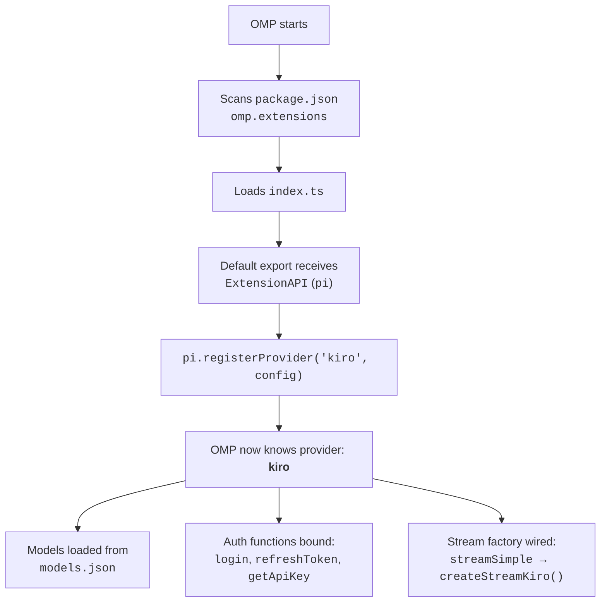
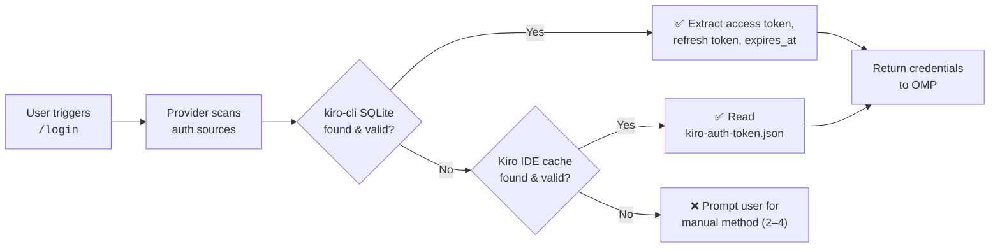
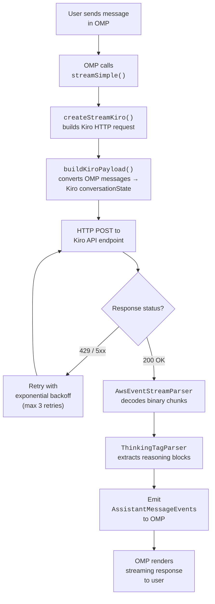

Get the **omp-kiro-provider** extension running inside your OMP (Oh My Pi) agent in under five minutes. This guide walks you through installation, authentication, and your first streaming request — the fastest path from zero to a working Kiro-powered coding assistant.

Sources: [index.ts](index.ts#L1-L15), [package.json](package.json#L1-L26)

## Prerequisites

Before you begin, confirm the following environment requirements:

| Requirement | Details |
|---|---|
| **OMP Framework** | A working installation of `@oh-my-pi/pi-coding-agent` (the host agent that loads extensions) |
| **Node.js** | Version ≥ 18 (uses `fetch`, `crypto.randomUUID`, and ES module syntax) |
| **TypeScript** | Project uses `import`/`export` ESM — your runtime must support `.ts` imports or be pre-compiled |
| **sqlite3 CLI** *(optional)* | Required only if you want to reuse credentials from an existing `kiro-cli` or Amazon Q installation |
| **Kiro Account** | A valid Kiro account — either a free trial or active subscription at [kiro.dev](https://kiro.dev) |

Sources: [package.json](package.json#L1-L26), [src/oauth.ts](src/oauth.ts#L99-L112)

## Installation

**omp-kiro-provider** is a zero-dependency local plugin. There is nothing to install from npm — you place the project directory where OMP can discover it.

**Step 1 — Clone or copy the project** into your OMP extensions directory (or any path OMP is configured to scan):

```bash
# Example: place it alongside other OMP extensions
cp -r omp-kiro-provider /path/to/omp/extensions/
```

**Step 2 — Verify OMP can locate the extension.** The `package.json` declares the entry point under the `omp.extensions` field:

```jsonc
{
  "omp": {
    "extensions": ["./index.ts"]   // OMP loads this file on startup
  }
}
```

**Step 3 — Start (or restart) your OMP agent.** OMP will auto-discover the provider and register it under the identifier `"kiro"`.

Sources: [package.json](package.json#L16-L25), [index.ts](index.ts#L83-L99)

## How Registration Works

When OMP loads the extension, it calls the default export function and receives a fully configured provider. Here is what happens at startup:



The provider registration object binds five critical pieces: a **name**, the **API base URL**, the **OAuth lifecycle** (login / refresh / getApiKey), the **model catalog**, and the **streaming factory**. Once registered, OMP treats Kiro identically to any other provider — users simply select it from the model picker.

Sources: [index.ts](index.ts#L66-L99)

## Authentication — Choose Your Login Method

The provider supports **four authentication strategies**, auto-detected and offered through an interactive login menu. When you trigger the OMP `/login` command (or OMP's equivalent), you will see:

```
Choose login method:
1. Reuse existing login (kiro-cli or Kiro IDE)
2. Paste API Key (ksk_xxx)
3. Paste Refresh Token
4. Browser Login (Builder ID)
Enter 1-4:
```

The table below compares all four methods to help you choose:

| Method | What You Need | Best For | Auto-Refresh |
|---|---|---|---|
| **① Reuse Existing** | An active `kiro-cli` session or Kiro IDE login on this machine | Quickest start — zero manual input | ✅ Yes (reads fresh tokens from kiro-cli SQLite) |
| **② API Key** | A Kiro API key starting with `ksk_` | Headless / CI environments; simple setups | ❌ No (keys don't expire) |
| **③ Refresh Token** | A raw refresh token string | Advanced users who extracted a token externally | ✅ Yes |
| **④ Browser Login** | A web browser and an AWS Builder ID | Full OAuth experience; no pre-existing credentials | ✅ Yes |

Sources: [src/oauth.ts](src/oauth.ts#L285-L374)

### Recommended Path: Reuse Existing Login (Option 1)

If you already have **kiro-cli** installed and logged in, this is the fastest path. The provider reads credentials directly from kiro-cli's SQLite database at `~/.local/share/kiro-cli/data.sqlite3`. It also falls back to the Kiro IDE's token cache at `~/.aws/sso/cache/kiro-auth-token.json`.



If the detected token is expired, the provider automatically refreshes it before returning credentials — you won't need to intervene.

Sources: [src/oauth.ts](src/oauth.ts#L127-L193), [src/oauth.ts](src/oauth.ts#L199-L238), [src/oauth.ts](src/oauth.ts#L336-L343)

### Alternative: Browser Login (Option 4)

For users with no pre-existing credentials, the **AWS Builder ID device code flow** performs a full OAuth handshake:

1. **Register client** — creates an OIDC client with Kiro-branded scopes.
2. **Start device auth** — receives a `userCode` and `verificationUri`.
3. **Open browser** — you visit the URL and approve the code.
4. **Poll for token** — the provider polls until you complete verification, then returns `accessToken` + `refreshToken`.

This is the same flow the real Kiro IDE uses for Builder ID authentication.

Sources: [src/auth/device-flow.ts](src/auth/device-flow.ts#L1-L14)

## Configuration — Environment Variables

The provider reads two optional environment variables at startup. You almost never need to change these, but they exist for regional or self-hosted deployments:

| Variable | Default | Purpose |
|---|---|---|
| `KIRO_REGION` | `us-east-1` | AWS region for the Kiro API endpoint |
| `KIRO_API_BASE` | `https://q.{region}.amazonaws.com` | Full base URL of the Kiro/CodeWhisperer API |

The region variable composes the default API base automatically — setting `KIRO_REGION=eu-west-1` produces `https://q.eu-west-1.amazonaws.com`. If you set `KIRO_API_BASE` explicitly, it overrides the composed default entirely.

```typescript
// From index.ts — how defaults are resolved
const DEFAULT_REGION = "us-east-1"
const region = process.env.KIRO_REGION ?? DEFAULT_REGION
const DEFAULT_API_BASE = `https://q.${region}.amazonaws.com`
const API_BASE = process.env.KIRO_API_BASE ?? DEFAULT_API_BASE
```

Sources: [index.ts](index.ts#L28-L31)

## Available Models

After authentication, you can select from the models defined in [models.json](models.json). Here is a summary of the most commonly used ones:

| Model ID | Display Name | Reasoning | Context Window | Max Output Tokens |
|---|---|---|---|---|
| `auto` | Auto | ✅ | 1,000,000 | 65,536 |
| `claude-sonnet-4-6` | Claude Sonnet 4.6 | ✅ | 1,000,000 | 65,536 |
| `claude-sonnet-4-5` | Claude Sonnet 4.5 | ✅ | 200,000 | 65,536 |
| `claude-opus-4-8` | Claude Opus 4.8 | ✅ | 1,000,000 | 128,000 |
| `claude-opus-4-7` | Claude Opus 4.7 | ✅ *(hidden)* | 1,000,000 | 128,000 |
| `claude-haiku-4-5` | Claude Haiku 4.5 | ❌ | 200,000 | 65,536 |
| `deepseek-3-2` | DeepSeek 3.2 | ✅ | 164,000 | 8,192 |
| `qwen3-coder-next` | Qwen3 Coder Next | ✅ | 256,000 | 8,192 |
| `minimax-m2-5` | MiniMax M2.5 | ❌ | 196,000 | 8,192 |
| `glm-5` | GLM 5 | ✅ | 200,000 | 8,192 |

> **Note:** All models report zero cost (`input: 0, output: 0`) because Kiro is free during its trial period and subscription covers usage afterward. The cost fields exist solely to satisfy OMP's `ProviderConfigInput` contract.

Sources: [models.json](models.json#L1-L109), [index.ts](index.ts#L49-L60)

## Project Structure

Understanding the file layout helps you navigate the codebase if you need to customize behavior:

```
omp-kiro-provider/
├── index.ts                  ← Extension entry point; registers provider with OMP
├── models.json               ← Static model catalog (id, name, context window, etc.)
├── package.json              ← NPM metadata + OMP extension manifest
└── src/
    ├── core.ts               ← Stream factory: retry, timeout, event parsing
    ├── converters.ts         ← OMP message format → Kiro conversationState format
    ├── oauth.ts              ← Login menu, credential auto-detection, sidecar metadata
    ├── runtime.ts            ← Push-based async event stream (bridges producer → consumer)
    ├── eventstream.ts        ← AWS Event Stream binary protocol decoder
    ├── thinking-parser.ts    ← Parses <thinking> tags from model output
    ├── bracket-tool-parser.ts← Fallback parser for bracket-style tool calls
    ├── types.ts              ← Shared TypeScript interfaces (OMP contract types)
    └── auth/
        ├── device-flow.ts    ← AWS SSO OIDC device code flow (Builder ID)
        ├── token-refresh.ts  ← Token refresh logic for social + OIDC sessions
        └── fingerprint.ts    ← Machine fingerprint generation (SHA-256)
```

Sources: [index.ts](index.ts#L1-L99), [src/types.ts](src/types.ts#L1-L197)

## End-to-End Request Flow

When you send a message through OMP to the Kiro provider, the following pipeline executes:



Each stage is isolated in its own module, making the pipeline easy to debug and extend.

Sources: [src/core.ts](src/core.ts#L1-L13), [src/converters.ts](src/converters.ts#L1-L22), [src/eventstream.ts](src/eventstream.ts#L1-L1)

## Troubleshooting Common Issues

| Symptom | Likely Cause | Resolution |
|---|---|---|
| `"No existing Kiro login found"` | No kiro-cli session or IDE token on this machine | Use option 2 (API Key) or option 4 (Browser Login) instead |
| `INSUFFICIENT_MODEL_CAPACITY` errors | Free-tier model temporarily at capacity | The provider auto-retries up to 3 times; wait a moment or switch models |
| `TEMPORARILY_SUSPENDED` in response | Account flagged by Kiro's abuse detection | Review your usage patterns; ensure headers aren't being modified by a proxy |
| Stream hangs with no output | First-token timeout (180s) or idle timeout (90s) exceeded | Check network connectivity; the provider auto-retries on empty responses |
| `sqlite3` not found error | kiro-cli database exists but `sqlite3` CLI tool is missing | Install `sqlite3` (`apt install sqlite3` / `brew install sqlite`) or use a different auth method |

Sources: [src/core.ts](src/core.ts#L44-L49), [src/oauth.ts](src/oauth.ts#L316-L331)

## What to Read Next

Now that you have the provider running, explore these topics to deepen your understanding:

- **[Supported Models and Configuration](3-supported-models-and-configuration)** — full model specifications, reasoning modes, and hidden reasoning behavior
- **[Environment Variables and Runtime Configuration](4-environment-variables-and-runtime-configuration)** — all configurable parameters and their effects
- **[Authentication Methods and Credential Auto-Detection](8-authentication-methods-and-credential-auto-detection)** — detailed breakdown of each auth strategy and the credential discovery pipeline
- **[Architecture Overview and Module Responsibilities](5-architecture-overview-and-module-responsibilities)** — how every source file fits together and why