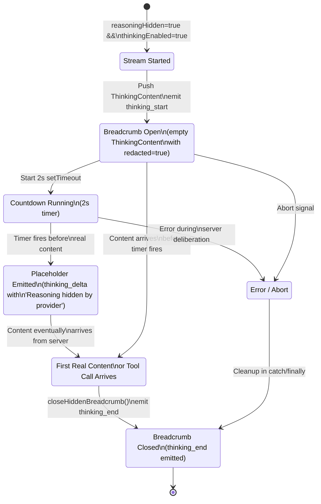
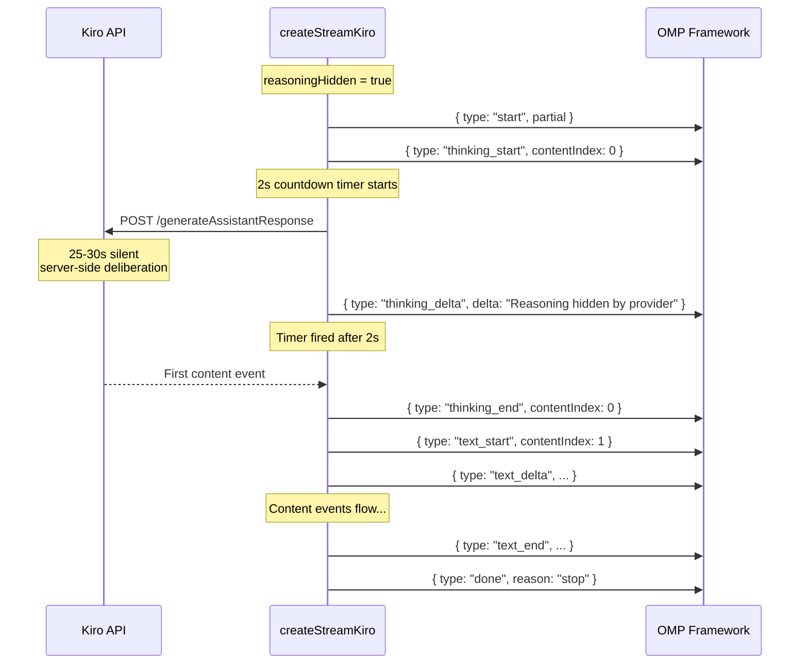

Some models — notably Claude Opus 4.7 — perform reasoning **entirely on the server side**, never emitting `<thinking>` tags in the response stream. The user would see a 25–30 second silence with zero feedback before the first content token arrives. This page documents how the provider detects these models, emits a **synthetic thinking breadcrumb** to keep the consumer informed, and cleans it up the instant real content appears. This mechanism is orthogonal to the tag-based [Thinking Tag Parser and Reasoning Mode Injection](19-thinking-tag-parser-and-reasoning-mode-injection) covered in the previous page — both coexist but never activate for the same model.

Sources: [core.ts](src/core.ts#L51-L53), [types.ts](src/types.ts#L80-L83)

## The Two Classes of Reasoning Models

The provider distinguishes two fundamentally different reasoning architectures based on a single model-level flag. **Tag-based reasoning models** (the majority) produce `<thinking>` blocks inline in the response; the `ThinkingTagParser` strips those tags and emits proper `thinking_start`/`thinking_delta`/`thinking_end` events. **Hidden reasoning models** never emit tags at all — the server deliberates silently and then returns only the final answer. The `reasoningHidden` boolean on `ModelLike` is the single source of truth that switches between these two code paths.

| Property | Tag-Based Reasoning | Hidden (Server-Side) Reasoning |
|---|---|---|
| `reasoningHidden` flag | `false` (default) | `true` |
| Thinking tag injection | `<thinking_mode>enabled</thinking_mode>` prepended to system prompt | **Skipped** — server already reasons |
| `ThinkingTagParser` created | ✅ Yes | ❌ No |
| Synthetic breadcrumb | ❌ No — real thinking events flow | ✅ Yes — covers deliberation silence |
| Example models | Claude Sonnet 4.5, DeepSeek 3.2, Qwen3 Coder Next | **Claude Opus 4.7** |

Sources: [types.ts](src/types.ts#L80-L83), [models.json](models.json#L44-L51), [core.ts](src/core.ts#L456-L503)

## Model Registration and the `reasoningHidden` Flag

The flag originates in [models.json](models.json) and flows through [index.ts](index.ts) into the `ModelLike` objects registered with OMP. Currently, only **Claude Opus 4.7** carries `reasoningHidden: true`:

```json
{
  "id": "claude-opus-4-7",
  "name": "Claude Opus 4.7",
  "reasoning": true,
  "reasoningHidden": true,
  "input": ["text"],
  "contextWindow": 1000000,
  "maxTokens": 128000
}
```

The `ModelDef` interface in the entry point mirrors this optional field and passes it through verbatim to OMP's model registry. At stream time, `core.ts` reads `model.reasoningHidden` to decide which reasoning path to take — no configuration or environment variable controls this; it is purely model-driven.

Sources: [models.json](models.json#L44-L51), [index.ts](index.ts#L37-L60)

## System Prompt Fork: Tag Injection vs. No Injection

When `thinkingEnabled` is true and `reasoningHidden` is **false**, the provider prepends a thinking-mode directive and a budget to the system prompt:

```
<thinking_mode>enabled</thinking_mode><max_thinking_length>10000</max_thinking_length>
```

This instructs the model to wrap its reasoning in `<thinking>` tags. When `reasoningHidden` is **true**, this injection is **skipped entirely** — the model already reasons server-side without needing the prompt hint. The budget function `thinkingBudget()` maps the `options.reasoning` level (`"low"` / `"medium"` / `"high"` / `"xhigh"`) to a token count (10K–50K), but this budget is irrelevant for hidden reasoning models since no thinking tags are ever produced.

```typescript
const thinkingEnabled = !!reasoningLevel || model.reasoning
const reasoningHidden = !!model.reasoningHidden

if (thinkingEnabled && !reasoningHidden) {
  const budget = thinkingBudget(reasoningLevel)
  const prefix = `<thinking_mode>enabled</thinking_mode><max_thinking_length>${budget}</max_thinking_length>`
  systemPromptOverride = `${prefix}${systemPromptOverride ? `\n${systemPromptOverride}` : ""}`
}
```

Sources: [core.ts](src/core.ts#L456-L474)

## The Synthetic Thinking Breadcrumb Lifecycle

The core innovation is a **two-phase synthetic indicator** that bridges the gap between the `start` event and the first real content token. Here is the complete lifecycle:



### Phase 1 — Immediate `thinking_start`

Immediately after the outer retry loop begins its first attempt, and *before* the HTTP fetch is even issued, the provider pushes a synthetic `ThinkingContent` block into `output.content`:

```typescript
const block: ThinkingContent = {
  type: "thinking",
  thinking: "",
  redacted: true,
}
output.content.push(block)
stream.push({ type: "thinking_start", contentIndex: hiddenThinkingIndex, partial: output })
```

The `redacted: true` field is the semantic marker — it signals to downstream consumers (the OMP framework, UI layers) that this thinking block does not contain actual model reasoning; it is a placeholder. This happens **only on the first attempt** (`outerAttempt === 0`) and only when no breadcrumb is already active (`hiddenThinkingIndex === null`).

Sources: [core.ts](src/core.ts#L508-L535), [types.ts](src/types.ts#L47-L51)

### Phase 2 — Delayed Placeholder Text

A `setTimeout` is armed with `HIDDEN_REASONING_COUNTDOWN_MS` (2000 ms). If the server hasn't produced any content within that window, the timer fires and emits a `thinking_delta` containing the `HIDDEN_REASONING_PLACEHOLDER` string (`"Reasoning hidden by provider"`). This two-stage approach means: during the first 2 seconds of silence, the consumer sees a `thinking_start` event (a spinner can appear); after 2 seconds of continued silence, the consumer receives visible placeholder text (the spinner can be replaced with a message). The boolean `hiddenMarkerEmitted` ensures this fires at most once.

```typescript
hiddenMarkerTimer = setTimeout(() => {
  hiddenMarkerTimer = null
  if (hiddenThinkingIndex === idx && !hiddenMarkerEmitted) {
    block.thinking = HIDDEN_REASONING_PLACEHOLDER
    stream.push({
      type: "thinking_delta",
      contentIndex: idx,
      delta: HIDDEN_REASONING_PLACEHOLDER,
      partial: output,
    })
    hiddenMarkerEmitted = true
  }
}, HIDDEN_REASONING_COUNTDOWN_MS)
```

Sources: [core.ts](src/core.ts#L51-L53), [core.ts](src/core.ts#L522-L534)

### Closure — `closeHiddenBreadcrumb()`

The breadcrumb is closed at multiple points to guarantee no orphaned thinking block leaks:

| Trigger | Location | Condition |
|---|---|---|
| First content event | `handleEvent → case "content"` | `closeHiddenBreadcrumb()` called immediately |
| First tool call event | `handleEvent → case "tool_start"` | `closeHiddenBreadcrumb()` called immediately |
| Stream finalization | Success path, step 5 | Defensive close after all processing |
| Error or abort | `catch` block | `cancelHiddenMarkerTimer()` + `closeHiddenBreadcrumb()` |
| Final cleanup | `finally` block | `cancelHiddenMarkerTimer()` ensures no dangling timer |

The closure function cancels any pending timer, then emits a `thinking_end` event with empty content and resets `hiddenThinkingIndex` to `null`:

```typescript
const closeHiddenBreadcrumb = () => {
  cancelHiddenMarkerTimer()
  if (hiddenThinkingIndex !== null) {
    stream.push({
      type: "thinking_end",
      contentIndex: hiddenThinkingIndex,
      content: "",
      partial: output,
    })
    hiddenThinkingIndex = null
  }
}
```

Sources: [core.ts](src/core.ts#L420-L439), [core.ts](src/core.ts#L342-L343), [core.ts](src/core.ts#L364), [core.ts](src/core.ts#L746-L747), [core.ts](src/core.ts#L800-L801), [core.ts](src/core.ts#L813-L814)

## Interaction with the ThinkingTagParser

A critical design constraint: **`ThinkingTagParser` is never instantiated for hidden reasoning models**. The conditional at line 501 of `core.ts` ensures this:

```typescript
if (thinkingEnabled && !reasoningHidden) {
  thinkingParser = new ThinkingTagParser(output, (evt) => eventBuffer.push(evt))
}
```

When `reasoningHidden` is `true`, the `thinkingParser` variable stays `null`, and all content events flow directly through the `else` branch of the content handler — plain `text_start`/`text_delta` events with no tag stripping. This prevents the parser from misinterpreting any response text as thinking tags, and avoids the overhead of maintaining a state machine that would never match anything.

Sources: [core.ts](src/core.ts#L499-L503), [core.ts](src/core.ts#L345-L358)

## Event Timeline: What the Consumer Sees

The following diagram shows the exact sequence of `AssistantMessageEvent` types that a downstream consumer receives for a hidden reasoning model. Compare it against the tag-based reasoning flow to see why the synthetic breadcrumb is necessary:



If the server responds within 2 seconds (unlikely for Opus 4.7 but defensive), the `thinking_delta` with placeholder text never fires — the breadcrumb closes cleanly with an empty `thinking_end` and the consumer transitions directly to real content.

Sources: [core.ts](src/core.ts#L508-L535), [core.ts](src/core.ts#L746-L762)

## Retry Safety and State Reset

When the outer retry loop re-enters for a second attempt (capacity error, empty response, or timeout), `resetAttemptState()` clears `output.content` to an empty array. However, the hidden reasoning state variables (`hiddenThinkingIndex`, `hiddenMarkerTimer`, `hiddenMarkerEmitted`) are **hoisted outside** the per-attempt scope and persist across attempts. The breadcrumb is only emitted on `outerAttempt === 0`, so retries do not produce duplicate synthetic thinking blocks. On the error path, `cancelHiddenMarkerTimer()` and `closeHiddenBreadcrumb()` are called in the `catch` block and again defensively in the `finally` block, ensuring no timer leaks even on unexpected exceptions.

Sources: [core.ts](src/core.ts#L294-L297), [core.ts](src/core.ts#L401-L418), [core.ts](src/core.ts#L798-L818)

## Configuration Constants

| Constant | Value | Purpose |
|---|---|---|
| `HIDDEN_REASONING_COUNTDOWN_MS` | `2000` | Milliseconds before the placeholder text is emitted |
| `HIDDEN_REASONING_PLACEHOLDER` | `"Reasoning hidden by provider"` | The text shown to indicate server-side reasoning |

These are compile-time constants — not configurable via environment variables. The 2-second countdown is calibrated to be long enough that a fast-responding model won't flash the placeholder unnecessarily, but short enough that the user sees feedback during the typical 25–30 second deliberation window.

Sources: [core.ts](src/core.ts#L52-L53)

## Next Steps

- See how the tag-based reasoning counterpart works: [Thinking Tag Parser and Reasoning Mode Injection](19-thinking-tag-parser-and-reasoning-mode-injection)
- Understand the full stream lifecycle that wraps this indicator: [Core Streaming Factory and Request Lifecycle](15-core-streaming-factory-and-request-lifecycle)
- Learn about the event types consumed downstream: [Push-Based Event Stream Runtime](17-push-based-event-stream-runtime)