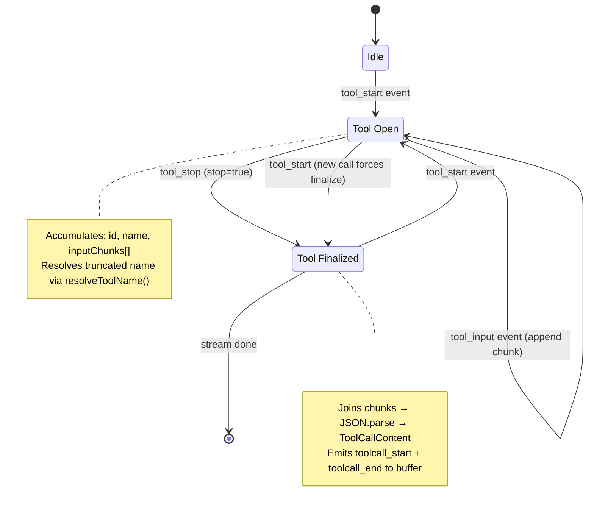
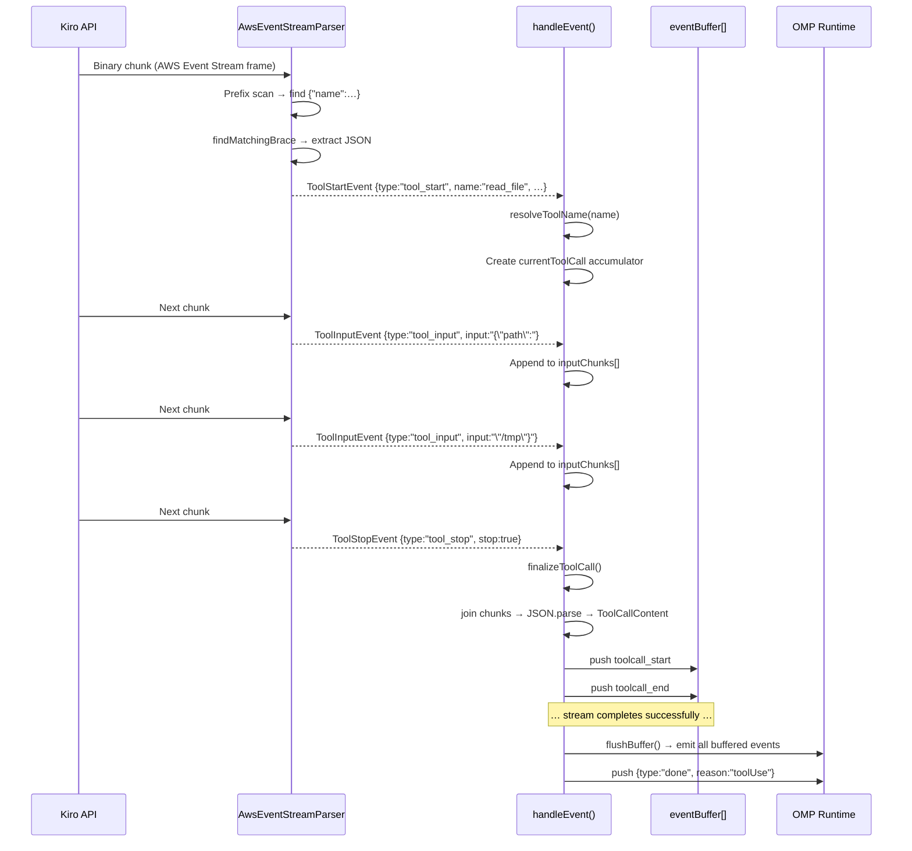

The Kiro API streams tool invocations as structured JSON events interleaved with text content inside the AWS Event Stream binary protocol. This page documents how the **omp-kiro-provider** detects, parses, accumulates, and emits those native tool call events — the primary path by which model-initiated function calls reach the OMP runtime. (A secondary fallback path, which scrapes bracket-style `[Called …]` patterns from plain text, is covered separately in [Bracket-Style Tool Call Fallback Parser](22-bracket-style-tool-call-fallback-parser).)

Sources: [eventstream.ts](src/eventstream.ts#L1-L30) · [core.ts](src/core.ts#L1-L35)

---

## Event Types in the Wire Protocol

The Kiro backend emits three distinct JSON shapes for a single tool invocation. Together they form a **start → input* → stop** lifecycle:

| Event | JSON Prefix | Purpose |
|---|---|---|
| `tool_start` | `{"name":` or `{"toolUseId":` | Opens a new tool call. Carries `toolUseId`, `name`, an optional initial `input` payload, and a `stop` flag for single-shot calls. |
| `tool_input` | `{"input":` | Appends an incremental chunk of the tool's JSON argument string. May appear zero or more times. |
| `tool_stop` | `{"stop":` | Closes the current tool call. `stop: true` signals the argument stream is complete. |

These are declared as TypeScript discriminated unions inside `AwsEventStreamParser`:

```typescript
// tool_start — carries identity + optional initial input
interface ToolStartEvent {
  type: "tool_start"
  toolUseId: string
  name: string
  input: string      // JSON string or empty
  stop: boolean       // true → single-shot, no further events
}

// tool_input — incremental argument fragment
interface ToolInputEvent {
  type: "tool_input"
  input: string
}

// tool_stop — terminates the current call
interface ToolStopEvent {
  type: "tool_stop"
  stop: boolean
}
```

The `stop` field on `tool_start` enables a **single-shot** optimization: when the model sends all arguments inline with `{"name":"get_time","toolUseId":"tu1","input":"","stop":true}`, no follow-up `tool_input`/`tool_stop` events are needed. This is common for tools with small or empty argument schemas.

Sources: [eventstream.ts](src/eventstream.ts#L17-L43)

---

## Detection: Prefix Scanning with Priority Ordering

The `AwsEventStreamParser` does **not** rely on the AWS binary framing headers to locate events. Instead, it performs a prefix-scan over the accumulated text buffer, matching against a prioritized array of known JSON prefixes:

| Priority | Prefix Pattern | Resolved Type |
|---|---|---|
| 1 | `{"name":` | `tool_start` |
| 2 | `{"toolUseId":` | `tool_start` |
| 3 | `{"toolUseId": ` | `tool_start` |
| 4 | `{"type":"tool_use"` | `tool_start` |
| 5 | `{"input":` | `tool_input` |
| 6 | `{"stop":` | `tool_stop` |
| 7+ | … | `content`, `usage`, `context_usage` |

The parser iterates over all patterns, finds the **earliest** match position in the buffer, extracts the balanced JSON object using `findMatchingBrace` (a character-level brace-depth tracker that correctly handles nested objects and escaped string characters), then parses the resulting JSON string. This design is resilient to the binary preamble bytes that precede each event frame — any non-JSON data is simply skipped over.

Sources: [eventstream.ts](src/eventstream.ts#L82-L118)

---

## Argument Normalization

The `input` field on `tool_start` and `tool_input` events may arrive as either a **JSON object** or a **string**. The parser normalizes both cases into a string:

```typescript
// If input is a non-empty object → serialize to JSON string
// If input is a string or falsy → coerce with String()
let inputStr: string
if (typeof input === "object" && input !== null && !Array.isArray(input)) {
  inputStr = Object.keys(input).length > 0 ? JSON.stringify(input) : ""
} else {
  inputStr = input ? String(input) : ""
}
```

This normalization is critical because the downstream accumulator in `core.ts` concatenates `inputChunks` and then performs a single `JSON.parse` at finalization time. Keeping everything as string fragments ensures the join → parse contract works correctly regardless of how the wire protocol delivers arguments.

Sources: [eventstream.ts](src/eventstream.ts#L210-L230)

---

## Accumulator State Machine in the Stream Factory

The `createStreamKiro` factory in `core.ts` maintains a per-attempt accumulator that tracks the currently open tool call. This accumulator is the **bridge** between the low-level event parser and the high-level OMP `AssistantMessageEvent` stream. The following diagram shows the state transitions:



The accumulator is a plain object:

```typescript
let currentToolCall: {
  id: string
  name: string
  inputChunks: string[]
} | undefined
```

Key behavioral rules enforced by the `handleEvent` function:

1. **`tool_start`** — If a previous tool call is still open, it is finalized first (auto-close). A synthetic `toolUseId` is generated when the event omits one. The tool name passes through `resolveToolName()` to reverse-map any truncation applied during request construction (see [Tool Name Truncation and Reverse Mapping](13-tool-name-truncation-and-reverse-mapping)).
2. **`tool_input`** — Appended to `inputChunks` only if a tool call is currently open; otherwise silently ignored.
3. **`tool_stop` with `stop: true`** — Triggers `finalizeToolCall()`.

Sources: [core.ts](src/core.ts#L307-L380)

---

## Finalization: From Chunks to ToolCallContent

When `finalizeToolCall()` is invoked (either by `tool_stop`, by a new `tool_start` that auto-closes the previous call, or at stream end), the following transformation occurs:

```typescript
const rawArgs = currentToolCall.inputChunks.join("")
let parsedArgs: Record<string, unknown> = {}
try {
  parsedArgs = JSON.parse(rawArgs || "{}")
} catch {
  parsedArgs = {}    // malformed JSON → empty object (graceful degradation)
}

const toolCall: ToolCallContent = {
  type: "toolCall",
  id: currentToolCall.id,
  name: currentToolCall.name,          // already resolveToolName'd
  arguments: parsedArgs,
}
```

The resulting `ToolCallContent` is appended to `output.content` and two events are pushed to the **event buffer** (not the stream — see next section):

| Event | Purpose |
|---|---|
| `toolcall_start` | Signals to OMP that a tool call block is beginning at `contentIndex` |
| `toolcall_end` | Carries the complete `ToolCallContent` object with parsed arguments |

The `contentIndex` is the position of the `ToolCallContent` within `output.content[]`, enabling OMP consumers to correlate tool call blocks with their position in the response.

Sources: [core.ts](src/core.ts#L294-L306)

---

## Buffered Emission: Why Tool Calls Never Leak on Retry

A critical architectural detail is that **tool call events are not emitted to the OMP stream immediately**. Instead, they are pushed into an `eventBuffer` array. This buffer is only flushed to the consumer-facing stream after the entire response has been successfully read and validated:

```typescript
// Only on success path:
flushBuffer()    // drains eventBuffer into stream.push()
```

This design exists because of the **retry infrastructure**. When the Kiro API returns a transient failure (HTTP 429, 5xx, `INSUFFICIENT_MODEL_CAPACITY`, first-token timeout, or empty response), the entire attempt is discarded via `resetAttemptState()`, which clears `output.content`, `eventBuffer`, and `currentToolCall`. If tool call events were emitted eagerly, a retried request would produce **duplicate** tool invocations visible to the consumer. The buffer-then-flush pattern ensures atomicity: either the complete response (with all its tool calls) is emitted, or none of it is.

The `resetAttemptState()` function zeroes out every per-attempt variable:

```typescript
const resetAttemptState = () => {
  output.content = []
  eventBuffer = []
  currentToolCall = undefined
  emittedToolCalls = 0
  sawAnyToolCalls = false
  // ... plus text, thinking, and usage state
}
```

Sources: [core.ts](src/core.ts#L397-L415) · [core.ts](src/core.ts#L424-L429)

---

## Stop Reason Determination

After successful stream completion, the provider determines the `stopReason` for the response message. Tool calls directly influence this:

```typescript
if (!receivedContextUsage && emittedToolCalls === 0) {
  output.stopReason = "length"
} else {
  output.stopReason = emittedToolCalls > 0 ? "toolUse" : "stop"
}
```

| Condition | Stop Reason | Meaning |
|---|---|---|
| No context usage event and no tool calls | `"length"` | Likely truncated response |
| One or more tool calls emitted | `"toolUse"` | Model requests tool execution |
| Content present, no tool calls | `"stop"` | Normal end-of-turn |

The `"toolUse"` stop reason is what triggers the OMP runtime's tool execution loop: it dispatches each `ToolCallContent` to the appropriate handler, collects results, and sends them back as the next user turn.

Sources: [core.ts](src/core.ts#L765-L772)

---

## Interaction with Bracket-Style Fallback

After the native event stream is fully processed, the stream factory checks whether any native tool calls were detected. If none were found (`sawAnyToolCalls === false`) and text content exists, it invokes the bracket-style parser as a **secondary extraction pass**:

```typescript
if (!sawAnyToolCalls && textBlockIdx !== null) {
  const bracketResult = parseBracketToolCalls(textContent.text)
  if (bracketResult.toolCalls.length > 0) {
    sawAnyToolCalls = true
    textContent.text = bracketResult.cleanedText
    // ... create ToolCallContent for each bracket match
  }
}
```

This means the bracket parser only activates when the model emits tool calls as plain text patterns rather than native events. When native `tool_start`/`tool_input`/`tool_stop` events are present, the bracket parser is skipped entirely. The two paths are mutually exclusive per response.

Sources: [core.ts](src/core.ts#L727-L746) · [bracket-tool-parser.ts](src/bracket-tool-parser.ts#L1-L15)

---

## Echo Noise Stripping After Tool Calls

When tool calls are present, the model sometimes emits filler text like `"."` or `"continue"` alongside the tool invocations — an artifact of the generation process that would accumulate in conversation history and reinforce the pattern. The stream factory strips this noise:

```typescript
if (emittedToolCalls > 0 && textBlockIdx !== null) {
  const textContent = output.content[textBlockIdx] as TextContent | undefined
  if (textContent && /^\s*(\.+|continue)\s*$/i.test(textContent.text)) {
    textContent.text = ""
  }
}
```

This regex matches text that consists **entirely** of dots or the word "continue" (case-insensitive), zeroing it out only when tool calls are present in the same response. Meaningful text content is never affected.

Sources: [core.ts](src/core.ts#L749-L756)

---

## End-to-End Event Flow

The following diagram traces a complete tool call through the system, from binary chunk to OMP consumer:



Sources: [eventstream.ts](src/eventstream.ts#L119-L167) · [core.ts](src/core.ts#L358-L393)

---

## Edge Cases and Defensive Measures

| Scenario | Behavior |
|---|---|
| **Missing `toolUseId`** | A synthetic ID is generated: `call_` + first 8 hex chars of a UUID |
| **Malformed JSON in arguments** | `JSON.parse` failure is caught; arguments default to `{}` |
| **Empty input** (`""` or `{}`) | Normalized to empty string; parsed as `{}` at finalization |
| **`tool_start` while another call is open** | Previous call is auto-finalized before the new one begins |
| **`tool_input` with no open call** | Silently ignored (no accumulator to append to) |
| **Single-shot tool** (`stop:true` on `tool_start`) | Finalized immediately; no `tool_input`/`tool_stop` expected |
| **Content dedup reset at tool boundary** | The parser's `lastContent` dedup state is cleared on every tool event, preventing false deduplication of text that appears before and after tool calls |
| **Buffer overflow protection** | If the internal buffer exceeds 10 MB, only the last 5 MB is retained — most likely to contain valid event starts |

Sources: [eventstream.ts](src/eventstream.ts#L200-L245) · [core.ts](src/core.ts#L358-L380) · [eventstream.ts](src/eventstream.ts#L133-L139)

---

## Related Pages

- **[Bracket-Style Tool Call Fallback Parser](22-bracket-style-tool-call-fallback-parser)** — the secondary extraction path when native events are absent
- **[AWS Event Stream Binary Decoding](18-aws-event-stream-binary-decoding)** — the low-level binary frame parser that feeds `AwsEventStreamParser`
- **[Tool Name Truncation and Reverse Mapping](13-tool-name-truncation-and-reverse-mapping)** — how `resolveToolName` reverses 64-char truncation
- **[Core Streaming Factory and Request Lifecycle](15-core-streaming-factory-and-request-lifecycle)** — the outer retry loop and buffered emission architecture
- **[Echo Noise Stripping and Response Cleanup](23-echo-noise-stripping-and-response-cleanup)** — the broader text sanitization after tool call extraction