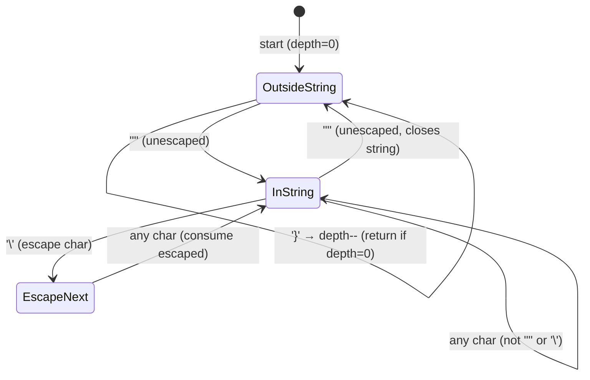
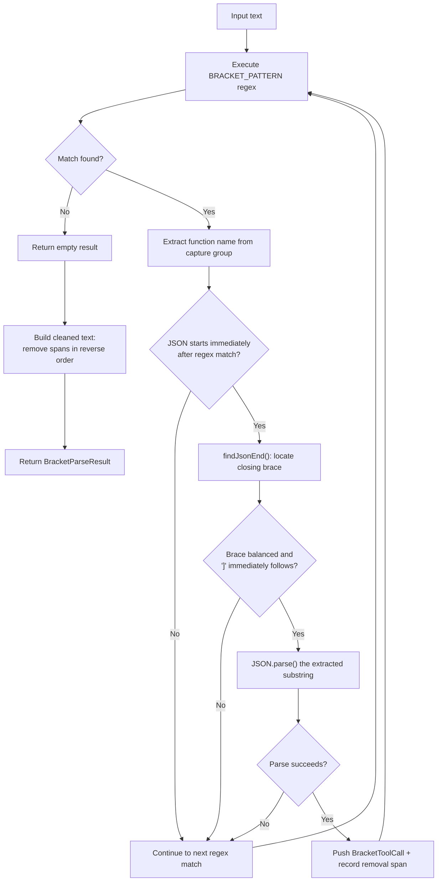
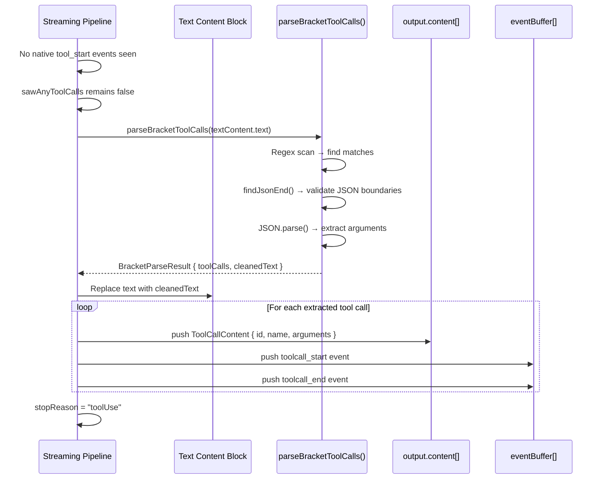

Not every model emits structured tool-call events over the wire. Some models — particularly those operating behind compatibility layers or older API versions — embed tool invocations directly in their text output as bracket-delimited annotations like `[Called read_file with args: {"path": "/foo"}]`. The **Bracket-Style Tool Call Fallback Parser** is a post-hoc text analysis module that detects these inline patterns, extracts them into structured `ToolCallContent` objects, strips the raw bracket text from the response, and synthesizes proper `toolcall_start`/`toolcall_end` events — making the downstream processing pipeline indistinguishable from a model that natively supports tool calls. It activates only when the streaming layer has seen zero native tool events, ensuring it never double-processes a response that already carries structured tool calls.

Sources: [bracket-tool-parser.ts](src/bracket-tool-parser.ts#L1-L9), [core.ts](src/core.ts#L710-L734)

## Why a Fallback Exists

The Kiro streaming pipeline processes two categories of tool-call signaling. The primary path handles native `tool_start`, `tool_input`, and `tool_stop` events decoded from the AWS Event Stream binary protocol — these are emitted by models that understand the Kiro tool-use protocol natively. The fallback path handles models that instead serialize their tool-call intent as plain text within the content stream, wrapping the invocation in a `[Called ... with args: ...]` bracket notation. Without the fallback parser, these text-embedded invocations would pass through as ordinary text content, breaking the tool-result round-trip that OMP expects.

The fallback condition is gated by the `sawAnyToolCalls` boolean flag, which is set to `true` the moment a native `tool_start` event is encountered during streaming. The bracket parser only executes when this flag remains `false` through the entire stream — meaning no native tool events were ever emitted. This two-tier design ensures zero overlap: a response is processed by exactly one tool-call path.

Sources: [core.ts](src/core.ts#L288), [core.ts](src/core.ts#L362-L363), [core.ts](src/core.ts#L712)

## Pattern Specification and Matching

The parser targets a specific text pattern using a global regular expression:

| Component | Regex Segment | Description |
|---|---|---|
| Opening bracket | `\[` | Literal `[` |
| Keyword | `Called` | Fixed sentinel word |
| Whitespace | `\s+` | One or more spaces |
| Function name | `([\w-]+)` | Capture group: alphanumeric, underscore, hyphen |
| Separator | `\s+with\s+args:\s*` | Fixed literal with flexible spacing |
| JSON payload | *(handled separately)* | Not captured by regex — extracted via brace matching |

The full regex: `/\[Called\s+([\w-]+)\s+with\s+args:\s*/g`. It captures only the function name; the JSON argument object that follows is located and bounded by a dedicated brace-matching algorithm rather than the regex engine. This separation is deliberate — JSON payloads can contain nested objects, escaped quotes, and arbitrarily deep structures that are impractical to express in a single regex.

An example of a matching input: `[Called read_file with args: {"path": "/etc/hosts", "encoding": "utf-8"}]`.

Sources: [bracket-tool-parser.ts](src/bracket-tool-parser.ts#L22)

## JSON Boundary Detection: The `findJsonEnd` Algorithm

After the regex matches the `[Called name with args: ` prefix, the parser must locate the complete JSON object that follows. Rather than relying on fragile heuristics like bracket-counting alone, `findJsonEnd` implements a **character-level state machine** that tracks three dimensions of parsing context simultaneously:



The algorithm iterates every character using charcode comparisons for performance (`0x7b` for `{`, `0x7d` for `}`, `0x22` for `"`, `0x5c` for `\`). The three tracked states are:

- **Brace depth** (`depth`): Incremented on `{`, decremented on `}`. Returns immediately when depth reaches zero.
- **String context** (`inString`): Toggled on unescaped `"`. Brace counting is suspended inside strings.
- **Escape state** (`escape`): Set on `\` inside strings, skips the next character. Prevents escaped quotes from toggling the string context.

If the algorithm reaches the end of the text without depth returning to zero, it returns `-1`, signaling malformed JSON — and the parser skips the match entirely.

Sources: [bracket-tool-parser.ts](src/bracket-tool-parser.ts#L28-L55)

## Full Extraction Flow

The `parseBracketToolCalls` function orchestrates the complete extraction in a single pass over the input text:



The extraction validates several constraints before accepting a match: (1) the JSON object must begin immediately after the regex match (no gap characters), (2) `findJsonEnd` must find a balanced closing brace, (3) the closing `]` must follow the JSON immediately with only whitespace allowed between, and (4) `JSON.parse` must succeed on the extracted substring. Any validation failure silently skips the match, leaving the original text intact — a defensive choice that prevents partial or malformed extractions from corrupting the response.

Each successfully extracted tool call is assigned a unique identifier via `crypto.randomUUID()`, ensuring downstream consumers can correlate tool results back to the correct invocation.

Sources: [bracket-tool-parser.ts](src/bracket-tool-parser.ts#L61-L106)

## Integration into the Stream Finalization Sequence

The bracket parser is invoked at a precise point in the stream's end-of-message finalization sequence within [core.ts](src/core.ts). The sequence executes six ordered steps:

| Step | Action | Relevance to Bracket Parser |
|------|--------|---------------------------|
| 1 | Finalize thinking parser / end text block | Ensures text block content is complete before scanning |
| 2 | Finalize any pending native tool call | Completes the native path so `sawAnyToolCalls` is authoritative |
| **3** | **Bracket-style tool call fallback** | **Runs only if `!sawAnyToolCalls && textBlockIdx !== null`** |
| 4 | Strip echo noise (`.` / `continue` text) | Cleans up residual filler text after tool calls are extracted |
| 5 | Close hidden reasoning breadcrumb | Defensive cleanup for thinking state |
| 6 | Emit `text_end` event | Finalizes the (now-cleaned) text block |

The bracket parser's position as step 3 is critical: it runs after all native tool events have been processed (step 2), so `sawAnyToolCalls` is definitive. It runs before echo-noise stripping (step 4), so that step can detect the presence of tool calls and remove filler text accordingly. It also runs before `text_end` emission (step 6), ensuring the downstream text content reflects the cleaned version with bracket patterns removed.

Sources: [core.ts](src/core.ts#L700-L763)

## Post-Extraction Event Synthesis

When the bracket parser finds tool calls, the core streaming loop does not simply append them to the output — it synthesizes a complete pair of lifecycle events for each extracted call, mirroring exactly what native tool events would have produced:

```
toolcall_start  → contentIndex: <index>, partial: <output reference>
toolcall_end    → contentIndex: <index>, toolCall: <ToolCallContent>, partial: <output reference>
```

Each bracket-extracted call is pushed into `output.content` as a `ToolCallContent` object — the same shape used by native tool events — and the corresponding event pair is appended to the `eventBuffer`. The `emittedToolCalls` counter is incremented for each, which directly affects the final `stopReason`: if `emittedToolCalls > 0`, the stop reason becomes `"toolUse"` rather than `"stop"` or `"length"`. This means the OMP framework receives a properly terminated response with the correct stop reason, enabling the tool-result round-trip to proceed without any awareness that the calls originated from text parsing rather than structured events.

Sources: [core.ts](src/core.ts#L716-L731), [core.ts](src/core.ts#L791-L795)

## Text Cleaning: Reverse-Order Span Removal

After extraction, the original bracket patterns must be removed from the text. The parser records each match as a `{ start, end }` span during the extraction loop. Because earlier spans shift the indices of later text when removed, the cleaning pass processes spans in **reverse order** — from the last match to the first — so that removing a later span never invalidates the indices of an earlier one. Each removal is a simple substring concatenation: `text.substring(0, start) + text.substring(end)`. The result is a clean text string with all bracket patterns excised and no index corruption.

Sources: [bracket-tool-parser.ts](src/bracket-tool-parser.ts#L98-L103)

## Guard Conditions and Edge Case Handling

The parser's defensive design means it gracefully degrades on malformed input without ever throwing or corrupting data. The full set of guard conditions:

| Condition | Behavior |
|-----------|----------|
| No `[Called ... with args: ...]` pattern present | Returns `{ toolCalls: [], cleanedText: originalText }` |
| Pattern found but no `{` follows | Skips match — continues to next regex result |
| `findJsonEnd` returns `-1` (unbalanced braces) | Skips match — text remains untouched |
| Non-empty text between JSON `}` and closing `]` | Skips match — prevents partial span extraction |
| `JSON.parse` throws on extracted substring | Caught silently — skips match |
| Multiple bracket patterns in one response | All valid matches extracted; all invalid ones preserved in text |
| Overlapping or nested bracket patterns | Global regex with progressive `lastIndex` prevents double-matching |

This fail-closed approach means that any ambiguity or parse failure leaves the original text intact. The downstream consumer sees unmodified text rather than partially garbled output — a correctness guarantee that is essential when the parser operates as an invisible fallback layer.

Sources: [bracket-tool-parser.ts](src/bracket-tool-parser.ts#L66-L96)

## Data Flow: From Raw Text to Structured Tool Calls



The resulting `ToolCallContent` objects are structurally identical to those produced by native tool events — same `type`, `id`, `name`, and `arguments` fields — ensuring that the OMP message processing pipeline handles them uniformly regardless of origin.

Sources: [bracket-tool-parser.ts](src/bracket-tool-parser.ts#L11-L15), [types.ts](src/types.ts#L53-L58), [core.ts](src/core.ts#L719-L730)

## Exported Types and API Surface

The module exports two interfaces and one function:

| Export | Kind | Description |
|--------|------|-------------|
| `BracketToolCall` | Interface | `{ toolUseId: string, name: string, arguments: Record<string, unknown> }` |
| `BracketParseResult` | Interface | `{ toolCalls: BracketToolCall[], cleanedText: string }` |
| `parseBracketToolCalls(text)` | Function | Main entry point. Takes raw content text, returns extracted calls and cleaned text. |

The `BracketToolCall` shape maps directly to `ToolCallContent` in the OMP type system — the core loop copies `toolUseId → id`, `name → name`, and `arguments → arguments` when constructing the canonical content block. This tight structural alignment means no adapter layer is needed between the parser output and the message content array.

Sources: [bracket-tool-parser.ts](src/bracket-tool-parser.ts#L11-L20), [bracket-tool-parser.ts](src/bracket-tool-parser.ts#L61)

## Related Pages

- [Native Tool Call Event Processing](21-native-tool-call-event-processing) — the primary (non-fallback) tool-call path that the bracket parser supplements
- [Core Streaming Factory and Request Lifecycle](15-core-streaming-factory-and-request-lifecycle) — the broader streaming context where the bracket parser is invoked
- [Echo Noise Stripping and Response Cleanup](23-echo-noise-stripping-and-response-cleanup) — step 4 in the finalization sequence, which runs after bracket extraction
- [AWS Event Stream Binary Decoding](18-aws-event-stream-binary-decoding) — the binary protocol layer that produces (or fails to produce) native tool events