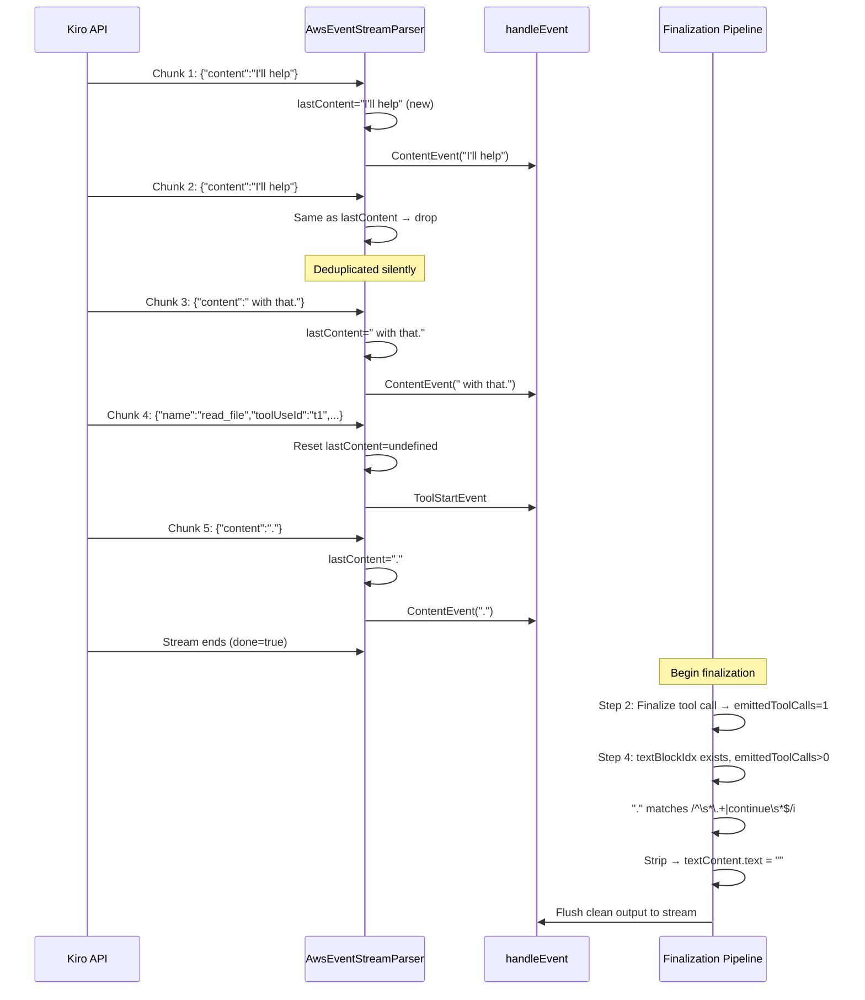

When a remote model streams back tokens over a persistent connection, two categories of noise can corrupt the final assistant message: **duplicate content deltas** that arrive from the wire protocol, and **echo filler text** (`"."`, `"continue"`) that the model appends alongside tool calls. This page explains the two noise-reduction layers the provider applies—one at the event-stream parser level and one during response finalization—and how they work together to produce clean output for downstream consumers.

Sources: [core.ts](src/core.ts#L736-L744), [eventstream.ts](src/eventstream.ts#L186-L200)

## The Noise Problem

The Kiro API streams responses as a sequence of JSON objects embedded in binary event-stream frames (see [AWS Event Stream Binary Decoding](18-aws-event-stream-binary-decoding)). Under certain conditions the server emits **repeated identical content deltas**—the same token string appearing in back-to-back events. Separately, when the model decides to invoke a tool, it sometimes emits a short filler text block (a single period or the word "continue") before or after the tool call events. If left unchecked, both artifacts propagate into the assistant message's content array, polluting conversation history and degrading the quality of subsequent turns.

Sources: [eventstream.ts](src/eventstream.ts#L186-L195), [core.ts](src/core.ts#L736-L743)

## Architecture: Two-Layer Cleanup Pipeline

The cleanup is split across two distinct processing stages, each operating at a different granularity:

| Layer | Location | Scope | What It Removes |
|-------|----------|-------|-----------------|
| **Consecutive Delta Deduplication** | `AwsEventStreamParser.processEvent` | Per-event, during streaming | Repeated identical `content` deltas arriving back-to-back |
| **Echo Noise Stripping** | Finalization pipeline in `createStream` | Post-stream, on the assembled `output` | Filler text (`.`, `continue`) when tool calls are present |

```mermaid
flowchart TD
    subgraph "Layer 1 — Event Stream Parser"
        A[Binary chunk from wire] --> B[AwsEventStreamParser.feed]
        B --> C{content event?}
        C -->|Yes| D{Same as lastContent<br/>AND lastContentType = 'content'?}
        D -->|Yes — duplicate| E[Drop — return null]
        D -->|No — unique| F[Update lastContent / lastContentType<br/>Emit KiroEvent]
        C -->|No — tool/usage event| G[Reset lastContent / lastContentType<br/>to undefined]
        G --> F
    end

    subgraph "Layer 2 — Response Finalization"
        H[Stream complete — begin finalization] --> I[Step 1: Finalize ThinkingTagParser]
        I --> J[Step 2: Finalize pending tool call]
        J --> K[Step 3: Bracket-style fallback parse]
        K --> L{emittedToolCalls > 0<br/>AND textBlockIdx ≠ null?}
        L -->|Yes| M{text matches /^\s*\.+\|continue\s*$/i ?}
        M -->|Yes — echo noise| N[Set textContent.text = '']
        M -->|No — keep text| O[Preserve text as-is]
        L -->|No| O
        N --> P[Step 5: Close hidden breadcrumb]
        O --> P
        P --> Q[Step 6: Emit text_end event]
        Q --> R[Flush eventBuffer to stream]
    end

    F --> H
```

The **first layer** runs on every binary chunk the parser receives, ensuring no redundant delta ever reaches the core event handler. The **second layer** runs once after the entire stream has been consumed successfully, acting as a final sweep on the fully assembled response content.

Sources: [eventstream.ts](src/eventstream.ts#L124-L200), [core.ts](src/core.ts#L695-L762)

## Layer 1: Consecutive Content Delta Deduplication

The `AwsEventStreamParser` maintains two private state fields—`lastContent` and `lastContentType`—that track the most recently emitted content event. When a new `content` event arrives during `processEvent`, the parser performs a **strict equality check** against the previous content string:

```
if (content === this.lastContent && this.lastContentType === "content") return null
```

If the content string matches the previously emitted one *and* the last event type was also `"content"`, the parser returns `null`, and the caller (`feed`) silently skips it. This is a **consecutive-only** deduplication strategy: it does not suppress the same token appearing again after a different event type has been processed.

Sources: [eventstream.ts](src/eventstream.ts#L186-L195)

### Dedup Reset Semantics

The deduplication state is deliberately **reset at event-type boundaries**. When any non-content event is processed—`tool_start`, `tool_input`, or `tool_stop`—both `lastContent` and `lastContentType` are set to `undefined`:

| Event Type | Action on Dedup State |
|------------|----------------------|
| `content` (same as previous) | **Suppress** — return `null` |
| `content` (new value) | Update `lastContent`, emit event |
| `tool_start` | Reset `lastContent = undefined` |
| `tool_input` | Reset `lastContent = undefined` |
| `tool_stop` | Reset `lastContent = undefined` |

This design ensures that a legitimate token like `"read"` appearing once in regular text and again after a tool event boundary is **not** incorrectly suppressed. The reset-on-boundary behavior is critical for multi-turn tool-use sequences where the same short tokens can legitimately recur across tool-call spans.

Sources: [eventstream.ts](src/eventstream.ts#L197-L236)

### Reset Method for Parser Reuse

The parser exposes a `reset()` method that clears both the internal buffer and the deduplication state, allowing the same parser instance to be reused across independent parsing sessions:

```typescript
reset(): void {
  this.buffer = ""
  this.lastContent = undefined
  this.lastContentType = undefined
}
```

In practice, the provider creates a **new `AwsEventStreamParser` instance per request attempt** (see [Core Streaming Factory and Request Lifecycle](15-core-streaming-factory-and-request-lifecycle)), so `reset()` is primarily useful for testing and edge cases where parser instances are pooled.

Sources: [eventstream.ts](src/eventstream.ts#L259-L264)

## Layer 2: Echo Noise Stripping at Finalization

After the stream completes and all events have been processed through `handleEvent`, the provider enters a six-step finalization sequence. Echo noise stripping is **step 4** in this pipeline, executing after thinking finalization (step 1), tool call finalization (step 2), and bracket-style tool call fallback parsing (step 3).

Sources: [core.ts](src/core.ts#L695-L744)

### Activation Conditions

The echo noise stripper activates only when **both** of the following conditions are true:

1. **`emittedToolCalls > 0`** — at least one tool call (native or bracket-style) was emitted during this response.
2. **`textBlockIdx !== null`** — a text content block exists in the output.

When both conditions hold, the provider examines the text content and applies a regex test:

```typescript
/^\s*(\.+|continue)\s*$/i
```

This pattern matches strings that consist entirely of (a) one or more dots, or (b) the word "continue", with optional surrounding whitespace. If matched, the text is **replaced with an empty string** (`textContent.text = ""`). The text block itself is not removed from the content array—only its text is cleared.

Sources: [core.ts](src/core.ts#L739-L743)

### Why This Pattern Exists

The comment in the source code states the motivation clearly: these filler strings **accumulate in conversation history** and **reinforce the pattern** in subsequent turns. If the model learns that `.` or `continue` is an acceptable text payload alongside tool calls, it will keep producing them, gradually polluting the context window with meaningless tokens. By stripping them at the response boundary, the provider prevents this feedback loop from ever starting.

Sources: [core.ts](src/core.ts#L736-L738)

### What Gets Stripped vs. What Survives

| Text Content | Tool Calls Present? | Regex Match? | Result |
|-------------|---------------------|--------------|--------|
| `"."` | Yes | Yes | **Stripped** → `""` |
| `"..."` | Yes | Yes | **Stripped** → `""` |
| `"Continue"` | Yes | Yes | **Stripped** → `""` |
| `" continue "` | Yes | Yes | **Stripped** → `""` |
| `"Please wait."` | Yes | No | **Preserved** |
| `"."` | No | — | **Preserved** (no tool calls) |
| `"Done."` | Yes | No | **Preserved** (contains real text) |

The regex is deliberately **narrow**—it only targets the exact patterns that the model emits as filler. Any text with substantive content survives, even if it's short.

Sources: [core.ts](src/core.ts#L739-L743)

## Interaction with the Bracket-Style Fallback Parser

The echo noise stripper operates **after** the [Bracket-Style Tool Call Fallback Parser](22-bracket-style-tool-call-fallback-parser) (step 3 in the finalization sequence). This ordering is significant: the bracket parser may discover tool calls in the text content that the native event stream did not emit as tool events. When this happens, two things change:

1. `sawAnyToolCalls` becomes `true`, and `emittedToolCalls` is incremented for each bracket-discovered tool call.
2. The text content is updated to `bracketResult.cleanedText`—the bracket patterns are removed, leaving only the non-tool text.

Because the echo noise stripper checks `emittedToolCalls > 0` (which now includes bracket-discovered calls), a response that originally had *no* native tool events but contained bracket-style tool calls will also be cleaned. This ensures the filler-text problem is handled uniformly regardless of which tool-call detection path was taken.

Sources: [core.ts](src/core.ts#L710-L744)

## End-to-End Event Flow

The following sequence illustrates the full lifecycle of a response that contains both duplicate deltas and echo noise:



Notice how Layer 1 prevents the duplicate `"I'll help"` from ever reaching `handleEvent`, while Layer 2 removes the trailing `"."` that arrived after the tool call was finalized.

Sources: [core.ts](src/core.ts#L628-L651), [eventstream.ts](src/eventstream.ts#L145-L195)

## Testing the Cleanup Logic

The test suite validates both cleanup layers independently. For Layer 1, the `AwsEventStreamParser` tests verify that feeding the same content JSON twice produces only one event, and that calling `reset()` restores the parser so the same content is emitted again:

```typescript
it("deduplicates repeated content", () => {
  const parser = new AwsEventStreamParser()
  const events1 = parser.feed(Buffer.from('{"content":"Hello"}'))
  const events2 = parser.feed(Buffer.from('{"content":"Hello"}'))
  assert.equal(events1.length, 1)
  assert.equal(events2.length, 0) // deduplicated
})

it("resets state correctly", () => {
  const parser = new AwsEventStreamParser()
  parser.feed(Buffer.from('{"content":"before"}'))
  parser.reset()
  const events = parser.feed(Buffer.from('{"content":"before"}'))
  assert.equal(events.length, 1) // no longer deduplicated after reset
})
```

For Layer 2, the echo noise stripping is exercised implicitly through integration tests that verify the full finalization pipeline produces clean output when tool calls are present alongside filler text. The bracket-tool-parser tests also confirm that `cleanedText` correctly removes bracket patterns, which feeds into the echo noise stripping logic when bracket-discovered tool calls satisfy the `emittedToolCalls > 0` condition.

Sources: [test-converters.ts](tests/test-converters.ts#L188-L308), [test-converters.ts](tests/test-converters.ts#L493-L542)

## Key Design Decisions

| Decision | Rationale |
|----------|-----------|
| **Consecutive-only dedup (not global)** | The same token can legitimately appear in different positions across the stream. Global dedup would suppress valid content. |
| **Reset dedup on tool boundaries** | Tool events create natural breaks in the token stream. Tokens after a tool event are independent of tokens before it. |
| **Strip only `"."` and `"continue"`** | These are the empirically observed filler patterns. A broader pattern risked removing legitimate short responses. |
| **Strip at finalization, not during streaming** | The echo noise detection requires knowing whether tool calls exist, which is only fully determined after the stream ends. |
| **Clear text to `""` rather than removing the block** | Removing the text block would shift content indices, complicating downstream event emission. Emptying the text is index-safe. |

Sources: [eventstream.ts](src/eventstream.ts#L189-L193), [core.ts](src/core.ts#L736-L743)

## Related Pages

- [Push-Based Event Stream Runtime](17-push-based-event-stream-runtime) — the runtime that drives the `readLoop` feeding chunks into `AwsEventStreamParser`
- [AWS Event Stream Binary Decoding](18-aws-event-stream-binary-decoding) — the binary frame parser that produces the raw chunks fed into `feed`
- [Bracket-Style Tool Call Fallback Parser](22-bracket-style-tool-call-fallback-parser) — step 3 of the finalization pipeline, which runs immediately before echo noise stripping
- [Core Streaming Factory and Request Lifecycle](15-core-streaming-factory-and-request-lifecycle) — the outer retry loop that manages parser creation and the finalization sequence