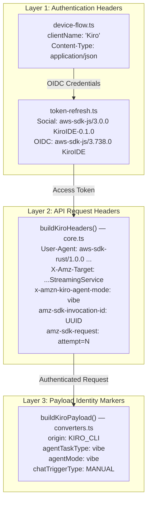

The omp-kiro-provider disguises its outbound HTTP requests as originating from a legitimate Kiro IDE installation. This is not a single header or a static string — it is a **layered identity construction** spanning the `User-Agent` string, AWS SDK metadata headers, per-request invocation IDs, payload-level origin markers, and context-aware UA selection across authentication flows. Each layer targets a different backend validation point: the API gateway inspects `X-Amz-Target` and `User-Agent`; the streaming service checks `x-amzn-kiro-agent-mode`; the token refresh endpoints expect different `User-Agent` patterns depending on whether the session is social or OIDC. This page documents the exact header construction, the per-request mutation strategy, and the payload-level signals that collectively form the provider's anti-detection fingerprint.

Sources: [core.ts](src/core.ts#L137-L161), [token-refresh.ts](src/auth/token-refresh.ts#L1-L12), [index.ts](index.ts#L1-L15)

## Architectural Overview: The Three-Layer Identity Stack

The impersonation strategy operates across three distinct layers, each constructed by a different module and applied at a different stage of the request lifecycle:



The first layer handles authentication-time identity — the headers sent during token refresh and device code registration. The second layer is the core API request header set, constructed by `buildKiroHeaders()` for every streaming call. The third layer embeds identity signals inside the JSON request body itself. All three must be consistent: if the `User-Agent` claims to be a Rust SDK but the payload claims `origin: "browser"`, the inconsistency is detectable.

Sources: [core.ts](src/core.ts#L137-L161), [token-refresh.ts](src/auth/token-refresh.ts#L44-L46), [converters.ts](src/converters.ts#L460-L484)

## The Core Header Set: Impersonating the Kiro CLI Rust SDK

The `buildKiroHeaders()` function in `core.ts` is the primary identity constructor. It is invoked once per streaming request, and its output headers are subsequently mutated on each HTTP retry attempt.

Sources: [core.ts](src/core.ts#L141-L161)

### Header-by-Header Breakdown

| Header | Value Pattern | Purpose |
|--------|--------------|---------|
| `Authorization` | `Bearer {accessToken}` | Standard AWS bearer token |
| `Content-Type` | `application/x-amz-json-1.0` | AWS JSON protocol version — not standard `application/json` |
| `Accept` | `application/json` | Response format negotiation |
| `X-Amz-Target` | `AmazonCodeWhispererStreamingService.GenerateAssistantResponse` | **Service operation identifier** — routes to the streaming endpoint |
| `User-Agent` | `aws-sdk-rust/1.0.0 ua/2.1 os/other lang/rust api/codewhispererstreaming#1.28.3 m/E app/AmazonQ-For-CLI md/appVersion-1.28.3-{mid}` | Impersonates the Kiro CLI's Rust SDK client |
| `x-amz-user-agent` | *(mirrors User-Agent)* | AWS SDK convention — both headers carry identical values |
| `x-amzn-codewhisperer-optout` | `true` | Disables CodeWhisperer telemetry tracking |
| `x-amzn-kiro-agent-mode` | `vibe` | **Kiro-specific** — activates the "vibe" agent mode on the backend |
| `amz-sdk-invocation-id` | `{randomUUID()}` | Per-request unique invocation identifier (regenerated on retry) |
| `amz-sdk-request` | `attempt=1; max=1` | Retry tracking metadata (updated per attempt) |

The `User-Agent` string is the most critical identity signal. It is not a simple static string — it contains a **per-request random component** `{mid}` derived from `randomUUID().replace(/-/g, "")` that makes each request appear to originate from a distinct SDK invocation while maintaining the overall structure that the backend expects from a legitimate Kiro CLI installation. The `app/AmazonQ-For-CLI` token and `md/appVersion-1.28.3-{mid}` metadata segments specifically match the pattern used by kiro-gateway and the real Kiro IDE's Rust SDK.

Sources: [core.ts](src/core.ts#L141-L161)

### The `_isApiKey` and `_isIdc` Parameters

The function signature accepts `_isApiKey` and `_isIdc` boolean parameters (both prefixed with underscore), indicating they are **currently unused but reserved** for future differentiation. The intent is to eventually route different header sets based on authentication method — for example, an API key session (`ksk_` prefix) might warrant a different `User-Agent` than an OIDC session. Today, all auth methods share the same Rust SDK impersonation headers.

Sources: [core.ts](src/core.ts#L141-L145)

## Per-Retry Header Mutation Strategy

The headers are not immutable after initial construction. On each HTTP retry attempt (triggered by 429, 5xx, or timeout), two headers are mutated to maintain the illusion of a fresh SDK invocation:

```typescript
// Inside the HTTP retry loop (core.ts lines 539-545)
reqHeaders["amz-sdk-invocation-id"] = randomUUID()
reqHeaders["amz-sdk-request"] = `attempt=${httpAttempt + 1}; max=${MAX_HTTP_RETRIES + 1}`
```

The `amz-sdk-invocation-id` is regenerated with a fresh UUID on every retry, making each attempt appear as a distinct invocation from the AWS SDK's perspective. The `amz-sdk-request` header updates its `attempt` counter to reflect the current retry number (1-indexed) while keeping `max` set to the total possible attempts (`MAX_HTTP_RETRIES + 1 = 4`). This mirrors the exact retry metadata pattern that the real `aws-sdk-rust` emits during its built-in retry logic.

Sources: [core.ts](src/core.ts#L539-L545)

## Authentication-Flow User-Agent Selection

Different authentication endpoints expect different `User-Agent` patterns. The provider maintains three distinct UA strings, each calibrated for its target endpoint:

| Flow | User-Agent | Target Endpoint | Rationale |
|------|-----------|----------------|-----------|
| **Social refresh** (Google/GitHub) | `aws-sdk-js/3.0.0 KiroIDE-0.1.0 os/linux lang/js md/nodejs/18.0.0` | `prod.{region}.auth.desktop.kiro.dev/refreshToken` | Mimics Kiro desktop IDE's JavaScript-based token refresh |
| **OIDC refresh** (Builder ID) | `aws-sdk-js/3.738.0 ua/2.1 os/other lang/js md/browser#unknown_unknown api/sso-oidc#3.738.0 m/E KiroIDE` | `oidc.{region}.amazonaws.com/token` | Mimics browser-based SSO OIDC flow with KiroIDE branding |
| **Streaming API** | `aws-sdk-rust/1.0.0 ua/2.1 os/other lang/rust api/codewhispererstreaming#1.28.3 ...` | `q.{region}.amazonaws.com/generateAssistantResponse` | Impersonates Kiro CLI's Rust SDK |

The key insight is that the social refresh endpoint (`auth.desktop.kiro.dev`) is a **Kiro-specific authentication service** that expects a desktop IDE UA string with `KiroIDE-0.1.0` branding, while the OIDC endpoint (`oidc.amazonaws.com`) is a **generic AWS service** that expects the standard AWS SDK JS format with `KiroIDE` appended as an application identifier. The streaming API, by contrast, expects the Rust SDK pattern because the real Kiro CLI uses a Rust-based HTTP client for streaming requests.

Sources: [token-refresh.ts](src/auth/token-refresh.ts#L44-L46), [token-refresh.ts](src/auth/token-refresh.ts#L101-L103), [core.ts](src/core.ts#L147-L148)

## Device Code Flow Registration Identity

The OIDC device code flow in `device-flow.ts` registers an OIDC client with `clientName: "Kiro"` — the same client name the real Kiro IDE uses when registering with AWS SSO OIDC. This is a subtle but important identity signal: the AWS OIDC service logs the `clientName` during registration, and using the correct name ensures the registered client appears indistinguishable from a legitimate Kiro IDE installation.

Sources: [device-flow.ts](src/auth/device-flow.ts#L52-L65)

## Payload-Level Identity Markers

Beyond HTTP headers, the JSON request body itself carries identity signals in the `buildKiroPayload()` function. These markers are embedded in the `conversationState` structure:

| Payload Field | Value | Location |
|---------------|-------|----------|
| `origin` | `"KIRO_CLI"` | `conversationState.currentMessage.userInputMessage.origin` |
| `chatTriggerType` | `"MANUAL"` | `conversationState.chatTriggerType` |
| `agentTaskType` | `"vibe"` | `conversationState.agentTaskType` |
| `agentMode` | `"vibe"` | Top-level `agentMode` field |
| `profileArn` | *(resolved dynamically)* | Top-level `profileArn` field |

The `origin: "KIRO_CLI"` value tells the Kiro backend that the request originates from a CLI interface (not the web IDE), which affects how the response is formatted. The `"vibe"` values for `agentTaskType` and `agentMode` are consistent with the `x-amzn-kiro-agent-mode: vibe` header — both the header and payload signal the same agent mode. The `profileArn` is resolved dynamically via `ListAvailableProfiles` or read from sidecar metadata, ensuring the request includes the correct AWS profile ARN when available.

Sources: [converters.ts](src/converters.ts#L460-L492), [core.ts](src/core.ts#L452-L454)

## Header Merging and Security: User-Supplied Header Stripping

Before the final request is dispatched, the provider merges the impersonation headers with any user-supplied headers from `StreamOptions`. A critical security step occurs first: the `Authorization` header is explicitly stripped from user-supplied headers to prevent OAuth bypass:

```typescript
// Build headers — strip Authorization from user-supplied headers to prevent OAuth bypass
const userHeaders = { ...options?.headers }
delete userHeaders["Authorization"]
delete userHeaders["authorization"]

const reqHeaders: Record<string, string> = {
  ...buildKiroHeaders(apiKey, isApiKey, isIdc),
  ...userHeaders,
}
```

The merge order is significant: `buildKiroHeaders()` is spread first, then `userHeaders` is spread on top. This means a user-supplied `User-Agent` would **override** the impersonation UA — a potential misconfiguration risk. In practice, OMP does not inject `User-Agent` into `options.headers`, but the architecture allows it for debugging purposes.

Sources: [core.ts](src/core.ts#L477-L485)

## Request Fingerprinting Architecture

```mermaid
sequenceDiagram
    participant OMP as OMP Runtime
    participant Core as createStreamKiro()
    participant Headers as buildKiroHeaders()
    participant API as Kiro API Gateway

    OMP->>Core: streamKiro(model, context, options)
    Core->>Core: Detect auth method (apiKey vs idc)
    Core->>Core: Resolve profileArn (sidecar or ListAvailableProfiles)
    Core->>Headers: buildKiroHeaders(accessToken, isApiKey, isIdc)
    Headers-->>Core: Full header set with randomUUID-based UA
    
    loop HTTP Retry Loop (up to 3 retries)
        Core->>Core: Mutate amz-sdk-invocation-id = fresh UUID
        Core->>Core: Mutate amz-sdk-request = attempt=N; max=4
        Core->>API: POST /generateAssistantResponse
        API-->>Core: Response (429/5xx triggers retry)
    end
    
    API-->>Core: 200 OK (AWS Event Stream)
    Core->>OMP: Buffered events flushed on success
```

Each request carries three layers of uniqueness: the `amz-sdk-invocation-id` (per-attempt UUID), the `{mid}` component embedded in the `User-Agent` string (per-request random), and the `conversationId` in the payload (per-conversation UUID). Together, these ensure that no two requests present identical fingerprints, even for retry attempts of the same logical operation.

Sources: [core.ts](src/core.ts#L477-L555), [core.ts](src/core.ts#L141-L161)

## Prepared Infrastructure: Machine Fingerprint Module

The `auth/fingerprint.ts` module exports `getMachineFingerprint()`, which generates a stable SHA-256 hash from `hostname-username-kiro`. This hash is **designed to be included** in `User-Agent` and `x-amz-user-agent` headers but is currently **not imported by any other module** — it is prepared infrastructure for future integration. The fingerprint is cached in a module-level variable (`_cached`) so it is computed exactly once per process lifetime.

The generation strategy is deliberately simple: concatenate the OS hostname, the current user's login name (from `process.env.USER` or `process.env.LOGNAME`), and the constant `"kiro"`, then SHA-256 hash the result. On failure, it falls back to hashing `"default-omp-kiro"`. This matches the pattern used by kiro-gateway and the real Kiro IDE for installation identification.

Sources: [fingerprint.ts](src/auth/fingerprint.ts#L1-L29)

## Anti-Detection Summary: Consistency Matrix

| Identity Signal | Header Layer | Payload Layer | Auth Layer |
|----------------|:------------:|:-------------:|:----------:|
| Rust SDK impersonation | ✅ `User-Agent`, `x-amz-user-agent` | — | — |
| Kiro IDE branding | — | — | ✅ `clientName: "Kiro"` |
| Agent mode "vibe" | ✅ `x-amzn-kiro-agent-mode` | ✅ `agentMode`, `agentTaskType` | — |
| CLI origin | ✅ `app/AmazonQ-For-CLI` in UA | ✅ `origin: "KIRO_CLI"` | — |
| Per-request uniqueness | ✅ `amz-sdk-invocation-id` UUID | ✅ `conversationId` UUID | — |
| Telemetry opt-out | ✅ `x-amzn-codewhisperer-optout` | — | — |
| AWS service targeting | ✅ `X-Amz-Target` | — | — |
| Profile identity | — | ✅ `profileArn` | — |

The matrix above illustrates the defense-in-depth approach: each identity claim is asserted at multiple layers. If a backend validator checks only headers, it sees a consistent Rust SDK. If it cross-references headers with the payload, the `app/AmazonQ-For-CLI` header aligns with `origin: "KIRO_CLI"`, and the `x-amzn-kiro-agent-mode: vibe` header aligns with `agentMode: "vibe"`. This multi-layer consistency is what distinguishes a well-crafted impersonation from a naive header override.

Sources: [core.ts](src/core.ts#L137-L161), [converters.ts](src/converters.ts#L460-L492), [device-flow.ts](src/auth/device-flow.ts#L52-L65)

## Next Steps

- **[Machine Fingerprint Generation](25-machine-fingerprint-generation)** — Deep dive into the SHA-256 fingerprint module, its caching strategy, and how it matches the real Kiro IDE's installation identification pattern.
- **[Core Streaming Factory and Request Lifecycle](15-core-streaming-factory-and-request-lifecycle)** — Understand how `buildKiroHeaders()` fits into the broader retry-and-streaming lifecycle.
- **[AWS SSO OIDC Device Code Flow](9-aws-sso-oidc-device-code-flow)** — Full documentation of the device code registration that uses `clientName: "Kiro"` for identity.