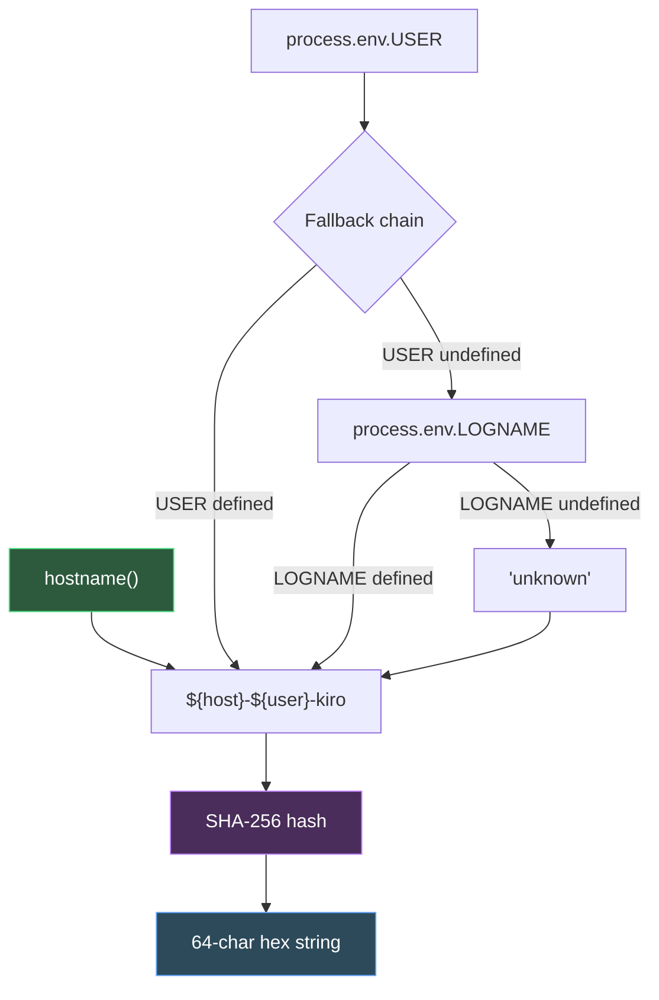
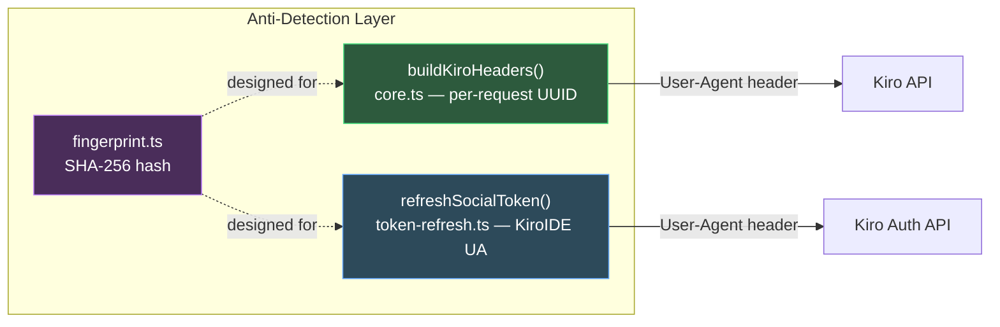

The **machine fingerprint** module provides a deterministic, per-installation identity token derived from host OS properties. Its purpose is to produce a **stable SHA-256 hash** that uniquely identifies a specific machine across all API requests — mirroring the fingerprinting behavior of the real Kiro IDE and the kiro-gateway proxy. This fingerprint anchors the anti-detection layer by ensuring that the provider's outgoing requests carry a consistent machine identity rather than appearing as a new installation on every invocation.

Sources: [fingerprint.ts](src/auth/fingerprint.ts#L1-L9)

## Fingerprint Construction Pipeline

The fingerprint is constructed from three inputs concatenated into a single plaintext string, which is then hashed using **SHA-256**. The pipeline is deliberately simple — it prioritizes stability and reproducibility over cryptographic uniqueness, since the fingerprint serves as an installation marker, not a security credential.

The three input components and their roles:

| Component | Source | Purpose | Fallback |
|---|---|---|---|
| `host` | `node:os` → `hostname()` | Identifies the machine's network name | None — if `hostname()` throws, the entire pipeline falls back |
| `user` | `process.env.USER` → `process.env.LOGNAME` | Distinguishes users on a shared machine | `"unknown"` if both env vars are undefined |
| `"kiro"` | Hard-coded suffix | Namespace separator, matches Kiro IDE's format | Always present |

The concatenation format `${host}-${user}-kiro` produces a plaintext like `archlinux-ravish-kiro`, which is then passed through `crypto.createHash("sha256").update(raw).digest("hex")` to yield a 64-character lowercase hexadecimal string. The `"kiro"` suffix acts as a **salt-like namespace** — it ensures the hash differs from what a naive `hostname-username` hash would produce, aligning the output with the Kiro IDE's own fingerprint format.

Sources: [fingerprint.ts](src/auth/fingerprint.ts#L11-L28)

## Caching and Idempotency

The module employs a **module-level singleton cache** via the `let _cached: string | undefined` variable. The first call to `getMachineFingerprint()` computes the hash and stores it; all subsequent calls return the cached value immediately, avoiding redundant `hostname()` lookups and hash computations. This design has three implications:

- **Deterministic within a process**: The same Node.js process always returns the identical fingerprint, regardless of env variable changes mid-execution.
- **Fresh per process**: Each new process invocation recomputes the fingerprint from scratch, reflecting any OS-level changes (hostname rename, user switch) since the last run.
- **No external state**: The fingerprint is never persisted to disk by this module — it is purely a runtime computation, ensuring no stale state survives across reboots or reinstalls.

Sources: [fingerprint.ts](src/auth/fingerprint.ts#L14-L17)

## Error Handling and Fallback Strategy

The fingerprint computation is wrapped in a `try/catch` block that catches any exception from the `hostname()` call or the environment variable access. On failure, the fallback hashes the **static string** `"default-omp-kiro"` using the same SHA-256 algorithm. This guarantees that `getMachineFingerprint()` **never throws** — it always returns a valid 64-character hex string, even on systems where OS introspection fails (restricted containers, minimal environments, or unusual Node.js runtimes).

The trade-off of this approach: all machines that fail fingerprint detection share the same fallback hash, which could cluster into a single identity from the server's perspective. This is an acceptable degradation because environments that cannot resolve `hostname()` or `USER` are typically constrained sandboxes where anti-detection fidelity is already limited.

Sources: [fingerprint.ts](src/auth/fingerprint.ts#L19-L28)

## Integration Context: Where the Fingerprint Lives

The fingerprint module sits within the **anti-detection subsystem** alongside the header impersonation logic in [Kiro IDE Header Impersonation and Request Fingerprinting](24-kiro-ide-header-impersonation-and-request-fingerprinting). While `buildKiroHeaders()` in the core streaming layer currently generates a **per-request random UUID** for the `User-Agent` and `x-amz-user-agent` headers (at [core.ts](src/core.ts#L141-L161)), the fingerprint module provides the **stable cross-request identity** that the real Kiro IDE embeds in its headers. The module-level docstring explicitly states this intent: the fingerprint is designed to be included in `User-Agent` and `x-amz-user-agent` headers to identify a specific installation.

The token refresh layer at [token-refresh.ts](src/auth/token-refresh.ts#L8-L11) documents the anti-detection convention that **social refresh** requests should carry the `KiroIDE` User-Agent with fingerprint, while OIDC refresh uses a different User-Agent pattern. This demonstrates the fingerprint's dual role: it serves both the primary API streaming path and the authentication renewal path.

Sources: [fingerprint.ts](src/auth/fingerprint.ts#L1-L9), [core.ts](src/core.ts#L141-L161), [token-refresh.ts](src/auth/token-refresh.ts#L8-L11)

## Determinism and Stability Properties

The fingerprint's stability depends entirely on the stability of its inputs. The following table maps environmental changes to fingerprint impact:

| Scenario | `hostname()` | `USER`/`LOGNAME` | Fingerprint | Notes |
|---|---|---|---|---|
| Same machine, same user, new process | Unchanged | Unchanged | **Identical** | Expected normal operation |
| Same machine, different user | Unchanged | Changed | **Different** | Correct — different installation identity |
| Renamed hostname | Changed | Unchanged | **Different** | Server sees a "new" machine |
| Docker container restart | Likely changed | Likely unchanged | **Likely different** | Container hostnames are ephemeral |
| SSH into same machine as same user | Unchanged | Unchanged | **Identical** | SSH doesn't affect hostname |
| `sudo` to another user | Unchanged | May change | **May differ** | Depends on env preservation |

For containerized deployments, the fingerprint's reliance on `hostname()` means the identity rotates with each container lifecycle. If stable identification is required in such environments, the `HOSTNAME` environment variable or container hostname should be set explicitly before the provider initializes.

Sources: [fingerprint.ts](src/auth/fingerprint.ts#L19-L28)

## Next Steps

- For the broader header impersonation strategy that would consume this fingerprint, see [Kiro IDE Header Impersonation and Request Fingerprinting](24-kiro-ide-header-impersonation-and-request-fingerprinting).
- For how token refresh applies the KiroIDE User-Agent pattern, see [Token Refresh for Social and OIDC Sessions](10-token-refresh-for-social-and-oidc-sessions).
- For the complete authentication flow that the fingerprint supports, see [Authentication Methods and Credential Auto-Detection](8-authentication-methods-and-credential-auto-detection).