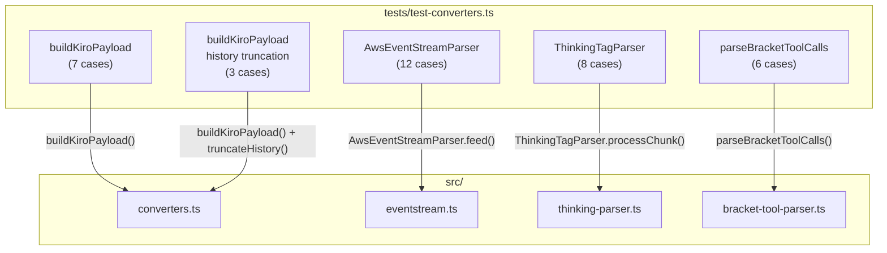
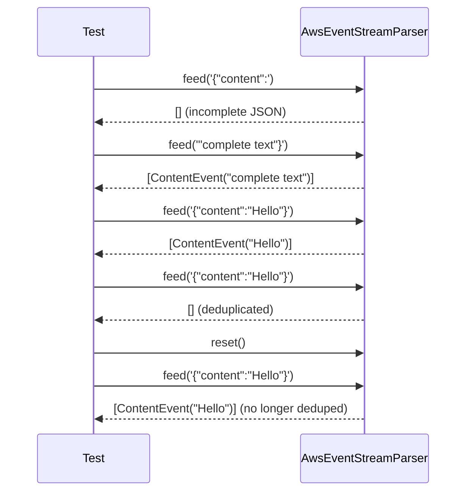
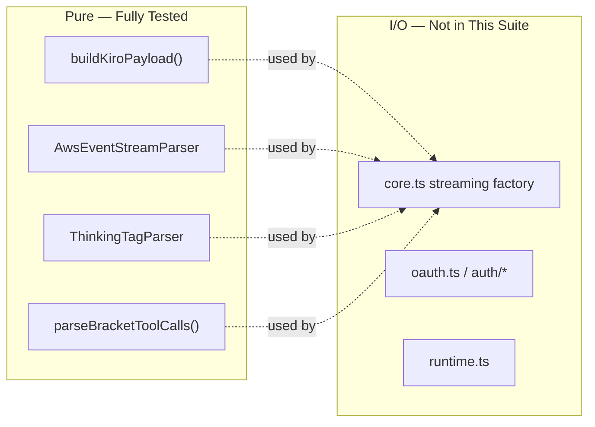

The `omp-kiro-provider` codebase deliberately isolates its most complex logic—message format conversion, binary stream decoding, thinking-tag parsing, and bracket-style tool call extraction—into **pure functions and stateful classes** with zero external dependencies. This architectural decision enables a test suite that runs entirely without mocks, networks, or fixtures: just Node.js's built-in test runner asserting against deterministic inputs and outputs. The single test file [tests/test-converters.ts](tests/test-converters.ts) covers four production modules across 36 test cases, validating every critical data transformation path from OMP's internal representation through to Kiro's wire format.

Sources: [test-converters.ts](tests/test-converters.ts#L1-L13), [package.json](package.json#L13-L15)

## Test Infrastructure and Execution Model

The project uses Node.js's native test runner—`node:test` for `describe`/`it` blocks and `node:assert/strict` for assertions—requiring no third-party testing framework. The single test command `node --test tests/test-converters.ts` (defined in `package.json`) executes the entire suite. This minimalism is intentional: because every module under test is either a pure function (`buildKiroPayload`, `parseBracketToolCalls`) or a self-contained stateful class (`AwsEventStreamParser`, `ThinkingTagParser`), there are no HTTP calls to intercept, no filesystem state to arrange, and no timer dependencies to fake. Each test constructs a plain TypeScript object matching the relevant `ContextLike` or `MessageLike` interface, passes it to the function under test, and asserts structural properties of the returned payload.

Sources: [package.json](package.json#L13-L15), [types.ts](src/types.ts#L91-L108)

## Test Suite Architecture

The 36 test cases are organized into five `describe` blocks, each targeting a specific production module. The following diagram illustrates the relationship between test suites and their corresponding source modules:

Sources: [test-converters.ts](tests/test-converters.ts#L1-L614)

## Converter Tests: buildKiroPayload

The converter test suite validates the `buildKiroPayload` function from [src/converters.ts](src/converters.ts), which transforms OMP's flat `ContextLike` message array into Kiro's nested `conversationState` format. Seven test cases exercise the critical transformation rules documented in the converter's header comments: system prompt prepending, history splitting, tool serialization, name truncation, empty-content placeholders, tool result embedding, and `profileArn` forwarding.

### Key Test Cases and What They Verify

| Test Case | Input Pattern | Verified Behavior |
|---|---|---|
| Minimal single-message payload | 1 user message + system prompt | System prompt prepended to content; `chatTriggerType` is `"MANUAL"`; `origin` is `"KIRO_CLI"`; model ID dash→dot conversion (`claude-sonnet-4-5` → `claude-sonnet-4.5`) |
| Multi-turn payload with history | 3 messages (user→assistant→user) | First two messages populate `history[]`; last message becomes `currentMessage`; system prompt injected only into first history user message |
| Tools in userInputMessageContext | 1 tool definition | Tool serializes under `userInputMessageContext.tools` with `name`, `description`, `inputSchema` fields |
| Tool name truncation > 64 chars | 100-char tool name | Name truncated to exactly 64 characters via hash-suffix strategy |
| profileArn forwarding | Optional `profileArn` string | Passed through to top-level payload field |
| Tool results in history | Tool call + tool result messages | Assistant entry includes `toolUses[]`; tool results nested in user message context |
| Empty content placeholder | `content: ""` | Content replaced with `"(empty placeholder)"` string |

The model ID normalization is particularly noteworthy: the test supplies `"claude-sonnet-4-5"` and verifies the output contains `"claude-sonnet-4.5"`—the regex-based dash-to-dot conversion in the converter handles this transparently. The empty-content test ensures Kiro's API never receives an empty string, which would cause a validation error.

Sources: [test-converters.ts](tests/test-converters.ts#L19-L170), [converters.ts](src/converters.ts#L419-L496), [converters.ts](src/converters.ts#L433-L447)

## Event Stream Decoder Tests: AwsEventStreamParser

The event stream decoder tests exercise the `AwsEventStreamParser` class from [src/eventstream.ts](src/eventstream.ts), which parses binary AWS event-stream frames into typed `KiroEvent` objects. Twelve test cases cover every event type, edge case in buffering, and the content deduplication mechanism. The parser is a stateful class that accumulates a string buffer and progressively scans for JSON patterns—making it particularly amenable to incremental-chunk testing.

### Event Type Coverage

| Event Type | Trigger JSON Pattern | Test Assertions |
|---|---|---|
| `content` | `{"content":"..."}` | Text extracted; empty content filtered |
| `tool_start` | `{"name":"...","toolUseId":"...","input":{...}}` | Name, ID, serialized input, and `stop` flag extracted |
| `tool_input` | `{"input":"..."}` | Continuation input string returned |
| `tool_stop` | `{"stop":true}` | Stop boolean preserved |
| `usage` | `{"usage":{"inputTokens":N,"outputTokens":M}}` | Both token counts extracted; partial usage (only `inputTokens`) handled |
| `context_usage` | `{"contextUsagePercentage":N}` | Percentage number extracted |

### Buffering and Deduplication Edge Cases

Three tests probe the parser's resilience to streaming realities. The **incremental chunks** test feeds `{"content":` in one call and `"complete text"}` in the next—verifying that the first call returns zero events (incomplete JSON) and the second call produces the full parsed content. The **multiple events in one chunk** test surrounds two valid JSON objects with garbage binary data (`garbage{"content":"hello"}more garbage{"content":"world"}`), confirming the pattern-scanning approach correctly locates and extracts both events while ignoring non-JSON noise. The **deduplication** test feeds identical content twice and asserts the second call produces zero events—the parser tracks `lastContent` and `lastContentType` to suppress consecutive identical content deltas, but a `reset()` call clears this state so the same content passes through again.

Additional edge cases include **nested JSON objects** in tool input (the brace-matching algorithm must correctly track depth through `{"nested":{"deep":"value"}}`) and **braces inside strings** (`"text with {braces} inside"` must not confuse the delimiter detection).

Sources: [test-converters.ts](tests/test-converters.ts#L176-L333), [eventstream.ts](src/eventstream.ts#L124-L265)

## Thinking Tag Parser Tests: ThinkingTagParser

The `ThinkingTagParser` tests validate the stateful parser from [src/thinking-parser.ts](src/thinking-parser.ts) that separates `<thinking>`, `<reasoning>`, and `<thought>` blocks from regular text content in streaming responses. Eight test cases cover the parser's three-phase state machine (before thinking → inside thinking → after thinking), tag splitting across chunk boundaries, block reordering, and event emission correctness.

### Tag Variant Recognition

The parser recognizes four opening/closing tag pairs, and the test suite explicitly verifies three of them:

| Tag Variant | Opening | Closing | Test Coverage |
|---|---|---|---|
| Primary | `<thinking>` | `</thinking>` | Multi-chunk extraction, split tags, event emission, reordering |
| Reasoning | `<reasoning>` | `</reasoning>` | Direct extraction verified |
| Thought | `<thought>` | `</thought>` | Direct extraction verified |
| Unicode dice | `⚆` / `⚅` | — | Not tested (obscure edge case) |

### Block Reordering Behavior

A distinctive behavior tested is the **splice-before reordering** when thinking tags arrive after text has already been emitted. Kiro's API sometimes sends text content before the thinking block appears, but OMP's contract expects `thinking` blocks to precede `text` blocks. The test `"reorders thinking before text when text arrives first"` feeds `"some text<thinking>my thoughts</thinking>more text"` and verifies the output content array is ordered as `[thinking, text("some text"), text("more text")]`. Internally, the parser's `emitThinking()` method splices a new thinking block at the text block's current index and shifts the text block index forward by one.

### Event Emission Contract

The test `"emits proper thinking_start/delta/end events"` verifies the full lifecycle event sequence. When `"<thinking>hello</thinking>world"` is processed, the `events` array must contain `thinking_start`, `thinking_delta`, `thinking_end`, `text_start`, and `text_delta`—matching the `AssistantMessageEvent` union type defined in [src/types.ts](src/types.ts). Each event carries the `contentIndex` and `partial` (the live `AssistantMessageLike` object) for downstream consumers.

Sources: [test-converters.ts](tests/test-converters.ts#L337-L485), [thinking-parser.ts](src/thinking-parser.ts#L54-L239), [types.ts](src/types.ts#L138-L150)

## Bracket Tool Parser Tests: parseBracketToolCalls

The bracket tool parser tests target the pure function `parseBracketToolCalls` from [src/bracket-tool-parser.ts](src/bracket-tool-parser.ts), which extracts `[Called func_name with args: {...}]` patterns from plain text. Six test cases verify extraction correctness, multi-call handling, nested JSON tolerance, malformed-input rejection, and unique ID generation.

### Pattern Extraction and Cleanup

The core regex `/\[Called\s+([\w-]+)\s+with\s+args:\s*/g` matches the opening bracket pattern, then the parser uses a brace-matching algorithm to locate the JSON arguments and the closing `]`. The returned `BracketParseResult` contains both the parsed `toolCalls` array and a `cleanedText` string with all bracket patterns removed—preserving surrounding prose.

| Test Case | Input | Verified Behavior |
|---|---|---|
| Single extraction | `"[Called read_file with args: {\"path\": \"/tmp/test.txt\"}]"` embedded in text | Tool name, arguments, and cleaned text all correct |
| No pattern match | Plain text without brackets | Empty `toolCalls` array; text returned unchanged |
| Multiple calls | Two bracket patterns in sequence | Both extracted in order; unique IDs differ |
| Nested JSON | `{"config": {"nested": true, "arr": [1, 2]}}` | Deeply nested objects parsed correctly |
| Malformed JSON | `{broken json}` | Pattern skipped; zero tool calls |
| Unique toolUseId | Two calls to same function | `crypto.randomUUID()` ensures distinct IDs |

The malformed-JSON test is particularly important: when the brace matcher or `JSON.parse` fails, the parser silently skips the bracket pattern and continues scanning rather than throwing an exception—ensuring robustness against model hallucinations that partially match the bracket syntax.

Sources: [test-converters.ts](tests/test-converters.ts#L491-L543), [bracket-tool-parser.ts](src/bracket-tool-parser.ts#L61-L106)

## History Truncation Tests

Three test cases in the `"buildKiroPayload with history truncation"` suite validate the history management pipeline: sanitization, truncation, and synthetic tool-call injection. These tests exercise the full `buildKiroPayload` function with the `contextWindow` parameter, which triggers the `truncateHistory()` → `sanitizeHistory()` → `injectSyntheticToolCalls()` chain defined in [src/converters.ts](src/converters.ts).

The **large history truncation** test constructs 2,000 messages (1,000 user/assistant pairs with 100× repeated content), then calls `buildKiroPayload` with a 200K-token context window. The dynamic limit is calculated as `(contextWindow / 200000) * 850000` characters. The test asserts that the resulting history is shorter than 2,000 entries but still non-empty—verifying that the oldest entries are dropped first and re-sanitization maintains the user/assistant alternation invariant after each removal.

The **preservation test** sends a short 3-message conversation through the same pipeline and asserts all 2 history entries survive intact—confirming the truncation logic only activates when the serialized history exceeds the dynamic character limit.

The **thinking mode injection** test verifies that thinking-related XML directives (`<thinking_mode>enabled</thinking_mode>`, `<max_thinking_length>10000</max_thinking_length>`) in the system prompt pass through to the current user message content unchanged—the converter treats these as opaque strings rather than parsing them.

Sources: [test-converters.ts](tests/test-converters.ts#L549-L613), [converters.ts](src/converters.ts#L139-L231)

## Design Philosophy: Pure-Function Testability

The test suite's simplicity is a direct consequence of the project's architectural decision to keep all data-transformation logic in pure functions and self-contained stateful classes, separate from I/O-bound concerns like HTTP requests and authentication. The `buildKiroPayload` function accepts a plain `ContextLike` object and returns a plain `KiroPayload` object—no side effects, no globals (beyond the per-request truncation map which is cleared at the start of each call). The `AwsEventStreamParser` class maintains internal buffer state but requires no external resources. This design enables the entire test suite to run in under a second with zero configuration, making it practical to execute as a pre-commit hook or CI gate.

The modules under test here (`converters`, `eventstream`, `thinking-parser`, `bracket-tool-parser`) form the **data transformation core** that the I/O-bound [Core Streaming Factory](15-core-streaming-factory-and-request-lifecycle) orchestrates at runtime. By testing them in isolation, the suite provides fast, deterministic coverage of every branch in the conversion pipeline without needing to mock fetch calls, simulate SSE connections, or manage authentication state.

Sources: [test-converters.ts](tests/test-converters.ts#L1-L13), [converters.ts](src/converters.ts#L1-L26), [eventstream.ts](src/eventstream.ts#L1-L8)

## Related Pages

- [OMP-to-Kiro Conversation Format Conversion](12-omp-to-kiro-conversation-format-conversion) — production documentation for `buildKiroPayload` and history management
- [AWS Event Stream Binary Decoding](18-aws-event-stream-binary-decoding) — production documentation for `AwsEventStreamParser`
- [Thinking Tag Parser and Reasoning Mode Injection](19-thinking-tag-parser-and-reasoning-mode-injection) — production documentation for `ThinkingTagParser`
- [Bracket-Style Tool Call Fallback Parser](22-bracket-style-tool-call-fallback-parser) — production documentation for `parseBracketToolCalls`
- [Dependency Injection and Testability Pattern](7-dependency-injection-and-testability-pattern) — how DI enables testing the I/O-bound modules