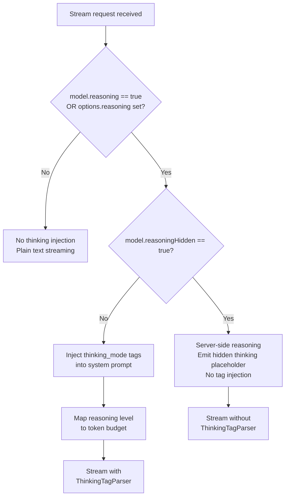
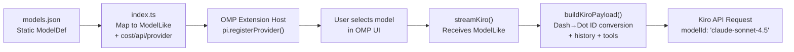

The OMP Kiro provider ships with a **static model registry** defined in [models.json](models.json) that enumerates every model available through the Kiro API. At startup, [index.ts](index.ts) loads this JSON file, augments each entry with pricing metadata and provider identity, and registers the full list with OMP's extension host via `pi.registerProvider()`. This page walks you through the complete model catalogue, explains every configuration field, and describes how reasoning mode and thinking budgets are wired into the streaming pipeline.

Sources: [models.json](models.json#L1-L109), [index.ts](index.ts#L17-L99), [src/types.ts](src/types.ts#L78-L89)

## Model Catalogue

The provider exposes **12 models** spanning four families: Claude (Anthropic), DeepSeek, Qwen, MiniMax, and GLM. Each model is listed below with its key operational parameters.

| Model ID | Display Name | Reasoning | Hidden Reasoning | Context Window | Max Output Tokens |
|---|---|---|---|---|---|
| `auto` | Auto | ✅ | — | 1,000,000 | 65,536 |
| `claude-sonnet-4-5` | Claude Sonnet 4.5 | ✅ | — | 200,000 | 65,536 |
| `claude-sonnet-4-6` | Claude Sonnet 4.6 | ✅ | — | 1,000,000 | 65,536 |
| `claude-sonnet-4` | Claude Sonnet 4 | ✅ | — | 200,000 | 65,536 |
| `claude-opus-4-6` | Claude Opus 4.6 | ✅ | — | 1,000,000 | 32,768 |
| `claude-opus-4-7` | Claude Opus 4.7 | ✅ | ✅ | 1,000,000 | 128,000 |
| `claude-opus-4-8` | Claude Opus 4.8 | ✅ | — | 1,000,000 | 128,000 |
| `claude-haiku-4-5` | Claude Haiku 4.5 | ❌ | — | 200,000 | 65,536 |
| `deepseek-3-2` | DeepSeek 3.2 | ✅ | — | 164,000 | 8,192 |
| `qwen3-coder-next` | Qwen3 Coder Next | ✅ | — | 256,000 | 8,192 |
| `minimax-m2-5` | MiniMax M2.5 | ❌ | — | 196,000 | 8,192 |
| `minimax-m2-1` | MiniMax M2.1 | ❌ | — | 196,000 | 8,192 |
| `glm-5` | GLM 5 | ✅ | — | 200,000 | 8,192 |

The **`auto`** model is a special delegation entry — when selected, the Kiro backend decides which underlying model to route the request to. All other models are routed directly by their identifier.

Sources: [models.json](models.json#L1-L109)

## Model Definition Schema

Every model entry in [models.json](models.json) conforms to the `ModelDef` interface defined in [index.ts](index.ts#L37-L45). The table below explains each field and how it flows into the OMP provider contract.

| Field | Type | Purpose |
|---|---|---|
| `id` | `string` | Unique identifier used in OMP model selection and API payloads. Uses dash-separated version numbers (e.g. `claude-sonnet-4-5`) internally. |
| `name` | `string` | Human-readable display name shown in OMP's model picker UI. |
| `reasoning` | `boolean` | Whether the model supports extended thinking/reasoning. When `true`, the provider injects `<thinking_mode>` tags into the system prompt. |
| `reasoningHidden` | `boolean?` | Optional. When `true`, the model performs server-side reasoning that is not streamed back. The provider emits a placeholder indicator instead. |
| `input` | `("text"\|"image")[]` | Accepted input modalities. All current models support `text` only. |
| `contextWindow` | `number` | Maximum context size in tokens. Used to scale the history truncation limit dynamically. |
| `maxTokens` | `number` | Maximum output tokens the model can generate in a single response. |

During registration, the provider augments each raw `ModelDef` with two additional fields required by OMP's `ProviderConfigInput` contract: a **`cost`** object (all zeroes, since Kiro is free during its trial period) and the implicit `api`/`provider` strings set at registration time.

Sources: [index.ts](index.ts#L37-L60), [src/types.ts](src/types.ts#L78-L89), [src/runtime.ts](src/runtime.ts#L82-L84)

## Model ID Translation (Dash-to-Dot)

OMP and the Kiro API use different version-number separators. Internally, the provider stores model IDs in **dash-form** (`claude-sonnet-4-5`), but the Kiro backend expects **dot-form** (`claude-sonnet-4.5`). The conversion happens at payload-build time via a targeted regex:

```
modelId.replace(/(\d)-(\d)(?!\d)/g, "$1.$2")
```

This regex matches only digit-dash-digit sequences (version numbers like `4-5`), leaving other dashes intact (e.g. `claude-sonnet`). The negative lookahead `(?!\d)` prevents false positives on patterns like `model-3-20250101`. This translation is invisible to OMP consumers — you always reference models by their dash-form IDs.

Sources: [src/converters.ts](src/converters.ts#L443-L447), [src/converters.ts](src/converters.ts#L460-L464)

## Reasoning Mode and Thinking Budget

Models with `reasoning: true` support extended thinking. The provider controls this through two mechanisms: **client-side thinking tag injection** and **server-side hidden reasoning**. The flowchart below shows how the reasoning configuration is resolved for each request.



### Thinking Budget Levels

When reasoning is enabled and not hidden, the provider maps the `reasoning` option from [StreamOptions](src/types.ts#L123-L132) to a concrete token budget injected as `<max_thinking_length>`:

| Reasoning Level | Token Budget | Configured Via |
|---|---|---|
| `true` (default) | 10,000 | `options.reasoning = true` |
| `"low"` | 10,000 | `options.reasoning = "low"` |
| `"medium"` | 20,000 | `options.reasoning = "medium"` |
| `"high"` | 30,000 | `options.reasoning = "high"` |
| `"xhigh"` | 50,000 | `options.reasoning = "xhigh"` |

The budget is prepended to the system prompt as: `<thinking_mode>enabled</thinking_mode><max_thinking_length>N</max_thinking_length>`. The model then wraps its reasoning output in `<thinking>` tags, which are parsed in real-time by the [ThinkingTagParser](src/thinking-parser.ts) to emit proper `thinking_start`/`thinking_delta`/`thinking_end` events.

Sources: [src/core.ts](src/core.ts#L56-L61), [src/core.ts](src/core.ts#L456-L503)

### Hidden Reasoning (Server-Side)

The **Claude Opus 4.7** model is the only model currently flagged with `reasoningHidden: true`. For this model, reasoning happens entirely on the server — no `<thinking>` tags appear in the response stream. Instead, the provider emits a synthetic `thinking_start` event when the request begins, and after a 2-second countdown (`HIDDEN_REASONING_COUNTDOWN_MS`), displays a placeholder message: *"Reasoning hidden by provider"*. This covers the 25–30 second server-side deliberation window, giving the user visual feedback that the model is processing.

Sources: [src/core.ts](src/core.ts#L52-L53), [src/core.ts](src/core.ts#L508-L535)

## Runtime Configuration via StreamOptions

Beyond the static model definition, each streaming request accepts a [StreamOptions](src/types.ts#L123-L132) object that overrides or supplements model defaults at call time:

| Option | Type | Effect |
|---|---|---|
| `apiKey` | `string?` | Bearer token for the Kiro API. If missing, the stream errors immediately with a login prompt. |
| `signal` | `AbortSignal?` | Allows OMP to cancel an in-flight request. Propagated to fetch and all internal timeouts. |
| `headers` | `Record<string, string>?` | Additional HTTP headers merged into the request. The provider strips `Authorization` from user-supplied headers to prevent OAuth bypass. |
| `maxTokens` | `number?` | Override the model's default `maxTokens` for this request. |
| `reasoning` | `boolean \| "low" \| "medium" \| "high" \| "xhigh"` | Control reasoning mode and thinking budget. Falls back to `model.reasoning` default. |
| `toolChoice` | `"auto" \| "none" \| string?` | Hint for tool dispatch behavior. |
| `onPayload` | `(body, model) => unknown?` | Pre-send hook to inspect or mutate the Kiro request body. |
| `onResponse` | `(info, model) => void?` | Post-response callback with HTTP status and headers for logging/metrics. |

Sources: [src/types.ts](src/types.ts#L123-L132), [src/core.ts](src/core.ts#L456-L475)

## Cost Model

All models report **zero cost** across every pricing dimension (`input`, `output`, `cacheRead`, `cacheWrite`). This is set explicitly during model registration in [index.ts](index.ts#L56-L57) and reinforced by the no-op [calculateCost](src/runtime.ts#L82-L84) function. The comment in the source code explains the rationale: *"Kiro is free during trial; after trial, subscription covers usage."*

Sources: [index.ts](index.ts#L55-L58), [src/runtime.ts](src/runtime.ts#L82-L84)

## How Models Flow Through the Provider Pipeline

The diagram below traces a model from its static definition in `models.json` all the way to the Kiro API wire format:



Key steps in this pipeline:

1. **Load** — [models.json](models.json) is imported as a JSON module and typed as `{ models: ModelDef[] }`.
2. **Augment** — Each `ModelDef` is mapped to a `ModelLike`-compatible object with zero costs. [index.ts](index.ts#L49-L60)
3. **Register** — The full model array is passed to `pi.registerProvider("kiro", { models: MODELS, ... })`. [index.ts](index.ts#L84-L98)
4. **Select** — OMP passes the chosen `ModelLike` into `streamKiro()` when a conversation begins.
5. **Convert** — [buildKiroPayload](src/converters.ts#L433-L495) translates the dash-form `model.id` to dot-form and embeds it in the Kiro `userInputMessage.modelId` field.
6. **Request** — The payload is sent to `POST /generateAssistantResponse` with the translated model identifier.

Sources: [index.ts](index.ts#L47-L60), [index.ts](index.ts#L84-L98), [src/converters.ts](src/converters.ts#L433-L495), [src/core.ts](src/core.ts#L211-L215)

## Where to Go Next

Now that you understand which models are available and how they are configured, the following pages provide deeper context on the systems that consume these model definitions:

- **[Environment Variables and Runtime Configuration](4-environment-variables-and-runtime-configuration)** — Learn how `KIRO_API_BASE`, `KIRO_REGION`, and other environment variables control API endpoint routing and region selection.
- **[OMP Provider Contract and Extension Registration](6-omp-provider-contract-and-extension-registration)** — Dive into how `pi.registerProvider()` maps the model catalogue to OMP's internal provider contract.
- **[Thinking Tag Parser and Reasoning Mode Injection](19-thinking-tag-parser-and-reasoning-mode-injection)** — Explore the full state-machine implementation that extracts `<thinking>` blocks from streaming responses.
- **[OMP-to-Kiro Conversation Format Conversion](12-omp-to-kiro-conversation-format-conversion)** — Understand the complete payload transformation including history management and tool conversion.