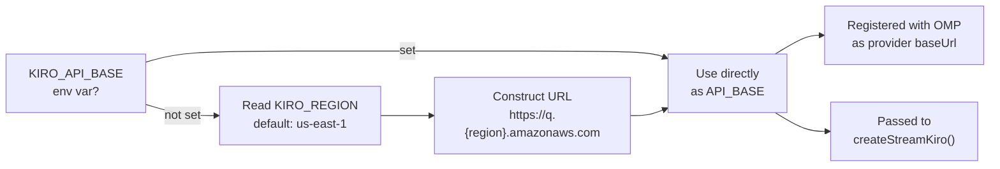
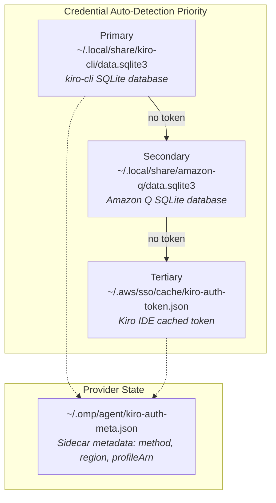

The omp-kiro-provider exposes a compact set of environment variables that control its API endpoint routing and region selection, while a much larger body of internal runtime constants govern retry budgets, timeout thresholds, history management, and stream parsing limits. Understanding both layers is essential for operators who need to tune the provider for specific deployment environments — and for contributors who want to understand why the system behaves the way it does under failure conditions.

This page is organized into three sections: **user-facing environment variables** (things you set before launch), **runtime constants and timeout budgets** (compiled-in defaults that define the provider's resilience envelope), and **dependency-injection configuration** (the `CoreDependencies` interface that makes the entire system testable without real network calls or filesystem access).

Sources: [index.ts](index.ts#L28-L31), [src/core.ts](src/core.ts#L44-L53), [src/types.ts](src/types.ts#L161-L172)

## User-Facing Environment Variables

The provider reads exactly three environment variables at startup. They are resolved once when the extension module is loaded by OMP, and their values are frozen for the lifetime of the process.

| Variable | Default | Purpose |
|---|---|---|
| `KIRO_REGION` | `us-east-1` | AWS region used to construct the Kiro API endpoint URL. |
| `KIRO_API_BASE` | `https://q.{region}.amazonaws.com` | Fully overrides the API base URL, bypassing region-based construction. |
| `KIRO_API_KEY` | *(none — set via `/login`)* | Registered as the provider's API key name with OMP. Users set this through OMP's credential UI or `/login`. |

The resolution chain is linear: `KIRO_API_BASE` wins outright if present. Otherwise the provider reads `KIRO_REGION`, falls back to `us-east-1`, and builds the URL from a template. The region variable also propagates into OIDC client registration endpoints (`oidc.{region}.amazonaws.com`) and social refresh endpoints (`prod.{region}.auth.desktop.kiro.dev`) through the auth metadata stored after login.

Sources: [index.ts](index.ts#L28-L31), [index.ts](index.ts#L87)

### Endpoint Construction Flow



The `KIRO_API_KEY` variable is not read via `process.env` directly — instead, it is registered as the `apiKey` identifier in OMP's provider configuration. When OMP has no stored credential for this key name, the streaming factory emits an error event telling the user to run `/login` or set the key. This makes the key name a stable contract between OMP's credential store and the provider.

Sources: [index.ts](index.ts#L84-L98), [src/core.ts](src/core.ts#L219-L237)

### System Environment Variables Used Indirectly

The fingerprint generator reads standard Unix identity variables to produce a stable machine identifier. These are not configuration knobs — they are ambient system state:

| Variable | Context | Fallback |
|---|---|---|
| `USER` | Machine fingerprint generation | `LOGNAME`, then `"unknown"` |
| `LOGNAME` | Machine fingerprint generation (secondary) | `"unknown"` |

The fingerprint hashes `hostname + username` into a SHA-256 digest that is embedded in the `User-Agent` header, matching the pattern used by the real Kiro IDE. Changing these variables between sessions would produce a different fingerprint, which could theoretically trigger anti-abuse signals on the remote API.

Sources: [src/auth/fingerprint.ts](src/auth/fingerprint.ts#L16-L29)

## Runtime Constants and Timeout Budgets

The provider's resilience behavior is defined by a set of compiled-in constants. These are not currently configurable via environment variables — they are tuned for the free-tier Kiro API where capacity errors and slow first-token times are common. The constants fall into five categories: retry budgets, timeouts, thinking configuration, history management, and stream parsing.

### Retry Budgets

| Constant | Value | Location | Description |
|---|---|---|---|
| `MAX_HTTP_RETRIES` | 3 | `core.ts` | Retries for HTTP 429 and 5xx responses, with exponential backoff (1s → 2s → 4s, capped at 10s). |
| `MAX_CAPACITY_RETRIES` | 3 | `core.ts` | Retries when `INSUFFICIENT_MODEL_CAPACITY` appears in the stream body, with exponential backoff (2s → 4s → 8s, capped at 30s). |
| `MAX_EMPTY_RETRIES` | 2 | `core.ts` | Retries when the API returns a 200 OK with zero content events, with a flat 1s delay between attempts. |

The outer retry loop combines capacity and empty retries into a single sequence of up to `1 + 3 + 2 = 6` attempts. The inner HTTP retry loop handles transient server errors before the stream is even opened. The two layers compose: a single request may fail at the HTTP level 3 times, then succeed at opening the stream, then discover capacity exhaustion, and retry the entire stream — buffering events only on confirmed success.

Sources: [src/core.ts](src/core.ts#L44-L46), [src/core.ts](src/core.ts#L494-L567)

### Timeout Thresholds

| Constant | Value | Location | Triggers When |
|---|---|---|---|
| `CONNECTION_TIMEOUT_MS` | 120,000 (2 min) | `core.ts` | The initial HTTP connection does not complete within this window. |
| `FIRST_TOKEN_TIMEOUT_MS` | 180,000 (3 min) | `core.ts` | No content event is received within 3 minutes of the stream opening. |
| `IDLE_STREAM_TIMEOUT_MS` | 90,000 (90s) | `core.ts` | No new content event arrives within 90 seconds of the previous one. |

Both token timeouts are retryable — they trigger a `RetryableError` that resets the per-attempt output buffer and restarts the request. The connection timeout, by contrast, applies via an `AbortController` that kills the fetch if the TCP handshake stalls. The 3-minute first-token budget is deliberately generous because Claude Opus models on the free tier can spend 25–30 seconds in server-side reasoning before emitting their first token.

Sources: [src/core.ts](src/core.ts#L47-L49), [src/core.ts](src/core.ts#L604-L613)

### Thinking and Reasoning Budgets

When reasoning mode is enabled, the provider injects `<thinking_mode>` tags and a token budget into the system prompt. The budget maps from a reasoning level string to a maximum thinking length in tokens:

| Reasoning Level | Token Budget |
|---|---|
| `xhigh` | 50,000 |
| `high` | 30,000 |
| `medium` | 20,000 |
| `low` / `true` / default | 10,000 |

Models marked `reasoningHidden` in the model definition (currently only Claude Opus 4.7) skip this injection entirely — their reasoning happens server-side, and the provider instead emits a "Reasoning hidden by provider" placeholder after a 2-second countdown (`HIDDEN_REASONING_COUNTDOWN_MS = 2000`). This countdown covers the server-side deliberation window where the user would otherwise see no activity.

Sources: [src/core.ts](src/core.ts#L52-L61), [src/core.ts](src/core.ts#L456-L534)

### History and Context Management

| Constant | Value | Location | Description |
|---|---|---|---|
| `HISTORY_LIMIT` | 850,000 chars | `converters.ts` | Maximum serialized JSON history size, calibrated for a 200K-token context window. |
| `HISTORY_LIMIT_CONTEXT_WINDOW` | 200,000 | `converters.ts` | The context window that `HISTORY_LIMIT` was calibrated against. |
| `KIRO_MAX_TOOL_NAME` | 64 chars | `converters.ts` | Maximum length for tool names sent to the Kiro API. Longer names are truncated with a hash suffix. |
| `MAX_BUFFER_SIZE` | 10 MB | `eventstream.ts` | Maximum internal buffer for the event stream parser before discarding data (prevents OOM on garbage input). |

The history limit scales dynamically with the model's context window: the effective limit is `floor((modelContextWindow / 200000) * 850000)`. For a 1M-token model like Claude Sonnet 4.6, this yields approximately 4.25M characters; for a 200K model, it stays at 850K. Trimming removes the oldest entries first and re-sanitizes after each removal to maintain the strict user/assistant alternation that the Kiro API requires.

Sources: [src/converters.ts](src/converters.ts#L140-L142), [src/converters.ts](src/converters.ts#L31), [src/eventstream.ts](src/eventstream.ts#L118)

### Authentication Defaults

| Constant | Value | Location | Description |
|---|---|---|---|
| `DEFAULT_REGION` | `us-east-1` | `oauth.ts`, `device-flow.ts`, `token-refresh.ts` | Fallback region for all auth operations when no region is stored in credentials. |
| `FAR_FUTURE_MS` | 10 years | `oauth.ts` | Expiry assigned to API key credentials (they never expire natively). |
| `START_URL` | `https://view.awsapps.com/start` | `device-flow.ts` | AWS SSO start URL for Builder ID device code flow. |

The `DEFAULT_REGION` constant appears in four separate modules, each independently falling back to `us-east-1` when no region is available from the credential store. This redundancy is intentional — each module can operate in isolation during testing without sharing state.

Sources: [src/oauth.ts](src/oauth.ts#L27-L28), [src/auth/device-flow.ts](src/auth/device-flow.ts#L26-L27), [src/auth/token-refresh.ts](src/auth/token-refresh.ts#L15)

## File System Paths

The provider reads credentials from three filesystem locations, tried in priority order during auto-detection. These paths are fixed relative to the user's home directory and are not configurable via environment variables.



| Path | Format | Purpose |
|---|---|---|
| `~/.local/share/kiro-cli/data.sqlite3` | SQLite | Primary credential source — kiro-cli actively maintains fresh tokens here. |
| `~/.local/share/amazon-q/data.sqlite3` | SQLite | Fallback — Amazon Q's database uses the same schema. |
| `~/.aws/sso/cache/kiro-auth-token.json` | JSON | Kiro IDE's cached SSO token, used when neither CLI database is available. |
| `~/.omp/agent/kiro-auth-meta.json` | JSON | Sidecar file storing auth method (`social`/`idc`/`apikey`), region, OIDC client registration, and profile ARN. Created with mode `0o600` for security. |

The sidecar metadata file is written after every successful login or token refresh. It exists because OMP's credential store only supports `access`/`refresh`/`expires` fields — the Kiro provider needs additional metadata (OIDC client secrets, profile ARNs, auth method) that doesn't fit in that schema.

Sources: [src/oauth.ts](src/oauth.ts#L27-L28), [src/oauth.ts](src/oauth.ts#L127-L130), [src/oauth.ts](src/oauth.ts#L34-L51), [src/oauth.ts](src/oauth.ts#L200)

## Dependency Injection and the CoreDependencies Interface

The provider's testability rests entirely on the `CoreDependencies` interface — a seam through which every external dependency is injected. In production, `index.ts` wires real implementations; in tests, callers substitute mocks without touching environment variables, the filesystem, or the network.

| Property | Type | Production Value | Purpose |
|---|---|---|---|
| `apiBase` | `string` | `API_BASE` (from env vars) | Base URL for Kiro API requests. |
| `fetchImpl` | `typeof fetch` | Native `fetch` | HTTP client — replaceable with a stub in tests. |
| `createStream` | `() => AssistantMessageEventStreamLike` | `createAssistantMessageEventStream` | Factory for the push-based event stream. |
| `cwd` | `() => string` | `() => process.cwd()` | Returns current working directory. |
| `now` | `() => number` | `() => Date.now()` | Returns current timestamp — replaceable for deterministic time in tests. |
| `uuid` | `() => string` | `() => crypto.randomUUID()` | Generates unique IDs — replaceable for deterministic IDs in tests. |
| `env` | `Record<string, string \| undefined>` | `process.env` | Full environment variable map — replaceable without mutating global state. |
| `authPaths` | `string[]` | `[]` | Additional auth file paths (reserved for future use). |
| `homeDir` | `string` | `""` | Home directory override (reserved for future use). |
| `calculateCost` | `(model, usage) => void` | No-op | Cost calculation — Kiro is free during trial, so this is a no-op. |

The production wiring in `index.ts` demonstrates the full injection:

```typescript
const streamKiro = createStreamKiro({
  apiBase: API_BASE,
  fetchImpl: fetch,
  createStream: createAssistantMessageEventStream,
  cwd: () => process.cwd(),
  now: () => Date.now(),
  uuid: () => crypto.randomUUID(),
  env: process.env as Record<string, string | undefined>,
  authPaths: [],
  homeDir: "",
  calculateCost,
})
```

This design means that no function inside the streaming factory ever calls `process.env`, `Date.now()`, or `fetch` directly — everything flows through the injected dependency. The `env` property is passed through but currently unused by `core.ts` itself; it exists as a forward-compatible extension point for future feature flags or debug configuration.

Sources: [src/types.ts](src/types.ts#L161-L172), [index.ts](index.ts#L66-L77)

## Complete Configuration Reference

The following table provides a single-view reference of every configurable surface in the provider, combining environment variables, runtime constants, and model-level settings from the static model definitions.

| Layer | Name | Value | User-Configurable? |
|---|---|---|---|
| **Env Var** | `KIRO_REGION` | `us-east-1` | ✅ Yes |
| **Env Var** | `KIRO_API_BASE` | `https://q.{region}.amazonaws.com` | ✅ Yes |
| **Env Var** | `KIRO_API_KEY` | *(set via OMP `/login`)* | ✅ Yes (via OMP UI) |
| **System Env** | `USER` / `LOGNAME` | OS-defined | ⚠️ Ambient |
| **Retry** | `MAX_HTTP_RETRIES` | 3 | ❌ Compiled-in |
| **Retry** | `MAX_CAPACITY_RETRIES` | 3 | ❌ Compiled-in |
| **Retry** | `MAX_EMPTY_RETRIES` | 2 | ❌ Compiled-in |
| **Timeout** | `CONNECTION_TIMEOUT_MS` | 120,000 ms | ❌ Compiled-in |
| **Timeout** | `FIRST_TOKEN_TIMEOUT_MS` | 180,000 ms | ❌ Compiled-in |
| **Timeout** | `IDLE_STREAM_TIMEOUT_MS` | 90,000 ms | ❌ Compiled-in |
| **Thinking** | Budget for `xhigh` | 50,000 tokens | ❌ Compiled-in |
| **Thinking** | Budget for `high` | 30,000 tokens | ❌ Compiled-in |
| **Thinking** | Budget for `medium` | 20,000 tokens | ❌ Compiled-in |
| **Thinking** | Budget for `low`/default | 10,000 tokens | ❌ Compiled-in |
| **Thinking** | `HIDDEN_REASONING_COUNTDOWN_MS` | 2,000 ms | ❌ Compiled-in |
| **History** | `HISTORY_LIMIT` | 850,000 chars | ❌ Compiled-in |
| **Tools** | `KIRO_MAX_TOOL_NAME` | 64 chars | ❌ Compiled-in |
| **Stream** | `MAX_BUFFER_SIZE` | 10 MB | ❌ Compiled-in |
| **Auth** | `DEFAULT_REGION` | `us-east-1` | ❌ Compiled-in |
| **Auth** | `START_URL` | `https://view.awsapps.com/start` | ❌ Compiled-in |
| **Model** | `reasoningHidden` | Model-specific | ❌ In `models.json` |

Sources: [src/core.ts](src/core.ts#L44-L53), [src/converters.ts](src/converters.ts#L31), [src/eventstream.ts](src/eventstream.ts#L118), [models.json](models.json#L1-L109)

## Next Steps

With the configuration landscape mapped, the logical progression is to understand how these settings compose at runtime:

- **[Architecture Overview and Module Responsibilities](5-architecture-overview-and-module-responsibilities)** — see how the environment variables feed into the broader module architecture and initialization sequence.
- **[Authentication Methods and Credential Auto-Detection](8-authentication-methods-and-credential-auto-detection)** — deep dive into how `KIRO_API_KEY` and the auto-detection filesystem paths work together during login.
- **[Core Streaming Factory and Request Lifecycle](15-core-streaming-factory-and-request-lifecycle)** — trace how the retry budgets and timeout constants behave during an actual streaming request.
- **[Dependency Injection and Testability Pattern](7-dependency-injection-and-testability-pattern)** — explore how the `CoreDependencies` interface enables fully isolated unit testing.