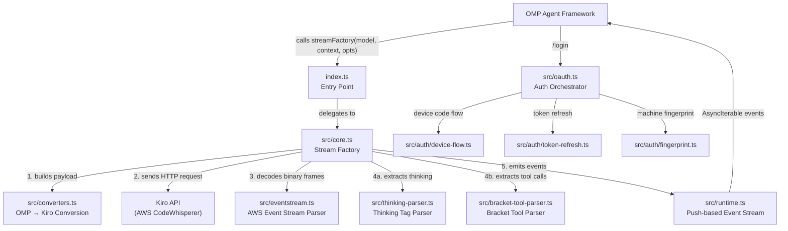
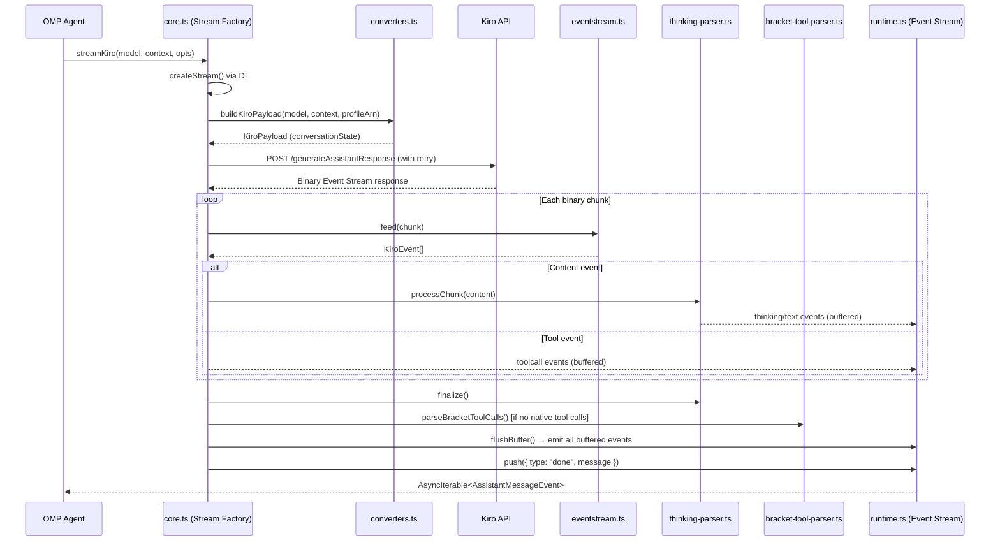

The **omp-kiro-provider** is a dependency-free local plugin that integrates [Kiro](https://kiro.dev) as a provider into the OMP (Oh-My-Pi) agent framework. Its architecture follows a clean layered design: an **entry point** registers the provider contract, a **core streaming engine** orchestrates the full request lifecycle, and several specialized **subsystems** handle authentication, format conversion, binary decoding, and content parsing — all wired together through injectable dependencies for testability. No external runtime dependencies exist; the entire system is built on pure TypeScript and Node.js built-in modules.

Sources: [index.ts](index.ts#L1-L100), [package.json](package.json#L1-L27)

## Project Structure

The repository is organized as a flat module graph with a single entry point. Each file in `src/` owns a distinct architectural responsibility:

```
omp-kiro-provider/
├── index.ts                          # Extension entry point — registers "kiro" provider with OMP
├── models.json                       # Static model definitions (id, context window, reasoning flags)
├── src/
│   ├── types.ts                      # Shared type contracts (OMP provider interface, events, deps)
│   ├── core.ts                       # Core streaming factory — full request lifecycle + retry logic
│   ├── oauth.ts                      # Authentication orchestrator — auto-detect, login, refresh
│   ├── converters.ts                 # OMP → Kiro payload conversion, history sanitization, tool mapping
│   ├── eventstream.ts                # AWS Event Stream binary frame decoder
│   ├── thinking-parser.ts            # Stateful <thinking> tag extraction from streaming content
│   ├── bracket-tool-parser.ts        # Fallback bracket-style tool call parser
│   ├── runtime.ts                    # Push-based AsyncIterable event stream bridge
│   └── auth/
│       ├── device-flow.ts            # AWS SSO OIDC device code flow (Builder ID browser login)
│       ├── fingerprint.ts            # SHA-256 machine fingerprint generation
│       └── token-refresh.ts          # Social + OIDC token refresh routing
└── tests/
    └── test-converters.ts            # Converter and event stream unit tests
```

Sources: [package.json](package.json#L1-L27)

## High-Level Architecture

The system operates as a **streaming pipeline**: OMP invokes the stream factory registered by the entry point, which delegates through conversion, HTTP request, binary decoding, and content parsing stages before emitting typed events back to the OMP runtime. The following diagram illustrates the primary data flow:



Sources: [index.ts](index.ts#L74-L100), [src/core.ts](src/core.ts#L1-L50)

## Module Responsibility Matrix

Each module encapsulates a single concern. The table below maps every file to its architectural role, its primary consumer, and its key exports:

| Module | Architectural Role | Primary Consumer | Key Exports |
|---|---|---|---|
| **index.ts** | Extension registration — wires all subsystems into OMP's `registerProvider` | OMP runtime | `default` export (plugin function) |
| **src/types.ts** | Shared type contracts — defines the OMP provider interface | All modules | `AssistantMessageEvent`, `CoreDependencies`, `KiroAuthMeta`, `ContextLike` |
| **src/core.ts** | Streaming orchestrator — manages retry, timeout, event routing | index.ts (stream factory) | `createStreamKiro()` |
| **src/oauth.ts** | Authentication orchestrator — auto-detects credentials, routes login methods | index.ts (oauth config) | `login()`, `refreshToken()`, `getApiKey()` |
| **src/converters.ts** | Format translation — builds Kiro payloads, truncates tool names, sanitizes history | core.ts | `buildKiroPayload()`, `resolveToolName()` |
| **src/eventstream.ts** | Binary protocol decoder — parses AWS Event Stream frames into typed events | core.ts | `AwsEventStreamParser` class |
| **src/thinking-parser.ts** | Streaming content parser — separates `<thinking>` blocks from text | core.ts | `ThinkingTagParser` class |
| **src/bracket-tool-parser.ts** | Fallback tool extractor — parses `[Called func with args: {...}]` patterns | core.ts | `parseBracketToolCalls()` |
| **src/runtime.ts** | Async bridge — connects push-based producers to async iteration consumers | core.ts (via DI) | `createAssistantMessageEventStream()`, `calculateCost()` |
| **src/auth/device-flow.ts** | Browser login — implements AWS SSO OIDC device code flow | oauth.ts | `runDeviceCodeFlow()` |
| **src/auth/fingerprint.ts** | Anti-detection — generates stable SHA-256 machine fingerprint | (available for header construction) | `getMachineFingerprint()` |
| **src/auth/token-refresh.ts** | Token lifecycle — routes refresh by auth method (social vs. OIDC) | oauth.ts | `refreshKiroToken()` |
| **models.json** | Static configuration — model IDs, context windows, reasoning flags | index.ts | (JSON data, not executable) |

Sources: [src/types.ts](src/types.ts#L1-L197), [src/core.ts](src/core.ts#L148-L160), [src/oauth.ts](src/oauth.ts#L1-L30)

## The Four Architectural Layers

The provider's modules can be grouped into four functional layers, each with a clear boundary and responsibility:

### Layer 1 — Extension Interface (Entry Point)

The entry point [`index.ts`](index.ts#L74-L100) serves a single purpose: assembling all subsystems into an OMP-compatible provider registration. It reads model definitions from [`models.json`](models.json#L1-L110), constructs the stream factory by injecting all dependencies into `createStreamKiro`, and calls `pi.registerProvider("kiro", {...})` with the provider's name, API base URL, authentication callbacks, and model list. Notably, it configures a zero-cost policy (`cost: { input: 0, output: 0, ... }`) reflecting that Kiro usage is covered by subscription rather than per-token billing.

Sources: [index.ts](index.ts#L34-L100), [models.json](models.json#L1-L110)

### Layer 2 — Core Streaming Engine

The heart of the provider is [`src/core.ts`](src/core.ts#L148-L160), which exports `createStreamKiro(deps: CoreDependencies)` — a factory that returns a stream function matching OMP's `streamSimple` contract. This function manages the **entire request lifecycle** through a sophisticated state machine:

- **Payload construction** — delegates to `buildKiroPayload` in the converters layer, which transforms OMP's message format into Kiro's `conversationState` structure.
- **HTTP request with anti-detection headers** — constructs headers that mimic the real Kiro CLI Rust SDK, including dynamic `User-Agent` strings and `amz-sdk-invocation-id` UUIDs.
- **Dual retry loops** — an outer loop handles capacity errors (`INSUFFICIENT_MODEL_CAPACITY`) and empty responses (up to 3 + 2 retries), while an inner loop handles HTTP 429/5xx errors (up to 3 retries with exponential backoff).
- **Timeout management** — enforces a 180-second first-token timeout, 90-second idle stream timeout, and 120-second connection timeout, all respecting the abort signal.
- **Event processing pipeline** — routes parsed events through the thinking parser, tool call handling, and echo noise stripping before buffering.
- **Buffered emission** — partial content from failed attempts is never leaked; events are only flushed to the consumer stream on success.

Sources: [src/core.ts](src/core.ts#L1-L200), [src/core.ts](src/core.ts#L400-L600)

### Layer 3 — Specialized Subsystems

This layer contains the focused parsing and conversion modules that the core engine delegates to:

**Message Conversion** ([`src/converters.ts`](src/converters.ts#L1-L50)) transforms OMP's internal representation into Kiro's `conversationState` format. It enforces critical constraints: history must alternate user/assistant, the first message must be from the user, tool names are truncated to 64 characters with a reverse-mapping table, and empty content uses a placeholder string. It also dynamically scales history truncation based on the model's context window.

**Binary Decoding** ([`src/eventstream.ts`](src/eventstream.ts#L1-L50)) parses the AWS Event Stream binary protocol that Kiro API responses use. It uses a pattern-scanning approach rather than full frame header parsing — scanning for known JSON prefixes (`{"content":`, `{"toolUseId":`, etc.) and extracting complete JSON objects via brace matching. It includes a 10 MB buffer cap to prevent OOM on garbage input.

**Thinking Tag Extraction** ([`src/thinking-parser.ts`](src/thinking-parser.ts#L1-L40)) is a stateful parser that separates `<thinking>`, `<reasoning>`, and `<thought>` blocks from regular text content in streaming chunks. It handles split tags across chunk boundaries and reorders blocks when thinking arrives after text — a behavior specific to the Kiro API.

**Bracket Tool Call Parsing** ([`src/bracket-tool-parser.ts`](src/bracket-tool-parser.ts#L1-L30)) provides a fallback mechanism for models that emit tool calls as inline text (`[Called func_name with args: {...}]`) instead of native tool events. It extracts these patterns, parses the JSON arguments, and returns cleaned text with the bracket patterns removed.

**Push-Based Event Stream** ([`src/runtime.ts`](src/runtime.ts#L1-L85)) bridges the push-based producer pattern (our stream parsers call `push()`) to the async iteration interface that OMP consumes (`for await...of`). It implements a queue with pending-waiter resolution, ensuring events are delivered in order without buffering delays.

Sources: [src/converters.ts](src/converters.ts#L1-L60), [src/eventstream.ts](src/eventstream.ts#L72-L120), [src/thinking-parser.ts](src/thinking-parser.ts#L1-L80), [src/bracket-tool-parser.ts](src/bracket-tool-parser.ts#L1-L40), [src/runtime.ts](src/runtime.ts#L8-L60)

### Layer 4 — Authentication System

The authentication layer ([`src/oauth.ts`](src/oauth.ts#L1-L30) and its submodules under `src/auth/`) implements a multi-source credential detection and management system:

- **Auto-detection** — tries reading credentials from the kiro-cli SQLite database (preferred, always fresh), falls back to the Kiro IDE's `~/.aws/sso/cache/kiro-auth-token.json`, and supports direct API key entry.
- **Sidecar metadata** — stores Kiro-specific auth metadata (method, clientId, clientSecret, profileArn) in a separate JSON file at `~/.omp/agent/kiro-auth-meta.json`, since OMP's credential format doesn't support these fields.
- **Token refresh routing** — dispatches to either social refresh (Google/GitHub via `prod.{region}.auth.desktop.kiro.dev`) or OIDC refresh (Builder ID via `oidc.{region}.amazonaws.com`) based on the stored method.
- **Device code flow** — implements the full AWS SSO OIDC three-step process: register client → start device auth → poll for token, with `PendingError`/`SlowDownError` handling for the polling loop.

Sources: [src/oauth.ts](src/oauth.ts#L1-L100), [src/auth/device-flow.ts](src/auth/device-flow.ts#L1-L50), [src/auth/fingerprint.ts](src/auth/fingerprint.ts#L1-L30), [src/auth/token-refresh.ts](src/auth/token-refresh.ts#L1-L50)

## Dependency Injection and Testability

A critical architectural decision is that `createStreamKiro` accepts a `CoreDependencies` object rather than using globals directly. The `CoreDependencies` interface injects `fetchImpl`, `createStream`, `cwd`, `now`, `uuid`, `env`, and `calculateCost` — allowing tests to substitute deterministic implementations without mocking Node.js globals. The entry point wires real implementations (`fetch`, `Date.now`, `crypto.randomUUID`), while tests provide controlled alternatives. This pattern is consistent with the contract established in `src/types.ts`.

Sources: [src/types.ts](src/types.ts#L157-L175), [index.ts](index.ts#L64-L72), [src/core.ts](src/core.ts#L148-L170)

## Request Lifecycle Summary

The following diagram shows the complete lifecycle of a single streaming request, from OMP invocation to event delivery:



Sources: [src/core.ts](src/core.ts#L200-L400), [src/core.ts](src/core.ts#L600-L780)

## Data Flow: OMP Messages → Kiro Payload

The conversion layer bridges two fundamentally different message formats. OMP uses a flat `messages[]` array with `role`/`content`/`toolCalls`/`toolResults` fields, while Kiro expects a nested `conversationState` with `currentMessage` and `history` arrays where each entry is wrapped in either `userInputMessage` or `assistantResponseMessage`. The converter enforces alternation, injects system prompts into the first user message, truncates tool names exceeding 64 characters, and dynamically scales history size based on the model's context window.

Sources: [src/converters.ts](src/converters.ts#L1-L50), [src/converters.ts](src/converters.ts#L400-L496)

## Where to Go Next

The architecture overview you just read establishes the structural foundation. The following pages dive into each subsystem in detail:

- **Provider contract specifics**: [OMP Provider Contract and Extension Registration](6-omp-provider-contract-and-extension-registration) — how `registerProvider` works and what OMP expects.
- **Testability deep dive**: [Dependency Injection and Testability Pattern](7-dependency-injection-and-testability-pattern) — the `CoreDependencies` injection mechanism in practice.
- **Authentication internals**: Start with [Authentication Methods and Credential Auto-Detection](8-authentication-methods-and-credential-auto-detection) for the full auth pipeline.
- **Message conversion details**: [OMP-to-Kiro Conversation Format Conversion](12-omp-to-kiro-conversation-format-conversion) for the conversion logic.
- **Streaming mechanics**: [Core Streaming Factory and Request Lifecycle](15-core-streaming-factory-and-request-lifecycle) for the retry/timeout/event-routing state machine.