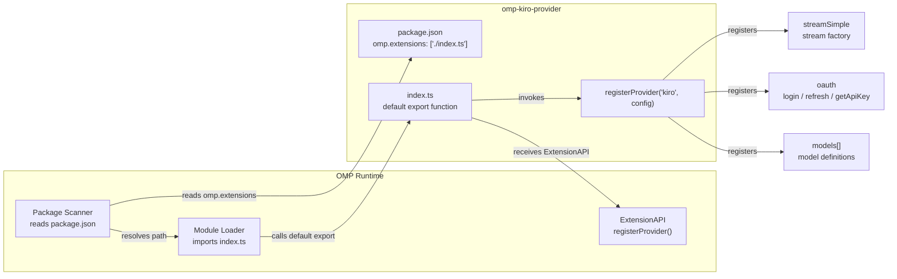
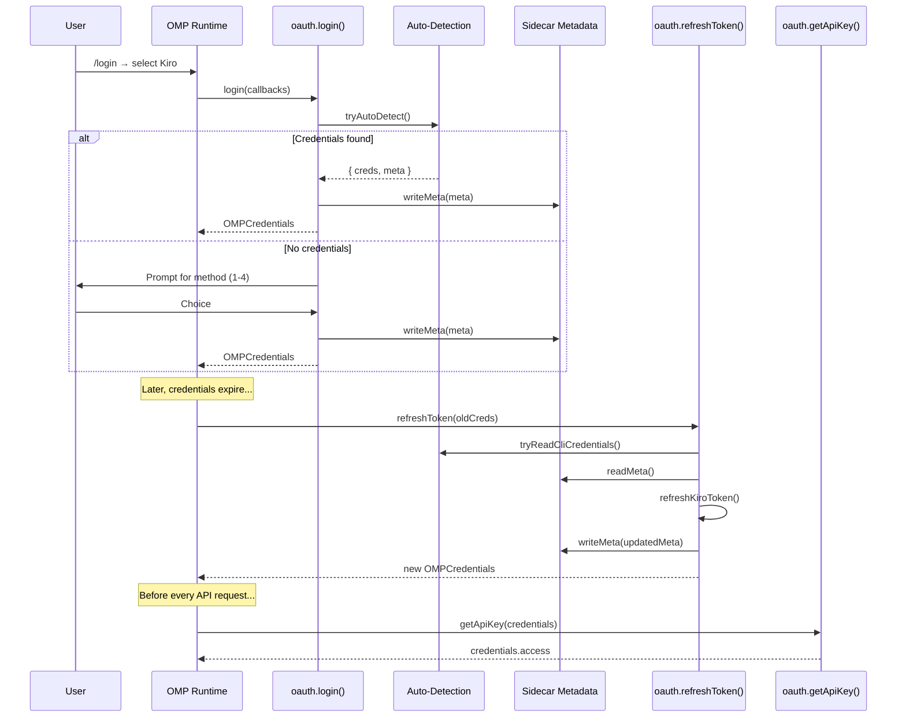
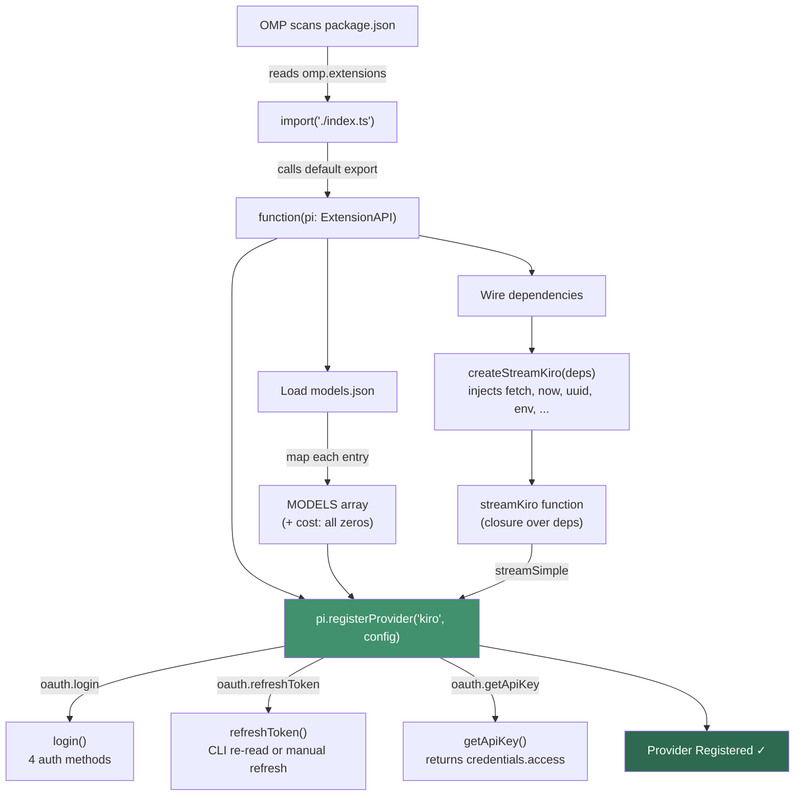

The **omp-kiro-provider** integrates into the OMP (Oh-My-Pi) agent framework through a well-defined extension contract. Rather than implementing a custom server or protocol adapter, the provider operates as a **local plugin** — a single TypeScript module that OMP discovers, loads, and invokes at runtime. This page explains how OMP discovers the extension, what the `registerProvider` contract requires, and how the Kiro provider wires every subsystem into that single registration call. Understanding this contract is essential for anyone modifying the provider's entry point, adding new models, or building a comparable provider from scratch.

Sources: [index.ts](index.ts#L1-L100), [package.json](package.json#L1-L27)

## Extension Discovery: How OMP Finds the Plugin

OMP locates extensions through **manifest fields** in `package.json`. The provider declares its entry point in two parallel configuration blocks — `"pi"` and `"omp"` — both pointing to the same `./index.ts` file. The `"omp"` block is the primary contract, while `"pi"` provides backward compatibility with earlier framework versions. When OMP scans installed packages, it reads the `"omp.extensions"` array, resolves each path relative to the package root, and dynamically imports the module. The module's **default export** must be a function — that function is the extension's sole entry point and receives the OMP `ExtensionAPI` object as its argument.

Sources: [package.json](package.json#L16-L26)

## The Entry Point Function and `registerProvider`

The default export in [index.ts](index.ts#L83-L99) receives a single parameter — `pi` (typed as `ExtensionAPI` from `@oh-my-pi/pi-coding-agent`) — and calls exactly one method: `pi.registerProvider()`. This is the **entirety** of the extension's interaction with OMP at registration time. The method takes two arguments: a **provider ID** (the string `"kiro"`) and a **configuration object** that satisfies OMP's `ProviderConfigInput` interface. Once registered, OMP owns the provider lifecycle — it invokes the stream factory when a user sends a message, calls the OAuth callbacks when authentication is needed, and reads the model list to populate its UI.

Sources: [index.ts](index.ts#L83-L99)



## The Provider Configuration Object

The configuration object passed to `registerProvider` is the **central contract** between the provider and the OMP runtime. Every field serves a specific purpose in the lifecycle. The table below documents each field, its value in the Kiro provider, and its role in the OMP contract:

Sources: [index.ts](index.ts#L83-L99)

| Field | Value | Contract Role |
|---|---|---|
| **`name`** | `"Kiro"` | Human-readable provider name displayed in OMP's UI and logs |
| **`baseUrl`** | `API_BASE` (defaults to `https://q.us-east-1.amazonaws.com`) | The API endpoint OMP uses for request routing and diagnostics |
| **`apiKey`** | `"KIRO_API_KEY"` | Environment variable name OMP checks for a pre-set API key |
| **`authHeader`** | `true` | Tells OMP to send the API key in the `Authorization` header automatically |
| **`api`** | `"kiro-custom" as never` | Custom API type identifier — OMP doesn't validate this field, allowing providers to use non-standard protocols |
| **`streamSimple`** | `streamKiro as never` | The **stream factory function** — OMP invokes this for every user message |
| **`oauth`** | `{ name, login, refreshToken, getApiKey }` | OAuth subsystem — OMP calls these functions during `/login` and token refresh flows |
| **`models`** | `MODELS` array | Static model definitions — OMP reads this to populate model selection UI and enforce context limits |

The `as never` type assertions on `api` and `streamSimple` are intentional: the internal types diverge between the provider and OMP's public interface, but the **runtime contract** matches exactly. The provider implements OMP's expected calling convention even though TypeScript's structural typing doesn't perfectly align.

Sources: [index.ts](index.ts#L84-L98)

## The Stream Factory Contract

The most critical piece of the registration is `streamSimple` — the function OMP calls for every conversation turn. It must accept three parameters and return an `AssistantMessageEventStreamLike`:

Sources: [src/core.ts](src/core.ts#L211-L215), [src/types.ts](src/types.ts#L151-L155)

```typescript
function streamKiro(
  model: ModelLike,       // The selected model (id, contextWindow, reasoning, etc.)
  context: ContextLike,   // Conversation state (systemPrompt, messages[], tools[])
  options?: StreamOptions, // Optional: apiKey, signal, headers, maxTokens, reasoning level
): AssistantMessageEventStreamLike  // AsyncIterable<AssistantMessageEvent>
```

The return type — `AssistantMessageEventStreamLike` — is the bridge between the provider and OMP. It must implement `AsyncIterable<AssistantMessageEvent>` (so OMP can consume it with `for await...of`), expose a `push(event)` method (so internal producers can emit events), and provide `result()` returning a `Promise<AssistantMessageLike>` (the final assembled message). The Kiro provider implements this through `KiroEventStream` in [src/runtime.ts](src/runtime.ts#L17-L76), a push-to-pull queue that resolves waiting consumers as events arrive.

Sources: [src/types.ts](src/types.ts#L151-L155), [src/runtime.ts](src/runtime.ts#L17-L76)

The stream factory is **not created directly** in `index.ts`. Instead, it is produced by `createStreamKiro(deps: CoreDependencies)` — a higher-order factory that captures all injectable dependencies in a closure and returns the actual `streamKiro` function. This two-stage construction is the basis of the provider's testability strategy, documented in detail on [Dependency Injection and Testability Pattern](7-dependency-injection-and-testability-pattern).

Sources: [index.ts](index.ts#L66-L77), [src/core.ts](src/core.ts#L166-L215)

## The OAuth Sub-Contract

OMP's authentication flow relies on three callback functions that the provider registers under the `oauth` field. Each callback has a specific role in the credential lifecycle, and together they form a complete authentication pipeline:

Sources: [index.ts](index.ts#L91-L96), [src/oauth.ts](src/oauth.ts#L1-L30)

| Callback | Signature | When OMP Calls It | What It Returns |
|---|---|---|---|
| **`login`** | `(callbacks) => Promise<OMPCredentials \| string>` | User runs `/login` and selects the Kiro provider | OMP-compatible credentials (`{ access, refresh, expires }`) or an error string |
| **`refreshToken`** | `(credentials) => Promise<OMPCredentials>` | Existing credentials have expired | Fresh credentials with updated `access` token and `expires` timestamp |
| **`getApiKey`** | `(credentials) => string` | Before every API request | The `access` field from stored credentials, used as the Bearer token |

The `OMPCredentials` interface is intentionally minimal — it contains only `access`, `refresh`, and `expires` fields. This is because OMP's credential storage format is fixed and doesn't support provider-specific metadata. The Kiro provider works around this limitation by storing additional auth metadata (auth method, client ID/secret, region, profile ARN) in a **sidecar JSON file** at `~/.omp/agent/kiro-auth-meta.json`. This sidecar pattern is transparent to OMP — it only sees the standard credential shape.

Sources: [src/oauth.ts](src/oauth.ts#L57-L66), [src/types.ts](src/types.ts#L186-L196)



## Model Registration: From Static JSON to OMP Contract

Models are defined statically in [models.json](models.json#L1-L110) and transformed at registration time into the shape OMP expects. The transformation in [index.ts](index.ts#L49-L60) maps each model entry through a function that adds the `cost` field (all zeros, since Kiro is free during its trial period) and passes through the remaining fields unchanged. The resulting `MODELS` array is passed directly to `registerProvider` as the `models` field.

Sources: [models.json](models.json#L1-L110), [index.ts](index.ts#L37-L60)

The `ModelLike` type in [src/types.ts](src/types.ts#L78-L89) defines the contract OMP expects for each model entry:

| ModelLike Field | Source | Purpose |
|---|---|---|
| **`id`** | `models.json` → `m.id` | Unique identifier used in API requests and model selection |
| **`name`** | `models.json` → `m.name` | Display name shown in OMP's model picker UI |
| **`reasoning`** | `models.json` → `m.reasoning` | Whether the model supports thinking/reasoning output |
| **`reasoningHidden`** | `models.json` → `m.reasoningHidden` | If `true`, reasoning is produced but hidden from the user |
| **`input`** | `models.json` → `m.input` | Supported input modalities (`"text"`, `"image"`) |
| **`cost`** | Computed (all zeros) | Per-token pricing — zero because Kiro uses subscription/trial |
| **`contextWindow`** | `models.json` → `m.contextWindow` | Maximum context window in tokens |
| **`maxTokens`** | `models.json` → `m.maxTokens` | Maximum output tokens per response |

Note that `ModelLike` also carries `api` and `provider` fields (populated by OMP at runtime, not by the provider at registration time). These fields allow the stream factory and event handlers to know which provider and API type originated a given request.

Sources: [src/types.ts](src/types.ts#L78-L89)

## Type System Alignment: Mirroring OMP's Internal Contracts

A key architectural decision is that [src/types.ts](src/types.ts#L1-L197) defines types that **mirror OMP's internal provider interface exactly** — the file header explicitly states these types are "identical to omp-commandcode-provider/src/types.ts" so that OMP can use any provider interchangeably. This alignment ensures that the provider's output (events, messages, model definitions) is structurally compatible with OMP's expectations without requiring adapter layers.

Sources: [src/types.ts](src/types.ts#L1-L8)

The type hierarchy follows a clear pattern. **Content blocks** (`TextContent`, `ThinkingContent`, `ToolCallContent`) represent individual pieces within a message. **`AssistantMessageLike`** assembles these into a complete assistant response with metadata (model, usage, stop reason, timestamp). **`AssistantMessageEvent`** is a discriminated union representing each stage of streaming — `start`, `text_start`, `text_delta`, `text_end`, `thinking_start/delta/end`, `toolcall_start/end`, `done`, and `error`. This event taxonomy gives OMP fine-grained control over rendering and tool execution.

Sources: [src/types.ts](src/types.ts#L42-L150)

## Dependency Wiring at Registration Time

The entry point performs all dependency injection **before** calling `registerProvider`. The `createStreamKiro` factory is invoked with a `CoreDependencies` object that captures concrete implementations for every injectable dependency:

Sources: [index.ts](index.ts#L66-L77), [src/types.ts](src/types.ts#L160-L172)

| Dependency | Injected Value | Purpose |
|---|---|---|
| **`apiBase`** | `API_BASE` (from env or default) | Kiro API endpoint URL |
| **`fetchImpl`** | Global `fetch` | HTTP client — swappable for testing |
| **`createStream`** | `createAssistantMessageEventStream` | Factory for push-based event stream instances |
| **`cwd`** | `() => process.cwd()` | Current working directory accessor |
| **`now`** | `() => Date.now()` | Timestamp accessor — swappable for deterministic tests |
| **`uuid`** | `() => crypto.randomUUID()` | UUID generator — swappable for deterministic tests |
| **`env`** | `process.env` | Environment variables — swappable for isolated tests |
| **`authPaths`** | `[]` | Auth file search paths (unused in production, available for extension) |
| **`homeDir`** | `""` | Home directory override (unused in production) |
| **`calculateCost`** | `calculateCost` (no-op, returns 0) | Cost calculation — Kiro is free, so this is a no-op |

This wiring happens **once** at module load time. The resulting `streamKiro` function is a closure that captures all dependencies and is reused for every request OMP sends. The factory pattern means the production entry point injects real implementations, while test code can inject deterministic fakes — a pattern explored in depth on [Dependency Injection and Testability Pattern](7-dependency-injection-and-testability-pattern).

Sources: [src/core.ts](src/core.ts#L166-L171)

## The Complete Registration Flow

The following diagram shows how all pieces connect during the registration sequence — from OMP loading the package to the provider being fully operational:



Sources: [index.ts](index.ts#L24-L99)

## What Happens After Registration

Once `registerProvider` returns, the Kiro provider is a fully-registered citizen of the OMP runtime. OMP will:

- **List the models** in its UI, using the `models` array from registration
- **Call `streamSimple`** (i.e., `streamKiro`) whenever the user sends a message with a Kiro model selected
- **Call `oauth.login`** when the user initiates authentication for the Kiro provider
- **Call `oauth.refreshToken`** transparently when stored credentials expire
- **Call `oauth.getApiKey`** before each API request to obtain the Bearer token

The provider has no further registration responsibilities — everything from this point is driven by OMP's invocation of the registered callbacks. The internal mechanics of each callback are covered in dedicated pages throughout this documentation set.

Sources: [index.ts](index.ts#L83-L99)

## Where to Go Next

Now that you understand the registration contract and how the provider declares itself to OMP, the following pages explore the subsystems in detail:

- **Testability pattern**: [Dependency Injection and Testability Pattern](7-dependency-injection-and-testability-pattern) — how `CoreDependencies` enables isolated unit testing
- **Authentication internals**: [Authentication Methods and Credential Auto-Detection](8-authentication-methods-and-credential-auto-detection) — the four auth methods and the sidecar metadata pattern
- **Streaming mechanics**: [Core Streaming Factory and Request Lifecycle](15-core-streaming-factory-and-request-lifecycle) — the retry/timeout/event-routing state machine inside `streamKiro`
- **Message conversion**: [OMP-to-Kiro Conversation Format Conversion](12-omp-to-kiro-conversation-format-conversion) — how `buildKiroPayload` transforms OMP messages into Kiro's format