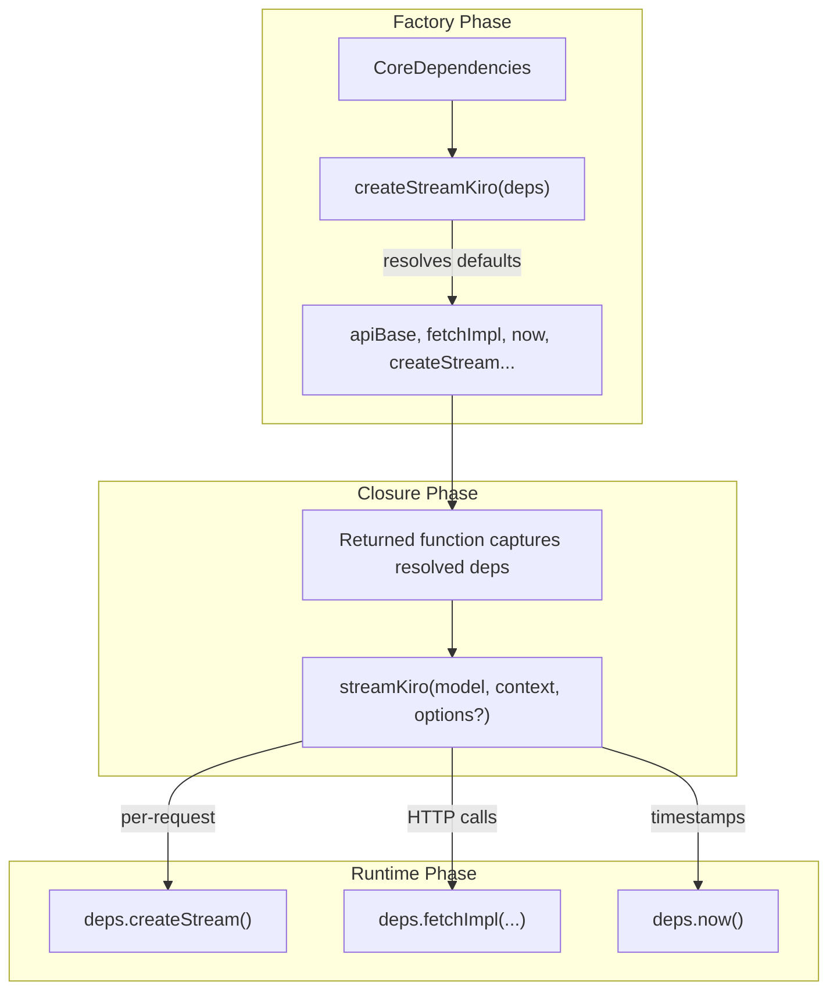
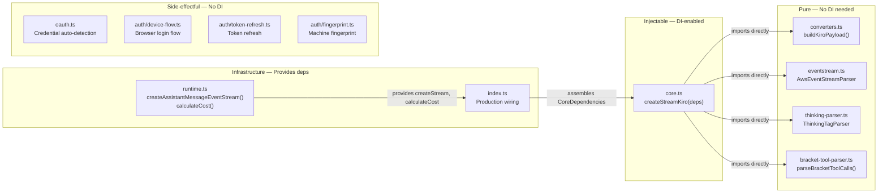

The omp-kiro-provider employs a **constructor-injected dependency bag** pattern centered on the `CoreDependencies` interface — a single object that encapsulates every external side effect the streaming engine might need. Rather than relying on global singletons, framework-managed IoC containers, or runtime service locators, the codebase uses a straightforward higher-order factory: one function receives all dependencies, closes over them, and returns the ready-to-use stream handler. This design keeps the provider's core logic hermetic, deterministic under test, and portable across runtime environments without any dependency on a specific DI framework.

Sources: [types.ts](src/types.ts#L158-L172), [core.ts](src/core.ts#L166-L171)

## The CoreDependencies Contract

The `CoreDependencies` interface defines the complete set of injectable services that `createStreamKiro` requires. Every field represents a seam where production infrastructure can be replaced with test doubles:

| Field | Type | Purpose | Active Usage |
|---|---|---|---|
| `apiBase` | `string` | Kiro API endpoint root URL | HTTP request routing |
| `fetchImpl` | `typeof fetch` | HTTP client for all outbound requests | API calls + profileArn resolution |
| `createStream` | `() => AssistantMessageEventStreamLike` | Factory for push-based event streams | Creates the async iterable output |
| `cwd` | `() => string` | Current working directory accessor | Contract-reserved |
| `now` | `() => number` | Monotonic timestamp generator | Output message timestamps |
| `uuid` | `() => string` | Unique identifier generator | Contract-reserved |
| `env` | `Record<string, string \| undefined>` | Environment variable map | Contract-reserved |
| `authPaths` | `string[]` | Authentication file search paths | Contract-reserved |
| `homeDir` | `string` | User home directory path | Contract-reserved |
| `calculateCost` | `(model, usage) => void` | Token cost computation | Cost accounting hook |

Fields marked "Contract-reserved" are part of the interface for OMP provider contract compatibility — they mirror the identical type signature found in `omp-commandcode-provider` — but are not actively invoked in the current Kiro implementation. This ensures the provider can be dropped into any OMP host without type mismatches while keeping the internal implementation focused on Kiro-specific concerns.

Sources: [types.ts](src/types.ts#L158-L172)

## Factory Architecture: Closure Over Dependencies

The central architectural mechanism is `createStreamKiro`, a higher-order function that performs a one-time dependency resolution and returns a **closure-based stream handler**. The factory resolves defaults via nullish coalescing, then the returned function captures these resolved values in its lexical scope:

The factory destructures the dependency bag at creation time (lines 167–171 of `core.ts`), falling back to Node.js builtins when a dependency is not supplied. This means the production wiring can omit optional overrides, while test harnesses can inject deterministic replacements for every side-effecting operation. The returned `streamKiro` function then uses these captured references throughout its execution — never reaching for globals like `fetch`, `Date.now()`, or `process.env` directly for the operations that need testability.

Sources: [core.ts](src/core.ts#L166-L190)

### Injectable Time vs. Wall-Clock Time

A critical distinction exists in how time is consumed. The injectable `now()` function (resolved from `deps.now`) is used exclusively for **output message timestamps** — the `timestamp` field on `AssistantMessageLike` objects that consumers see. In contrast, the internal **timeout tracking** for first-token and idle-stream detection uses the real `Date.now()` directly. This separation is deliberate: output timestamps should be deterministic for snapshot testing, but timeout logic must measure genuine elapsed wall-clock time regardless of the test environment. The provider never wants a mocked clock to accidentally disable its timeout safeguards.

Sources: [core.ts](src/core.ts#L232-L233), [core.ts](src/core.ts#L598-L646)

### Injectable HTTP Client

The `fetchImpl` dependency is the most consequential injection point. It flows into two distinct call sites: the primary `generateAssistantResponse` streaming endpoint and the auxiliary `ListAvailableProfiles` endpoint used for dynamic `profileArn` resolution. Both use the same injected reference, meaning a test can replace the entire network layer with a single stub. The `resolveProfileArn` helper function accepts `fetchImpl` as an explicit parameter, threading the injection through the call chain without resorting to global interception.

Sources: [core.ts](src/core.ts#L106-L135), [core.ts](src/core.ts#L548-L555)

## Production Wiring

The `index.ts` entry point assembles the production dependency graph and passes it to the factory in a single, declarative block. Every production dependency maps directly to a Node.js builtin:

| Dependency | Production Value | Origin |
|---|---|---|
| `apiBase` | `KIRO_API_BASE` or `https://q.{region}.amazonaws.com` | Environment variable with region-based default |
| `fetchImpl` | Native `fetch` | Global `fetch` (Node 18+) |
| `createStream` | `createAssistantMessageEventStream` | [runtime.ts](src/runtime.ts#L78-L80) |
| `cwd` | `() => process.cwd()` | Node.js `process` |
| `now` | `() => Date.now()` | Native `Date` |
| `uuid` | `() => crypto.randomUUID()` | Web Crypto API |
| `env` | `process.env` | Node.js `process` |
| `calculateCost` | `calculateCost` from runtime | [runtime.ts](src/runtime.ts#L82-L84) |

The `calculateCost` function is a no-op in the current implementation — Kiro is free during its trial period — but the injection point remains for future cost accounting. Similarly, `authPaths` and `homeDir` are passed as empty string and empty array respectively, as the Kiro provider resolves authentication paths internally through its own credential auto-detection chain rather than through the generic OMP path resolution.

Sources: [index.ts](index.ts#L66-L77), [runtime.ts](src/runtime.ts#L78-L84)

## Test Strategy: Two-Tier Approach

The codebase employs a deliberate two-tier testability model that maps directly to its module architecture:

### Tier 1: Pure Functions — No DI Required

Modules like `converters.ts` and `eventstream.ts` are designed as **pure transformations** with no external side effects. The `buildKiroPayload` function accepts structured input and returns a plain object — no network calls, no filesystem access, no global state mutation. The `AwsEventStreamParser` class maintains internal buffer state but operates deterministically on its inputs; feeding the same byte sequence always produces the same event sequence. The test file explicitly notes this design: *"These are pure functions — no network, no mocks needed."* This tier provides maximum test velocity — tests run instantly, require zero setup, and produce deterministic assertions.

Sources: [test-converters.ts](tests/test-converters.ts#L1-L6), [converters.ts](src/converters.ts#L1-L22), [eventstream.ts](src/eventstream.ts#L1-L8)

### Tier 2: Effectful Core — DI-Enabled

The `createStreamKiro` factory, by contrast, orchestrates network I/O, timeout management, retry logic, and event stream lifecycle — all inherently side-effectful. The `CoreDependencies` interface exists precisely to make this tier testable. A test harness can construct a minimal dependency bag with:

- A stub `fetchImpl` that returns canned `Response` objects wrapping pre-built event-stream binaries
- A deterministic `now()` that returns a fixed sequence of timestamps
- A `createStream` factory that produces an inspectable event stream for assertion
- An `env` map with controlled values for configuration edge-case testing

The factory's nullish-coalescing defaults mean a test only needs to inject the dependencies it cares about — everything else falls through to the real implementation. For example, a test focused on retry behavior might inject only `fetchImpl` (to simulate 429 responses) while leaving `now` and `createStream` at their production defaults.

Sources: [core.ts](src/core.ts#L166-L171)

## Module Responsibility Boundaries

The DI pattern reinforces clear architectural boundaries between modules. Each module occupies a specific position on the purity spectrum:

The authentication modules (`oauth.ts`, `device-flow.ts`, `token-refresh.ts`, `fingerprint.ts`) sit outside the DI system entirely. They interact with the filesystem, SQLite databases, and external OIDC endpoints — side effects that are inherently bound to the host machine. These modules are tested through integration-level validation rather than unit-level injection. The `CoreDependencies` interface deliberately excludes authentication concerns; the stream factory receives a pre-resolved `apiKey` via the `StreamOptions` parameter at call time, not through the dependency bag. This keeps the authentication lifecycle (login, refresh, credential storage) cleanly separated from the streaming lifecycle (request building, response parsing, event emission).

Sources: [core.ts](src/core.ts#L218-L237), [oauth.ts](src/oauth.ts#L1-L14)

## Design Rationale and Trade-offs

The choice of a manually-assembled dependency bag over a framework-managed IoC container reflects the project's **zero external dependency** constraint. The `package.json` declares no runtime dependencies whatsoever — the entire provider runs on Node.js builtins and the Web standard `fetch` API. A DI framework would violate this constraint. The manual approach also provides superior type safety: TypeScript can infer the exact type of every dependency from the `CoreDependencies` interface, catching mismatches at compile time rather than at container resolution time.

The trade-off is that the `CoreDependencies` interface is a flat structure — it does not support named service overrides, scoped lifetimes, or conditional bindings. If the provider's dependency surface grows significantly, the interface may need to be decomposed into smaller, domain-specific sub-interfaces (e.g., `NetworkDependencies`, `TimeDependencies`, `StreamDependencies`). At the current scale — ten fields, one factory — the flat structure provides the best readability-to-flexibility ratio.

Sources: [package.json](package.json#L1-L26), [types.ts](src/types.ts#L158-L172)

## Related Pages

- [Architecture Overview and Module Responsibilities](5-architecture-overview-and-module-responsibilities) — how the DI container fits into the overall module graph
- [OMP Provider Contract and Extension Registration](6-omp-provider-contract-and-extension-registration) — how `CoreDependencies` aligns with the OMP extension API
- [Core Streaming Factory and Request Lifecycle](15-core-streaming-factory-and-request-lifecycle) — how the injected dependencies are consumed during a streaming request
- [Testing the Converter and Event Stream Decoder](26-testing-the-converter-and-event-stream-decoder) — concrete test examples for the pure-function tier