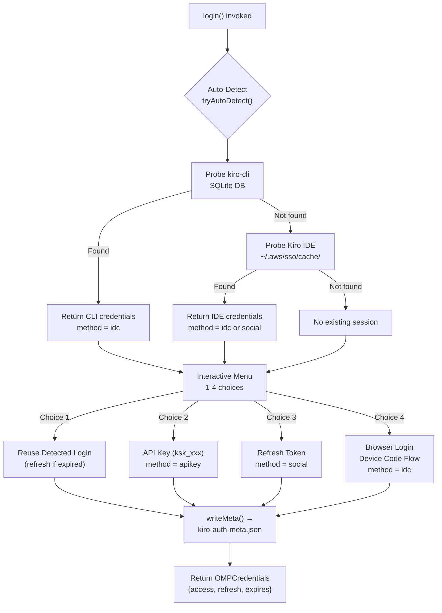
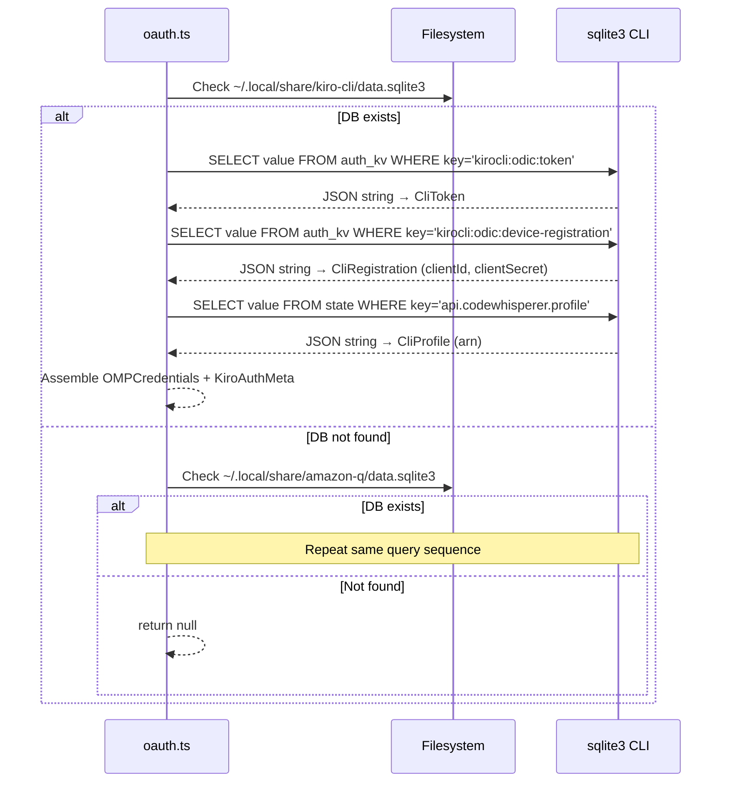
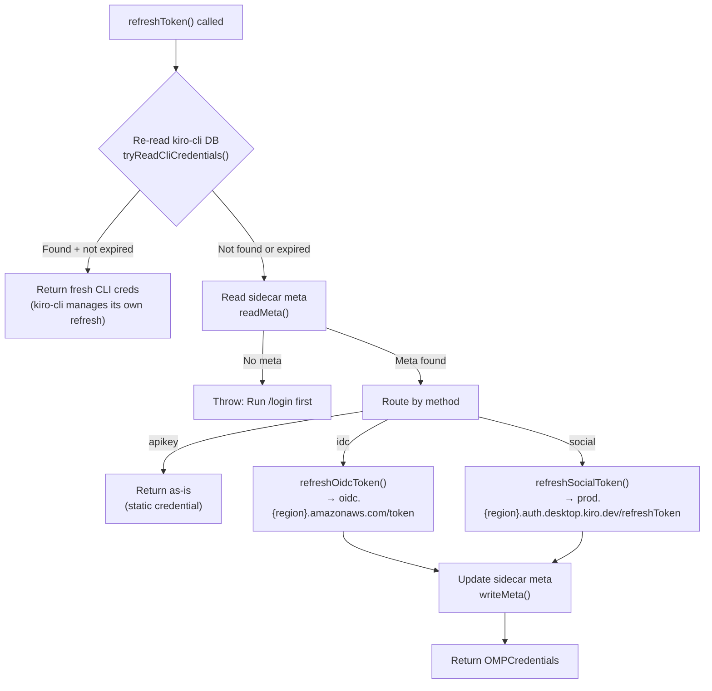

The Kiro OMP provider implements a **multi-source credential resolution system** that transparently discovers existing authentication sessions from kiro-cli and the Kiro IDE, falling back to interactive login methods when no prior session exists. This page covers the four supported authentication pathways, the auto-detection priority chain, the sidecar metadata persistence model, and how credentials are normalized into OMP's contract shape for downstream consumption.

Sources: [oauth.ts](src/oauth.ts#L1-L27)

## Authentication Architecture Overview

The provider supports four distinct authentication methods, each mapping to a different Kiro access pathway. The system's central design principle is **credential auto-detection**: on every `login()` invocation, the provider probes known filesystem locations for existing sessions before presenting any interactive prompt. This eliminates redundant authentication when the user has already logged in through kiro-cli or the Kiro IDE.

Sources: [oauth.ts](src/oauth.ts#L1-L27), [index.ts](index.ts#L83-L99)



The flow above illustrates the full login lifecycle. The auto-detection function `tryAutoDetect()` chains two probes using null-coalescing: `tryReadCliCredentials() ?? tryReadIdeToken()`. If either succeeds, the interactive menu annotates option 1 with `[DETECTED]` to signal that a reusable session exists. Only when both probes return null does the user need to authenticate from scratch.

Sources: [oauth.ts](src/oauth.ts#L285-L343)

## Supported Authentication Methods

Each method produces a different `KiroAuthMeta.method` identifier that controls downstream behavior — most importantly, which token refresh endpoint is called and which headers are sent. The table below summarizes the four methods and their characteristics.

Sources: [oauth.ts](src/oauth.ts#L1-L27), [types.ts](src/types.ts#L186-L196)

| Method | Identifier | Source | Token Refresh Endpoint | Requires Browser |
|--------|-----------|--------|----------------------|-----------------|
| AWS SSO OIDC (Builder ID) | `idc` | kiro-cli SQLite, Kiro IDE cache, or Device Code Flow | `oidc.{region}.amazonaws.com/token` | Only for Device Code Flow |
| Social (Google/GitHub) | `social` | Kiro IDE cache or manual refresh token | `prod.{region}.auth.desktop.kiro.dev/refreshToken` | No |
| API Key | `apikey` | Manual paste (`ksk_xxx`) | None (static credential) | No |
| Manual Refresh Token | `social` | Manual paste | `prod.{region}.auth.desktop.kiro.dev/refreshToken` | No |

### Method Discrimination Logic

The system determines the method tag through context rather than explicit user declaration. When reading from the Kiro IDE cache, the presence of `clientId` in the cached JSON determines the method: if `clientId` exists, the method is `idc` (OIDC); otherwise, it is `social`. When reading from kiro-cli's SQLite database, the method is always `idc` because kiro-cli uses the AWS SSO OIDC flow exclusively.

Sources: [oauth.ts](src/oauth.ts#L222-L222)

## Auto-Detection Priority Chain

The credential auto-detection system follows a strict priority order, attempting sources in sequence and returning the first successful result. This ensures the freshest available credentials are always used.

### Priority 1: kiro-cli SQLite Database

The **primary auth source** is kiro-cli's SQLite database, located at one of two standard paths. The provider executes `sqlite3` as a subprocess to query the `auth_kv` table for the OIDC token, device registration, and profile information.

Sources: [oauth.ts](src/oauth.ts#L127-L193)



The database paths are probed in order:

| Path | Purpose |
|------|---------|
| `~/.local/share/kiro-cli/data.sqlite3` | Primary kiro-cli database |
| `~/.local/share/amazon-q/data.sqlite3` | Fallback Amazon Q database |

Three SQLite queries extract everything needed for authentication. The first retrieves the OIDC token (`access_token`, `refresh_token`, `expires_at`, `region`, `start_url`). The second retrieves the OIDC client registration (`client_id`, `client_secret`) required for token refresh. The third retrieves the user's profile ARN, which is sent in API requests for authorization context.

Sources: [oauth.ts](src/oauth.ts#L136-L193)

### Priority 2: Kiro IDE Token Cache

When kiro-cli is not available, the provider falls back to reading the Kiro IDE's cached token at `~/.aws/sso/cache/kiro-auth-token.json`. This JSON file contains the access token, refresh token, expiration, region, and optionally the OIDC client registration details.

Sources: [oauth.ts](src/oauth.ts#L199-L238)

The cache file structure includes fields for `accessToken`, `refreshToken`, `expiresAt`, `region`, `profileArn`, `clientId`, and `clientSecret`. The method is dynamically determined: if `clientId` is present in the file, the session is classified as `idc`; otherwise it is `social`. The `expiresAt` field accepts both ISO string and numeric timestamp formats for maximum compatibility.

Sources: [oauth.ts](src/oauth.ts#L203-L238)

### Fallback: Interactive Login

When no existing session is detected, or when the user explicitly chooses an alternative method, the interactive menu provides four options. The provider uses OMP's `OAuthLoginCallbacks` interface — `onPrompt()` for user input and `onAuth()` for displaying browser URLs — keeping the provider decoupled from any specific UI implementation.

Sources: [oauth.ts](src/oauth.ts#L293-L374), [types.ts](src/types.ts#L176-L181)

## Credential Shape Normalization

A core architectural challenge is that OMP's credential contract (`OMPCredentials`) uses only three fields — `access`, `refresh`, and `expires` — while the Kiro authentication system requires additional metadata (`method`, `clientId`, `clientSecret`, `region`, `profileArn`) for proper token refresh and request routing. The provider solves this through a **dual-storage pattern**.

Sources: [oauth.ts](src/oauth.ts#L57-L66)

### The Sidecar Metadata File

Kiro-specific auth metadata is persisted in a **sidecar JSON file** at `~/.omp/agent/kiro-auth-meta.json`, completely independent of OMP's credential storage. This file stores a `KiroAuthMeta` object containing `method`, `clientId`, `clientSecret`, `region`, and `profileArn`. The file is created with restrictive permissions (`0o600`) and its parent directory with `0o700` for security.

Sources: [oauth.ts](src/oauth.ts#L28-L51), [types.ts](src/types.ts#L186-L196)

```mermaid
graph LR
    subgraph "OMP Credential Storage"
        A["OMPCredentials<br/>access<br/>refresh<br/>expires"]
    end

    subgraph "Sidecar File (~/.omp/agent/kiro-auth-meta.json)"
        B["KiroAuthMeta<br/>method<br/>clientId<br/>clientSecret<br/>region<br/>profileArn"]
    end

    subgraph "Internal Adapter"
        C["FullCredentials<br/>(combines both)"]
    end

    A --> C
    B --> C
    C -->|toFull()| D["refreshKiroToken()"]
    D -->|fromFull()| A
    D -->|writeMeta()| B
```

### Adapter Functions

Two adapter functions bridge between the split storage and the unified internal representation. `toFull()` merges `OMPCredentials` and `KiroAuthMeta` into `FullCredentials` — the enriched shape consumed by the refresh logic. `fromFull()` splits the refreshed result back into the two-part storage model. This ensures the refresh module receives all necessary context while OMP sees only its expected three-field credential shape.

Sources: [oauth.ts](src/oauth.ts#L244-L279)

## Token Refresh Strategy

The `refreshToken()` function implements a **two-tier refresh strategy** that prioritizes credential freshness by re-reading the kiro-cli database before falling back to manual token refresh.

Sources: [oauth.ts](src/oauth.ts#L380-L396)



### IDC Refresh Re-read Optimization

A critical design decision: for IDC-authenticated sessions, `refreshToken()` first attempts to **re-read from the kiro-cli SQLite database**. This is because kiro-cli independently manages its own token lifecycle — it refreshes tokens proactively, ensuring the database always contains the freshest credentials. By re-reading the database on every refresh cycle, the provider piggybacks on kiro-cli's refresh logic and avoids making unnecessary HTTP calls. Only when the database is unavailable or the token is expired does the provider fall back to its own OIDC refresh.

Sources: [oauth.ts](src/oauth.ts#L381-L386)

### Method-Routed Refresh

The unified refresh function `refreshKiroToken()` routes to the correct endpoint based on the method tag stored in sidecar metadata. The `apikey` method is a no-op (API keys don't expire). The `idc` method calls AWS SSO OIDC's token endpoint with `grantType: "refresh_token"` and the stored `clientId`/`clientSecret`. The `social` method calls Kiro's authentication endpoint with just the refresh token. Both methods return new access tokens with refreshed expiration windows (subtracting 60 seconds as a safety buffer).

Sources: [auth/token-refresh.ts](src/auth/token-refresh.ts#L138-L144)

| Refresh Path | Endpoint | Required Credentials | User-Agent Strategy |
|-------------|----------|---------------------|-------------------|
| Social | `prod.{region}.auth.desktop.kiro.dev/refreshToken` | `refreshToken` only | KiroIDE branding with fingerprint |
| OIDC | `oidc.{region}.amazonaws.com/token` | `refreshToken` + `clientId` + `clientSecret` | Plain `aws-sdk-js` branding |
| API Key | N/A | N/A | N/A |

Sources: [auth/token-refresh.ts](src/auth/token-refresh.ts#L36-L144)

## API Key Sanitization

The provider's `sanitizeApiKey()` function cleans user-provided input before credential creation. It strips surrounding quotes (single, double, backtick), removes control characters (`\x00-\x1F` and `\x7F`), and trims whitespace. This handles common paste artifacts like terminal bracket-paste wrappers and accidental leading/trailing whitespace.

Sources: [oauth.ts](src/oauth.ts#L68-L74)

## Provider Registration and the OAuth Contract

The authentication system integrates with OMP through the provider's `oauth` registration object, which exposes three functions: `login`, `refreshToken`, and `getApiKey`. The `getApiKey()` function is a simple accessor that returns the `access` field from `OMPCredentials` — for API key sessions this is the raw key; for OAuth sessions it is the access token. OMP calls these functions throughout the session lifecycle: `login()` during initial setup, `refreshToken()` when the current credentials expire, and `getApiKey()` to extract the bearer token for each API request.

Sources: [index.ts](index.ts#L83-L99), [oauth.ts](src/oauth.ts#L402-L405)

## Summary of File Locations

All credential and metadata files reside under the user's home directory. The table below documents each path and its role in the authentication pipeline.

| Path | Purpose | Created By |
|------|---------|-----------|
| `~/.local/share/kiro-cli/data.sqlite3` | Primary kiro-cli token store (auto-detected) | kiro-cli |
| `~/.local/share/amazon-q/data.sqlite3` | Fallback Amazon Q token store (auto-detected) | Amazon Q CLI |
| `~/.aws/sso/cache/kiro-auth-token.json` | Kiro IDE cached session (auto-detected) | Kiro IDE |
| `~/.omp/agent/kiro-auth-meta.json` | Sidecar auth metadata (method, clientId, region) | This provider |

Sources: [oauth.ts](src/oauth.ts#L28-L28), [oauth.ts](src/oauth.ts#L127-L130), [oauth.ts](src/oauth.ts#L200-L201)

## Next Steps

Now that you understand how credentials are discovered and normalized, explore the specific authentication flows in depth:

- **[AWS SSO OIDC Device Code Flow](9-aws-sso-oidc-device-code-flow)** — the four-step browser-based Builder ID login flow
- **[Token Refresh for Social and OIDC Sessions](10-token-refresh-for-social-and-oidc-sessions)** — detailed refresh endpoint mechanics and error handling
- **[API Key and Sidecar Metadata Persistence](11-api-key-and-sidecar-metadata-persistence)** — the sidecar file format, permission model, and read/write lifecycle