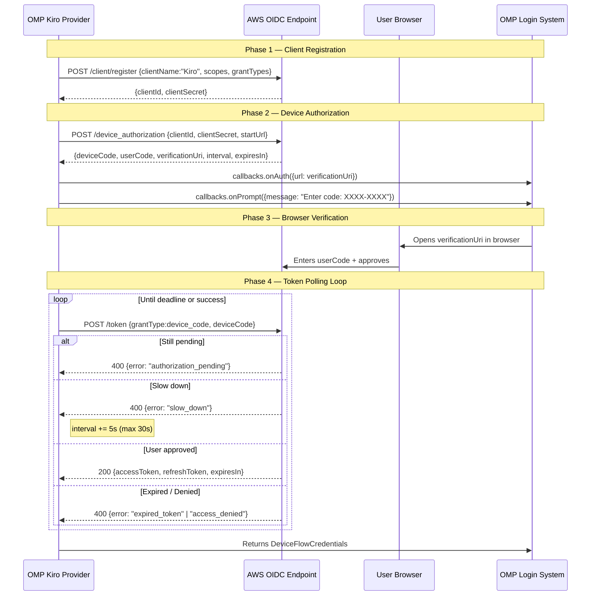
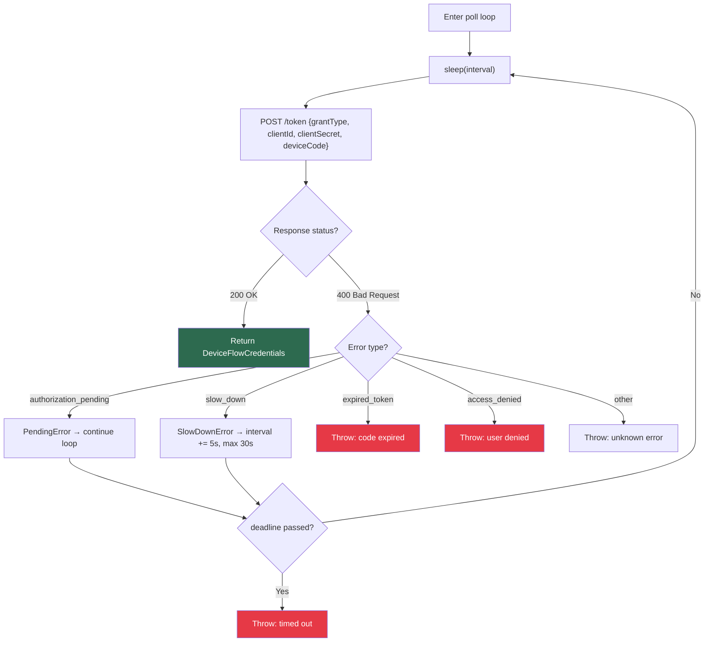

The **AWS SSO OIDC Device Code Flow** is the most interactive — and most secure — authentication method available in the OMP Kiro provider. It implements the same RFC 8628 device authorization grant that the real Kiro IDE uses for Builder ID login, performing a browser-based identity verification through AWS's Identity Center (formerly AWS SSO). The flow is encapsulated entirely within [`device-flow.ts`](src/auth/device-flow.ts) and orchestrated by the [`login()`](src/oauth.ts#L293-L374) function when the user selects option 4 ("Browser Login"). Unlike API key or refresh token methods that require pre-existing credentials, the device code flow bootstraps from zero — registering an ephemeral OIDC client, obtaining a user code, and polling AWS's token endpoint until the user completes browser verification.

Sources: [device-flow.ts](src/auth/device-flow.ts#L1-L14), [oauth.ts](src/oauth.ts#L1-L13)

## Protocol Architecture and Four-Phase Lifecycle

The device code flow is a strictly sequential, four-phase protocol. Each phase depends on the output of its predecessor — there is no parallelism, and failure at any phase aborts the entire flow. The diagram below illustrates the complete lifecycle from client registration through token acquisition:

The orchestrator [`runDeviceCodeFlow()`](src/auth/device-flow.ts#L195-L231) wires all four phases together. It accepts an `OAuthLoginCallbacks` interface for UI interaction and an optional `region` parameter (defaulting to `us-east-1`), returning a `DeviceFlowCredentials` object upon success.

Sources: [device-flow.ts](src/auth/device-flow.ts#L195-L231)

## Phase 1: OIDC Client Registration

The flow begins by registering an ephemeral public client with AWS's OIDC service. This is **not** a one-time operation — each invocation of the device code flow registers a fresh client, making the registration truly stateless. The registration request is sent to `https://oidc.{region}.amazonaws.com/client/register` with the following payload:

| Field | Value | Purpose |
|---|---|---|
| `clientName` | `"Kiro"` | **Anti-detection**: matches real Kiro IDE branding |
| `clientType` | `"public"` | Public client (no client authentication) |
| `scopes` | `CODEWHISPERER_SCOPES` | Five CodeWhisperer permission scopes |
| `grantTypes` | `["urn:ietf:params:oauth:grant-type:device_code", "refresh_token"]` | Device code + refresh capability |
| `issuerUrl` | `"https://view.awsapps.com/start"` | AWS SSO start URL |

The **CodeWhisperer scopes** define the exact permission envelope the registered client will hold. These five scopes collectively authorize the full spectrum of Kiro's backend interactions:

| Scope | Authorization |
|---|---|
| `codewhisperer:completions` | Code completion requests |
| `codewhisperer:analysis` | Code analysis operations |
| `codewhisperer:conversations` | Chat/conversation API |
| `codewhisperer:transformations` | Code transformation operations |
| `codewhisperer:taskassist` | Task-assist features |

The registration returns `{clientId, clientSecret}` which are required for all subsequent phases. The implementation validates that both fields are present and non-empty, throwing an explicit error if the OIDC service returns an incomplete response.

Sources: [device-flow.ts](src/auth/device-flow.ts#L47-L78), [device-flow.ts](src/auth/device-flow.ts#L18-L24)

## Phase 2: Device Authorization Request

With a registered client in hand, the flow requests device authorization from `https://oidc.{region}.amazonaws.com/device_authorization`. The request body contains only three fields — `{clientId, clientSecret, startUrl}` — where `startUrl` is the same AWS SSO entry point used during registration.

The response provides everything needed to direct the user through browser verification:

| Response Field | Type | Default | Description |
|---|---|---|---|
| `deviceCode` | `string` | — | Opaque code used for polling (never shown to user) |
| `userCode` | `string` | — | Short alphanumeric code the user must enter |
| `verificationUri` | `string` | — | URL where the user enters the code |
| `verificationUriComplete` | `string?` | — | URL with code pre-filled (preferred if present) |
| `interval` | `number?` | `5` | Recommended polling interval in seconds |
| `expiresIn` | `number?` | `600` | Device code lifetime in seconds |

The implementation prefers `verificationUriComplete` over `verificationUri` when available, as the complete URL auto-fills the user code in the browser — reducing friction. The user is notified through two callback invocations: `onAuth({url})` to open the browser, and `onPrompt({message: "Enter code: XXXX-XXXX"})` as a fallback display of the code in case the URL doesn't auto-fill.

Sources: [device-flow.ts](src/auth/device-flow.ts#L84-L127), [device-flow.ts](src/auth/device-flow.ts#L206-L209)

## Phase 3: Token Polling Loop and Error Handling

Once the browser verification URL is presented to the user, the provider enters a time-bounded polling loop. This is the most complex phase because it must handle four distinct response states from the OIDC token endpoint at `https://oidc.{region}.amazonaws.com/token`:

The poll loop uses two custom error classes — `PendingError` and `SlowDownError` — as **flow control signals** rather than true error conditions. When `PendingError` is caught, the loop simply continues to the next iteration. When `SlowDownError` is caught, the polling interval is incremented by 5 seconds (capped at 30 seconds) before continuing. This implements the RFC 8628 slow-down protocol, ensuring the provider does not overwhelm AWS's token endpoint while waiting for user completion.

The loop is bounded by a deadline calculated as `Date.now() + expiresIn * 1000`, using the `expiresIn` value from the device authorization response (default 600 seconds). If the deadline passes without a successful token response, the flow throws a timeout error.

Sources: [device-flow.ts](src/auth/device-flow.ts#L133-L182), [device-flow.ts](src/auth/device-flow.ts#L188-L235)

## Credential Shape and Metadata Persistence

When the token endpoint returns a successful 200 response, the raw `{accessToken, refreshToken, expiresIn}` is transformed into a `DeviceFlowCredentials` object — the internal credential representation used throughout the device flow module:

| Field | Type | Source | Notes |
|---|---|---|---|
| `access` | `string` | `accessToken` | Short-lived bearer token |
| `refresh` | `string` | `refreshToken` | Long-lived refresh token |
| `expiresAt` | `number` | `Date.now() + expiresIn * 1000 - 60_000` | **60-second safety margin** |
| `method` | `string` | Hardcoded `"idc"` | Identifies as Identity Center auth |
| `clientId` | `string?` | From Phase 1 registration | Stored for future refresh |
| `clientSecret` | `string?` | From Phase 1 registration | Stored for future refresh |
| `region` | `string?` | From flow parameter | AWS region for refresh routing |

The **60-second safety margin** subtracted from the calculated expiry (`expiresIn * 1000 - 60_000`) ensures that downstream consumers never use an expired token — the token is considered expired a full minute before AWS actually invalidates it.

Because OMP's credential contract (`OMPCredentials`) only stores `{access, refresh, expires}` — without `method`, `clientId`, `clientSecret`, or `region` — the Kiro provider persists these extra fields in a **sidecar metadata file** at `~/.omp/agent/kiro-auth-meta.json`. This separation is critical: when the login function invokes the device code flow (option 4 in the login menu), it calls `fromFull()` to convert the `DeviceFlowCredentials` into the OMP-compatible shape, then `writeMeta()` to persist the sidecar. The refresh logic later reads this metadata back via `readMeta()` and reconstructs the full credentials using `toFull()` before calling the OIDC refresh endpoint.

Sources: [device-flow.ts](src/auth/device-flow.ts#L33-L41), [device-flow.ts](src/auth/device-flow.ts#L159-L167), [oauth.ts](src/oauth.ts#L34-L51), [oauth.ts](src/oauth.ts#L255-L279), [oauth.ts](src/oauth.ts#L364-L369)

## Anti-Detection Considerations

The device code flow incorporates a deliberate anti-detection strategy designed to make the OMP provider's requests indistinguishable from those of the real Kiro IDE. This is concentrated in two areas:

**Client Registration Branding.** The `clientName` field is set to `"Kiro"` — matching exactly what the genuine Kiro IDE sends during its own OIDC client registration. AWS's OIDC service logs this client name, so using the correct branding ensures the registration appears legitimate in any server-side audit trail.

**OIDC Token Refresh User-Agent.** When tokens obtained via the device code flow are later refreshed (through [Token Refresh for Social and OIDC Sessions](10-token-refresh-for-social-and-oidc-sessions)), the refresh request uses a carefully crafted User-Agent string: `aws-sdk-js/3.738.0 ua/2.1 os/other lang/js md/browser#unknown_unknown api/sso-oidc#3.738.0 m/E KiroIDE`. This mirrors the exact User-Agent that the real Kiro IDE's embedded AWS SDK sends during OIDC token refreshes. Notably, OIDC refresh uses this branded User-Agent, while the device flow's initial registration and authorization requests use only `Content-Type: application/json` without any branded headers — matching the real IDE's behavior pattern.

Sources: [device-flow.ts](src/auth/device-flow.ts#L53-L65), [token-refresh.ts](src/auth/token-refresh.ts#L8-L12), [token-refresh.ts](src/auth/token-refresh.ts#L99-L106)

## Integration with the OAuth Login Pipeline

The device code flow is option 4 in the [`login()`](src/oauth.ts#L293-L374) function's authentication menu. It is the **last resort** in the preference chain — attempted only after the user explicitly chooses it, because the other methods (reusing existing credentials from kiro-cli or Kiro IDE, pasting an API key, or pasting a refresh token) are all less interactive. The flow receives the same `OAuthLoginCallbacks` interface that OMP provides for all login methods, ensuring consistent UI integration regardless of which authentication path the user selects.

The complete integration looks like this: when the user selects option 4, `login()` calls `runDeviceCodeFlow(callbacks)` which performs all four phases. On success, the `DeviceFlowCredentials` are converted via `fromFull()` into `{creds: OMPCredentials, meta: KiroAuthMeta}`, the metadata is persisted to the sidecar file via `writeMeta()`, and the OMP-compatible credentials are returned to the caller. Subsequent token refreshes — handled by [`refreshToken()`](src/oauth.ts#L380-L396) — will first attempt to re-read from kiro-cli's SQLite database (which manages its own refresh cycle), and only fall back to the stored metadata + OIDC refresh if the kiro-cli token is stale or unavailable.

Sources: [oauth.ts](src/oauth.ts#L293-L374), [oauth.ts](src/oauth.ts#L364-L369), [oauth.ts](src/oauth.ts#L380-L396)

## Next Steps

- **[Token Refresh for Social and OIDC Sessions](10-token-refresh-for-social-and-oidc-sessions)** — Understand how tokens obtained from this device code flow are refreshed when they expire, including the OIDC refresh endpoint and the social vs. IDC routing logic.
- **[API Key and Sidecar Metadata Persistence](11-api-key-and-sidecar-metadata-persistence)** — Explore how the sidecar metadata file (`kiro-auth-meta.json`) is structured and used across all authentication methods.
- **[Authentication Methods and Credential Auto-Detection](8-authentication-methods-and-credential-auto-detection)** — See the full authentication preference chain and how the device code flow fits among all available login methods.